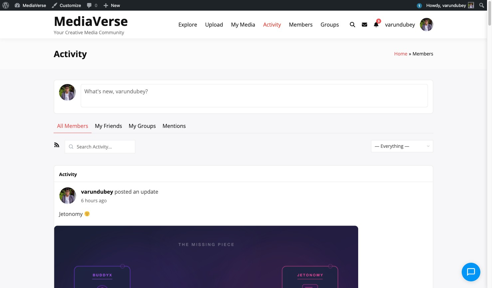
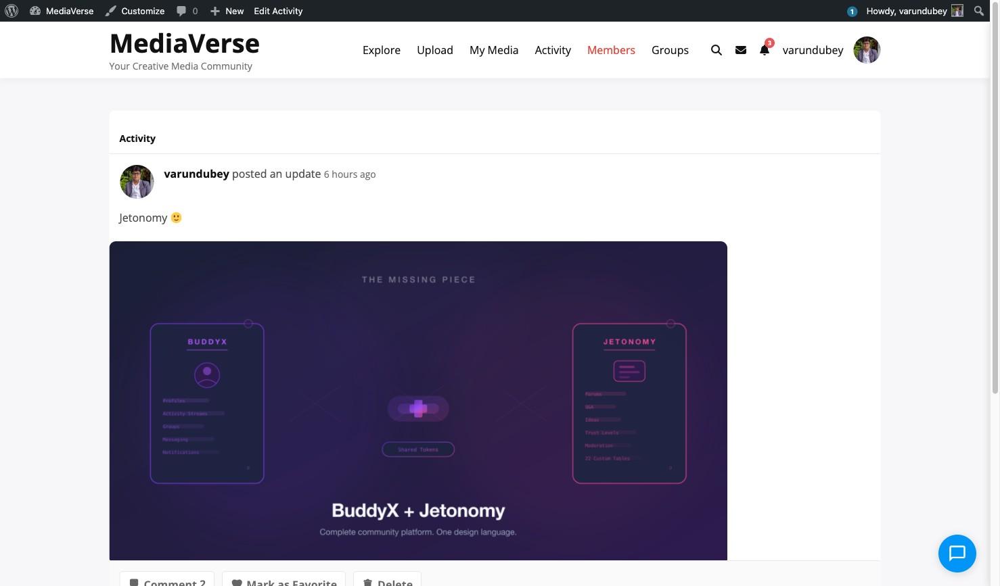

# Activity Stream Media

> **Included in Free** - WPMediaVerse is the most complete media solution for BuddyPress communities. Integration is optional - the plugin works standalone on any WordPress site, but when BuddyPress is active, it unlocks profile tabs, group media, activity stream, and notifications automatically.


WPMediaVerse records media events as BuddyPress activity items and enhances existing activity with media thumbnails and inline video players.

## Activity Types Registered

WPMediaVerse registers two custom activity action types:

| Action Type | Component | Label |
|-------------|-----------|-------|
| `mvs_media_upload` | `wpmediaverse` | Media Uploads |
| `mvs_media_upload` | `groups` | Group Media Uploads |
| `mvs_comment` | `wpmediaverse` | Media Comments |

These appear in the BuddyPress activity filter dropdown.

## When Activity Is Recorded

| Event | Action Hook | Activity Recorded |
|-------|-------------|-------------------|
| Media uploaded via UploadService | `mvs_media_uploaded` | "Username uploaded a new [type]" with thumbnail |
| Comment posted on media | `mvs_comment_created` | "Username commented on [media title]" (synced as an activity comment) |
| Media added to an album | `mvs_album_items_added` | Updates existing upload activity to reference the album |
| Media assigned to a group | `mvs_media_group_assigned` | Reassigns activity to the group component |
| Bulk album upload | `mvs_album_items_added` | One grouped activity for all files in the same upload action - see below |

### Bulk album upload activity grouping (1.2.0)

When a user uploads multiple files at once via the album upload modal, WPMediaVerse emits **one** grouped activity entry for the whole batch instead of one entry per file:

> **Username uploaded 3 photos to album _Portrait Series_** - with a 3-thumbnail grid

The mechanism: the upload modal sends `?album_upload=1` with each per-file `POST /media` request. The `mvs_media_uploaded` listener records a skip flag on the activity row, suppressing per-media activity creation. After the JS link call finishes, `mvs_album_items_added` fires once with the bundled media IDs and the listener emits a single grouped `bp_activity_add` with the thumbnail grid as content. Single-file album uploads still produce a per-photo activity (no bundling needed); ad-hoc photo posts via the activity composer keep their existing one-row-per-post behaviour.

## Activity Format



Upload activities use the format:
> **Username** uploaded a new **[type]**

When the media belongs to an album:
> **Username** uploaded a new **[type]** to album **[Album Name]**

For group uploads:
> **Username** uploaded a new **[type]** in the group **[Group Name]**

## Thumbnail Injection

WPMediaVerse injects media thumbnails into activity items in two ways:

1. `bp_get_activity_content_body` filter (priority 0) - transforms activity content to include an image tag.
2. `bp_activity_entry_content` action - injects thumbnails for activities with empty content (common for imported media).

Inline video players are injected for video media via `inject_video_player_in_activity`.

## Attaching Media via the Activity Post Form

The **Attach Media** button appears in the BuddyPress activity post form for members and inside groups.



Users select previously uploaded media or upload new files inline. The media IDs are attached to the activity via `bp_activity_posted_update` / `bp_groups_posted_update`.

## BuddyNext: Media Links Open Their Activity Post (2.0.0)

When the BuddyNext theme is active, WPMediaVerse media stops behaving like a separate public page by default. Clicking a media item, or visiting its `/media/{slug}/` URL directly, redirects (HTTP 301) to the BuddyPress activity entry the media was originally posted in - so a photo lives in the community feed, not as a standalone URL alongside it.

This is implemented through a single filter WPMediaVerse exposes for any host to use:

```php
apply_filters( 'mvs_single_media_redirect', '', $media_id, $slug );
```

Return a URL to redirect `/media/{slug}/` there instead of rendering the native single-media page; return `''` (the default) to render the native page. Standalone WPMediaVerse installs (no BuddyNext) always return `''`, so this only changes behavior when BuddyNext is active and hooks the filter.

If you prefer a dedicated, standalone page per media item even with BuddyNext active, BuddyNext ships its own settings toggle to switch back to that mode - check BuddyNext's own settings screen for the exact option, since it lives in the theme, not in WPMediaVerse.

WPMediaVerse also exposes filterable seams so BuddyNext (or any profile system) can point member links and avatars at its own profile/avatar URLs instead of WPMediaVerse's standalone `/media/@handle/` profile:

- `mvs_user_profile_url` (`$url`, `$user_id`) - overrides the profile link used across grids, cards, notifications, and share text.
- `mvs_user_avatar_url` (`$url`, `$user_id`, `$size`) - overrides the avatar image URL.

## Allowed HTML Tags in Activity

WPMediaVerse extends the `bp_activity_allowed_tags` filter to allow its custom HTML attributes (`data-mvs-*`, `data-wp-*`) to pass through BP's kses filter without being stripped.
