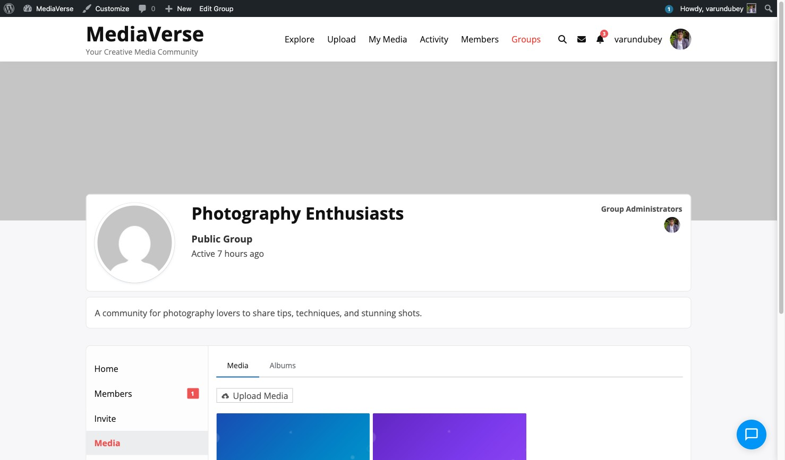

# Group Media Tab

> **Included in Free** — BuddyPress integration works with the free version of WPMediaVerse.


When BuddyPress Groups is active, WPMediaVerse adds a **Media** tab to every BuddyPress group.



## Tab Location

The tab appears in the group navigation at:

```
/groups/{group-slug}/media/
```

It is registered via `bp_setup_nav` at priority 100, conditional on `bp_is_active( 'groups' )`.

## What the Tab Shows

The group media tab displays media that was:
- Uploaded with `privacy=group` and `group_id={this-group-id}`.
- Reassigned to the group via the `mvs_media_group_assigned` action.

Privacy applies within the group: only group members can view the tab content.

## Assigning Media to a Group

When uploading, set the `privacy` to `group` and provide the `group_id`:

```bash
curl -X POST https://yoursite.com/wp-json/mvs/v1/media \
  -H "X-WP-Nonce: NONCE" \
  -F "file=@photo.jpg" \
  -F "privacy=group" \
  -F "group_id=42"
```

This stores `_mvs_privacy=group` and `_mvs_group_id=42` on the media post.

## Group Activity Integration

Media uploaded to a group fires the `mvs_media_group_assigned` action:

```php
do_action( 'mvs_media_group_assigned', $media_id, $group_id );
```

The BuddyPress integration listens to this action and re-scopes the upload's activity item from the member component to the groups component, so it appears in the group's activity stream rather than the member's personal stream.


## Group Activity in the Activity Post Form

When a group member uses the BP activity post form inside a group, the **Attach Media** button (added by WPMediaVerse) automatically assigns uploaded media to that group.
