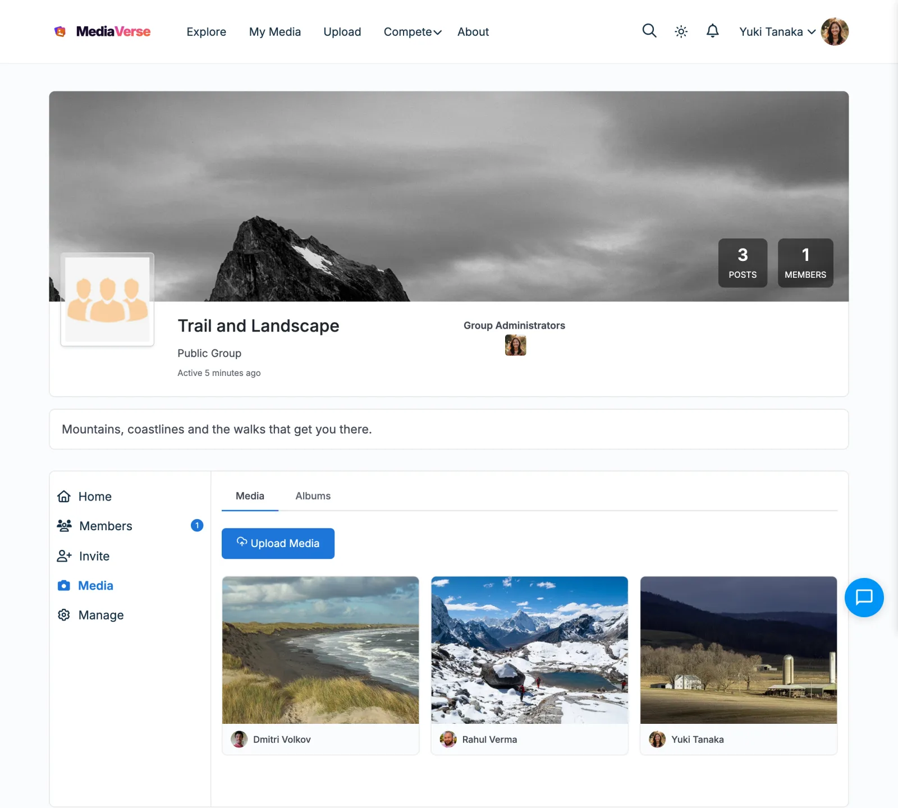

# Group Media Tab



> **Included in Free** - MediaVerse is the most complete media solution for BuddyPress communities. Integration is optional - the plugin works standalone on any WordPress site, but when BuddyPress is active, it unlocks profile tabs, group media, activity stream, and notifications automatically.

When BuddyPress Groups is active, MediaVerse adds a **Media** tab to every BuddyPress group.

## Tab Location

The tab appears in the group navigation at:

```
/groups/{group-slug}/media/
```

It is registered via `bp_setup_nav` at priority 100, conditional on `bp_is_active( 'groups' )`.

## What the Tab Shows

The group media tab displays media that was:
- Uploaded with `privacy=group` and `group_id={this-group-id}`.
- Reassigned to the group via the `mvs_media_group_assigned` action.

Privacy applies to each item. Visitors see the group's public media, signed-in members also see members-only media, and media set to **group** privacy is visible only to members of that group. The tab also has an **Albums** section for albums that belong to the group.

## Assigning Media to a Group

When uploading, set the `privacy` to `group` and provide the `group_id`. The uploader must be a member of that group; otherwise the group is ignored:

```bash
curl -X POST https://yoursite.com/wp-json/mvs/v1/media \
  -H "X-WP-Nonce: NONCE" \
  -F "file=@photo.jpg" \
  -F "privacy=group" \
  -F "group_id=42"
```

This sets the media row's `privacy` to `group` (a column in `mvs_media_index`) and stores `group_id=42` (in `mvs_media_meta`). Media is tracked in MediaVerse's custom tables, not as a WordPress post.

## Group Activity Integration

Media uploaded to a group fires the `mvs_media_group_assigned` action:

```php
do_action( 'mvs_media_group_assigned', $media_id, $group_id );
```

The BuddyPress integration listens to this action and re-scopes the upload's activity item from the member component to the groups component, so it appears in the group's activity stream rather than the member's personal stream.

## Group Activity in the Activity Post Form

When a group member uses the BP activity post form inside a group, the **Attach Media** button (added by MediaVerse) automatically assigns uploaded media to that group.
