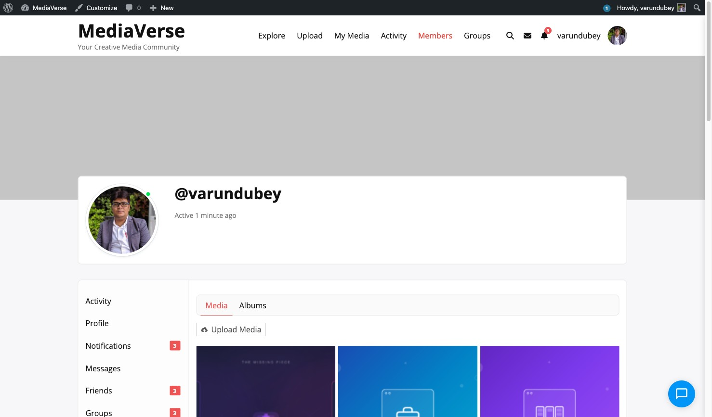

# Profile Media Tab

> **Included in Free** — BuddyPress integration works with the free version of WPMediaVerse.


When BuddyPress is active, WPMediaVerse adds a **Media** tab to every user's BuddyPress profile page.



## Tab Location

The tab appears in the main BuddyPress profile navigation at:

```
/members/{username}/media/
```

It is added via `bp_setup_nav` at priority 100.

## What the Tab Shows

The Media tab displays the profile owner's published media items in a paginated grid. Privacy filtering applies:

- Visitors see only the profile owner's **public** media.
- Logged-in users see **public** and **members-only** media.
- BuddyPress friends see **public**, **members-only**, and **friends** media.
- The profile owner sees all their own media.
- Moderators (`moderate_mvs_media`) see all media.


## Profile URL Pattern

WPMediaVerse also registers a standalone media profile URL:

```
/media/@{username}/
/media/@{username}/page/2/
```

These URLs are handled by the `TemplateLoader` and use the `explore.php` template, filtered to the specific user.

## User Profile Edit Page

Logged-in users can edit their avatar and profile details at:

```
/media/edit-profile/
```

Or use the `[mvs_profile_edit]` shortcode on any page.

## Disabling the Profile Tab

To remove the profile tab without disabling the entire integration:

```php
remove_action( 'bp_setup_nav', array( $integration, 'add_profile_tab' ), 100 );
```

Since `$integration` is not easily accessible externally, the cleaner approach is to use the tab's existence to skip rendering:

```php
add_action( 'bp_setup_nav', function() {
    // Remove the WPMediaVerse media nav item from BP.
    bp_core_remove_nav_item( 'media' );
}, 200 );
```
