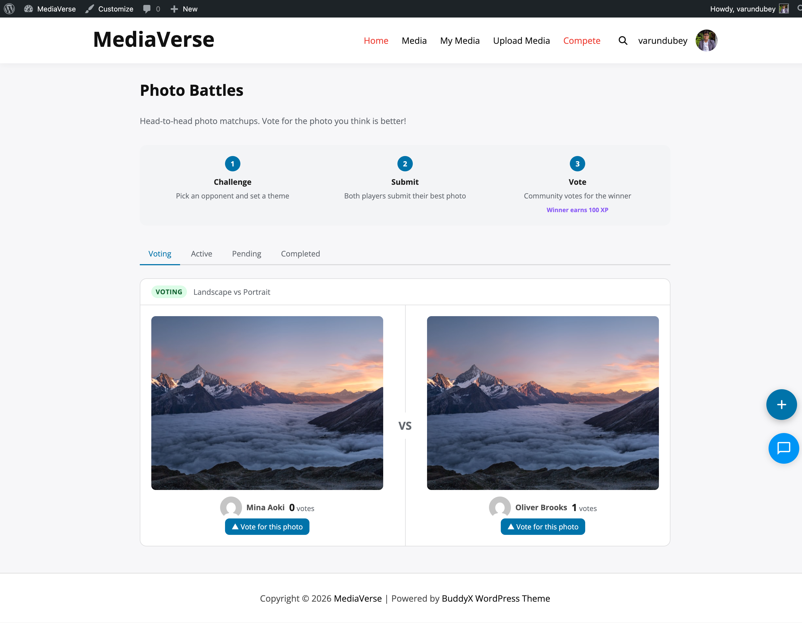

# Albums

> **Included in Free** - This feature is available in the free version of MediaVerse.


Group your own uploads into an album - tell a story, document a trip, or build a portfolio you can share with one link.

## What You Can Do

- Create albums to organize related photos and videos together
- Add photos from your existing media library to any album
- Set a cover photo that represents the album
- Set one privacy for a whole album: every photo in it follows the album
- Share albums with friends or keep them private
- Embed any album on a page using a block or shortcode

## How It Works (for Users)

1. Go to your media dashboard and click **Create Album**
2. Give your album a title and optional description
3. Choose a privacy level: public, members only, friends, or private
4. Click **Add Media** to pick photos from your uploads - select as many as you like
5. Drag photos in the album to reorder them. Click the star on any photo to set it as the cover
6. Click **Save Album** - your album is live and appears on your profile
7. To share your album, copy the album link from the album page and send it to anyone



## For Site Owners

1. Albums are enabled by default once MediaVerse is activated
2. To embed a specific album on a page, use the **MediaVerse: Album Viewer** block in the block editor - select the album from the block sidebar
3. Or use the shortcode `[mvs_album id="123"]` where `123` is the album's post ID
4. Users manage their own albums from their media dashboard
5. Admins can view and delete any album from **Media > Albums** in wp-admin
6. In the **Album Settings** box, **Album type** is a choice: Standard album or Playlist (audio only). A custom type set through the API stays selectable.
7. WordPress's password and private options are hidden for albums and collections. Who can see an album is its privacy in Album Settings.

## Album Privacy

One rule: **a photo in an album shows with the album's privacy. A photo in no album shows with its own.**

- Make an album **Private** and every photo in it stops appearing in Explore and in other members' feeds. Make it **Public** again and they come back.
- The album decides even when it is more open than a photo's own setting. Before you make an album more public, MediaVerse tells you how many photos in it are set to be more private, and asks you to confirm.
- Adding a photo that is more private than the album: the prompt names the photos and the button reads 'Show them as "<album privacy>"'.
- Changing an album to a stricter privacy asks first, for example: 'Changing this album to "Only me" makes its 3 photos show as "Only me" while they are in it.' Album privacy still wins while a photo is in the album.
- On the /album/ and /collection/ pages, private and members-only albums and collections are listed only to people allowed to see them.
- Each photo remembers its own privacy. Take it out of the album, or delete the album, and the photo goes back to the privacy you set for it.
- A photo belongs to **one album**. Picking a photo that is already in another album moves it; the album screen shows which album each photo is in ("In: Holiday") and says "Moves from Holiday" once you pick it.
- While a photo is in an album, its privacy setting on the Edit screen is shown but locked, with a note naming the album. Choose the album in the upload screen and the privacy choice is replaced by "Follows album ...".
- Badges show the privacy that applies, marked "(album)".

Updating to 2.6.0 changes nothing you can see: each photo's current privacy is recorded as its own, and the album rule applies the next time you change that album or its photos.

Site owners who want album and photo privacy to stay fully independent (the behaviour before 2.3.0) can return `false` from the `mvs_album_inherit_privacy` filter.

If a user can see the album but not a specific media item (because the item's privacy is more restrictive still), that item is hidden from the album view.

## Displaying an Album

**Gutenberg Block:** Add the **MediaVerse: Album Viewer** block, then select an album from the block settings.

**Shortcode:**
```
[mvs_album id="123"]
[mvs_album id="123" columns="4" show_title="true" show_description="true"]
```

| Attribute | Default | Description |
|-----------|---------|-------------|
| `id` | (required) | Album post ID |
| `columns` | `3` | Grid columns to display |
| `show_title` | `true` | Show the album title above the grid |
| `show_description` | `true` | Show the album description |

## REST API Endpoints for Albums

| Method | Endpoint | Description |
|--------|----------|-------------|
| `GET` | `/mvs/v1/albums` | List albums |
| `POST` | `/mvs/v1/albums` | Create album |
| `GET` | `/mvs/v1/albums/{id}` | Get album |
| `PUT` | `/mvs/v1/albums/{id}` | Update album |
| `DELETE` | `/mvs/v1/albums/{id}` | Delete album |
| `GET` | `/mvs/v1/albums/{id}/items` | List album media |
| `POST` | `/mvs/v1/albums/{id}/items` | Add media to album |
| `DELETE` | `/mvs/v1/albums/{id}/items/{media_id}` | Remove media from album |

### Creating an Album via API

```bash
curl -X POST https://yoursite.com/wp-json/mvs/v1/albums \
  -H "X-WP-Nonce: YOUR_NONCE" \
  -H "Content-Type: application/json" \
  -d '{
    "title": "Summer 2025",
    "description": "Photos from our trip",
    "privacy": "public"
  }'
```

### Adding Media to Albums via API

```bash
curl -X POST https://yoursite.com/wp-json/mvs/v1/albums/ALBUM_ID/items \
  -H "X-WP-Nonce: YOUR_NONCE" \
  -H "Content-Type: application/json" \
  -d '{"media_ids": [101, 102, 103]}'
```

This fires the `mvs_album_items_added` action, which triggers BuddyPress activity updates if BuddyPress is active.

### Audio playlists (API only)

An album can be an audio playlist: send `"type": "playlist"` when creating it. A playlist accepts only audio files (other files are skipped when added) and its album page plays the tracks in order.

Playlists are created through the REST API, for the mobile app and custom integrations. The member's "New album" form on the site has no type choice on purpose: most communities only need photo albums, and one simple form keeps it that way.

```bash
curl -X POST https://yoursite.com/wp-json/mvs/v1/albums \
  -H "X-WP-Nonce: YOUR_NONCE" \
  -H "Content-Type: application/json" \
  -d '{"title": "Rehearsal takes", "type": "playlist"}'
```

## BuddyPress Activity

When media is added to an album and BuddyPress is active, the `mvs_album_items_added` action updates the upload activity item to reference the album. This replaces the generic "uploaded media" activity with "uploaded media to [Album Name]".
