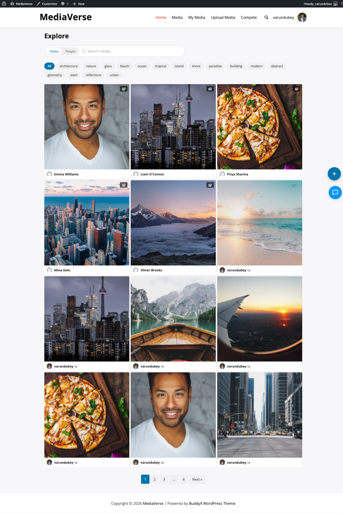

# Gutenberg Blocks

> **Included in Free** — This feature is available in the free version of WPMediaVerse.

WPMediaVerse registers 8 Gutenberg blocks under the **WPMediaVerse** block category. All blocks use the WordPress Interactivity API for reactive front-end behavior without a separate JavaScript framework.

## Block List

| Block Name | Handle | Description |
|------------|--------|-------------|
| Media Upload | `wpmediaverse/media-upload` | Frontend file upload form with drag-and-drop |
| Media Grid | `wpmediaverse/media-grid` | Filterable, paginated media gallery grid |
| Media Player | `wpmediaverse/media-player` | Single-item audio/video player with controls |
| Album Viewer | `wpmediaverse/album-viewer` | Displays a single album's media in a grid |
| Story Viewer | `wpmediaverse/story-viewer` | Recent uploaders bar — full story viewer coming soon |
| Media Stats | `wpmediaverse/media-stats` | Site-wide or per-user media statistics |
| Explore Feed | `wpmediaverse/explore-feed` | Infinite-scroll explore feed (all public media) |
| Lock Overlay | `wpmediaverse/lock-overlay` | Paywall/restriction overlay for any block |

## Interactivity API Architecture

Each block ships with a `view.js` module registered via `wp_enqueue_script_module()`. Blocks communicate through shared state in the `mvs` interactivity store. The `shared-ui` module provides common utilities (REST fetching, nonce management) shared by all blocks.

## Using Blocks in Templates

All 8 blocks can be used in Full Site Editing (FSE) templates, template parts, and block patterns. They are fully compatible with query blocks and block themes.

## Media Upload Block

**Block Settings:**
- Max Files per Upload (default: 10)
- Show Privacy Selector (default: on)

## Media Grid Block

**Block Settings:**
- Media Type Filter (image/video/audio/all)
- Category Filter
- Tag Filter
- Sort Order
- Lightbox (default: on)
- Show Reactions (default: on)

Grid columns and pagination inherit from **Media > Settings > Display**.

## Media Player Block

**Block Settings:**
- Media ID (required — use the picker to select)
- Autoplay (default: off)
- Loop (default: off)
- Show Download Button (default: off)

## Album Viewer Block

**Block Settings:**
- Album (select from a dropdown of your albums)
- Columns override
- Show Title / Show Description

## Story Viewer Block (Coming Soon)

Currently displays a horizontal bar of recent uploaders with circular avatars (visible in Instagram layout mode). A full story viewer with tap-to-advance navigation is planned for a future release.

## Media Stats Block

**Block Settings:**
- Show Views (default: on)
- Show Downloads (default: on)
- Show Reactions (default: on)
- Show Top Media (default: on)
- Top Media Count (default: 5)

## Explore Feed Block

The Explore Feed block provides an infinite-scroll feed of all public media. It supports URL-based filtering via `?mvs_tag=slug` and `?s=search-term` query parameters.

## Lock Overlay Block

The Lock Overlay block wraps any other block content and shows a restriction message to users who do not meet access criteria. Configure access rules via the **Access Control** REST API.
