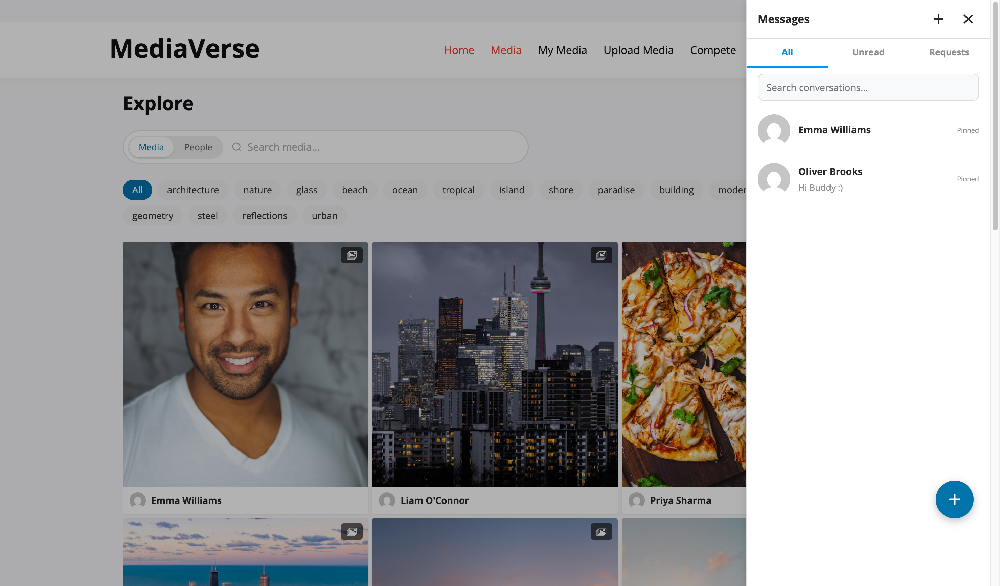

# Direct Messages

> **Included in Free** - This feature is available in the free version of WPMediaVerse.


Send private messages, share photos, record voice notes, and have real conversations - all without leaving your media community.

## What You Can Do

- Send a private message to any member directly from their profile
- Attach photos, videos, or audio, or share a media item from the gallery straight into chat
- Record and send short voice messages
- React to individual messages with any emoji
- See typing indicators and read receipts in real time
- Mute noisy conversations, pin important ones, or archive old chats
- Search across all your messages to find anything instantly
- Control who can message you: everyone, followers only, mutual followers only, or nobody

## How It Works (for Users)

### Starting a Conversation

1. Visit any member's profile page
2. Click **Message** - the chat panel opens in the bottom-right corner with that conversation ready
3. Type your message and press Enter to send

To start a conversation without visiting a profile:
1. Click the chat icon at the bottom of any page
2. Click the compose icon inside the chat panel
3. Search for the member by name or username and select them

### Sending a Voice Message

1. Open a conversation
2. Click the microphone icon in the message bar
3. Hold to record your message, then release to send
4. The recipient sees a playable audio clip in the conversation

### Sharing a Photo in Chat

1. Open a conversation
2. Click the media icon (photo frame) in the message bar
3. Browse your uploaded media and click any item to share it directly into the chat

### Managing Conversations

| Action | How to do it |
|--------|-------------|
| Mute | Open the conversation menu and click **Mute** - notifications are suppressed |
| Pin | Click **Pin** to keep the conversation at the top of your list |
| Archive | Click **Archive** to hide it from the main list. Find archived chats under the Archive tab |
| Search | Click the search icon in the panel header and type any word or phrase |

### Message Requests

If a member has restricted who can message them to followers only, your message goes to their **Requests** tab rather than their main inbox. They can accept or decline the request.

- **Accept** - Your conversation moves to their main inbox and messaging continues normally
- **Decline** - The request is removed. You are not notified of the decline



## For Site Owners

1. Go to **Media > Settings > Social** to configure site-wide DM defaults
2. Set who can send DMs by default: everyone, followers, mutual followers, or nobody
3. Set a minimum account age (in days) to prevent new accounts from sending DMs
4. Users can override their own DM access setting from their account settings
5. The chat panel appears automatically at the bottom of every page for logged-in users - no shortcode needed
6. To adjust how often the chat checks for new messages, set the polling interval (default: 3 seconds)

## Database Tables

| Table | Purpose |
|-------|---------|
| `mvs_conversations` | One row per conversation, stores metadata (muted, pinned, archived state per participant) |
| `mvs_conversation_participants` | Maps users to conversations (supports future group chat expansion) |
| `mvs_messages` | Individual messages with content, type, read status, and soft-delete flag |
| `mvs_message_reactions` | Emoji reactions attached to individual messages |

## Opening a Conversation

There are three ways to start or open a conversation:

- **From a profile page** - Click the **Message** button on any user's profile. The chat panel opens with that conversation pre-loaded. No searching required.
- **From the chat panel** - Click the compose icon inside the chat panel and search by username or display name.
- **Deep links** - Link directly to a conversation or user using a URL fragment:

| Fragment | Opens |
|----------|-------|
| `#mvs-chat/{conversationId}` | A specific conversation by ID |
| `#mvs-chat/user/{userId}` | The conversation with a specific user (creates one if none exists) |


## Chat Panel Features

| Feature | Description |
|---------|-------------|
| Text messages | Plain text with @mention support |
| Media attachments | Attach images, video, or audio. MediaVerse is a media platform, so documents (PDF, DOC, ZIP) are not accepted in chat as of 2.2.0 - a developer can extend the list with the `mvs_dm_allowed_file_types` filter. While a file uploads, the composer shows an "Uploading..." chip and Send waits for the upload to finish |
| Media sharing | Share a WPMediaVerse media item directly into a conversation |
| Voice messages | Record and send short audio clips |
| Emoji reactions | React to individual messages with any emoji |
| Typing indicators | Shows a live indicator when the other user is typing |
| Read receipts | Delivered and read timestamps shown per message |
| Message deletion | Delete your own messages (content replaced with "This message was deleted") |


## Conversation Management

| Action | How |
|--------|-----|
| Mute | Suppress notifications for a conversation without leaving it |
| Pin | Keep a conversation at the top of the conversation list |
| Archive | Hide a conversation from the main list; accessible via the Archive tab |
| Search | Full-text search across all your messages via the search icon in the panel header |

## Privacy Settings

Each user controls their DM privacy from their account settings. Admins set the site-wide defaults at **Media > Settings > Social**.

| Option | Key | Values |
|--------|-----|--------|
| Who can message me | `mvs_dm_access` | `everyone`, `followers`, `mutual`, `nobody` |
| Minimum account age | `mvs_dm_min_age` | Integer (days). Prevents newly registered accounts from sending DMs. |
| Show online status | `mvs_show_online_status` | `everyone`, `followers`, or `nobody` |

When `mvs_dm_access` is set to `nobody`, the **Message** button is hidden on that user's profile.

## Content Moderation (1.9.0)

Every outgoing DM passes through the `mvs_message_content_check` filter before it is stored, the same seam other content types on the site already use to reject disallowed words. On its own, WPMediaVerse Free doesn't ship a word-blocklist for messages - the filter is what lets a host (a full community stack like BuddyNext, or your own mu-plugin) block a message the moment it's sent, so a member can't route banned words through a DM that would otherwise be caught in a comment or activity post. A blocked send returns an error instead of saving the message.

```php
add_filter( 'mvs_message_content_check', function( $result, $content, $sender_id, $conversation_id ) {
    if ( str_contains( strtolower( $content ), 'bannedword' ) ) {
        return new WP_Error( 'content_blocked', 'That word is not allowed.' );
    }
    return $result; // true lets the message through.
}, 10, 4 );
```

## Transport

The chat panel polls the REST API to fetch new messages. There are three intervals (in milliseconds), chosen by context: an open conversation polls fastest, the conversation list slower, and a closed panel slowest. The defaults are `active` 3000, `list` 10000, and `background` 30000.

Filter the intervals with `mvs_messaging_poll_intervals`:

```php
add_filter( 'mvs_messaging_poll_intervals', function( $intervals ) {
    $intervals['active'] = 2000; // Poll the open conversation every 2 seconds.
    return $intervals;
} );
```

## REST API

**Base URL:** `/wp-json/mvs/v1/`

All endpoints require a logged-in user. Pass the `X-WP-Nonce` header with a nonce from `wp_create_nonce( 'wp_rest' )`.

### POST /conversations

Start a new conversation.

**Body:**

```json
{ "recipient_id": 42 }
```

**Response:** `201 Created` with the new conversation object, or `200 OK` with the existing conversation if one already exists between the two users.

---

### GET /me/conversations

List all conversations for the current user. Excludes archived conversations unless `?include_archived=1` is passed.

**Parameters:**

| Parameter | Type | Default | Description |
|-----------|------|---------|-------------|
| `include_archived` | int | `0` | Set to `1` to include archived conversations |
| `per_page` | int | `20` | Conversations per page |
| `page` | int | `1` | Page number |

---

### GET /conversations/{id}/messages

List messages in a conversation. The current user must be a participant.

**Parameters:**

| Parameter | Type | Default | Description |
|-----------|------|---------|-------------|
| `per_page` | int | `30` | Messages per page |
| `before` | int | `0` | Return messages with ID lower than this value (for pagination). `0` means no cursor. |

---

### POST /conversations/{id}/messages

Send a message. The current user must be a participant and must satisfy the recipient's `mvs_dm_access` setting.

**Body (JSON or multipart/form-data for file attachments):**

| Field | Required | Description |
|-------|----------|-------------|
| `content` | No | Text content. Defaults to empty string. |
| `message_type` | No | Message type: `text` (default), `media_share`, `image`, `video`, `audio`, `voice`, `file`, `system`. Unknown values fall back to `text`. |
| `media_id` | No | WPMediaVerse media ID when `message_type=media_share` |
| `attachment_id` | No | WordPress attachment ID from a prior `POST /messages/upload`, used for `image`/`video`/`audio`/`voice`/`file` messages |
| `parent_id` | No | Message ID to reply to. Creates a threaded reply visible under the parent message. |
| `metadata` | No | Object of extra data (e.g. `{ "duration": 12 }` for voice messages). |

**Response:** `201 Created` with the new message object.

---

### GET /conversations/{id}/messages/search

Search message content within a single conversation (1.9.0). The current user must be a participant.

**Parameters:**

| Parameter | Type | Default | Description |
|-----------|------|---------|-------------|
| `q` | string | (required) | Search term matched against message content |
| `per_page` | int | `50` | Matching messages per page |

**Response:** Array of matching message objects, same shape as `GET /conversations/{id}/messages`.

---

### POST /messages/upload

Upload a file to use as a DM attachment. Returns the WordPress attachment ID to pass as `attachment_id` in a subsequent `POST /conversations/{id}/messages` call.

**Body:** `multipart/form-data` with a `file` field.

**Allowed types (2.2.0):** media only - `image/jpeg`, `image/png`, `image/gif`, `image/webp`, `audio/webm`, `audio/mp4`, `audio/mpeg`, `audio/ogg`, `video/mp4`, `video/webm`. The real MIME is sniffed server-side (`finfo`), so renaming a file does not bypass the check; anything else returns `400 File type not allowed.` Extend the list with the `mvs_dm_allowed_file_types` filter. (The `file` message type remains for messages sent before 2.2.0.)

**Response:** `200 OK`

```json
{ "id": 123, "source_url": "https://yoursite.com/...", "thumbnail": "https://yoursite.com/..." }
```

---

### PATCH /conversations/{id}

Update conversation state for the current user.

**Body:**

| Field | Type | Description |
|-------|------|-------------|
| `is_muted` | bool | Set to `true` to mute, `false` to unmute |
| `is_pinned` | bool | Set to `true` to pin, `false` to unpin |
| `is_archived` | bool | Set to `true` to archive, `false` to restore |

**Response:** `200 OK` with the updated conversation object.

---

### DELETE /conversations/{id}

Delete a conversation for the current user. The conversation remains visible to the other participant.

**Response:** `204 No Content`

---

### DELETE /messages/{id}

Soft-delete a message. Requires ownership of the message. The message record is kept but its content is replaced and `is_deleted` is set to `1`.

---

### DELETE /messages/{id}/unsend

Hard-delete a message. Only available within the edit window (default: 5 minutes after sending). Requires ownership of the message. The message record is permanently removed.

**Response:** `204 No Content`

---

### GET /me/messages/unread-count

Return the total number of unread messages across all conversations for the current user. Used to update the chat panel badge.

**Response:**

```json
{ "unread": 4 }
```

---

### POST /messages/{id}/reactions

Add or change a reaction on a message.

```json
{ "emoji": "❤️" }
```

To remove a reaction, call `DELETE /messages/{id}/reactions`.

---

## Actions and Filters

### `mvs_message_sent`

Fires after a message is successfully saved.

```php
add_action( 'mvs_message_sent', function( $message_id, $conversation_id, $sender_id, $recipient_ids ) {
    // React to the new message.
}, 10, 4 );
```

### `mvs_message_types`

Filter the list of allowed message types accepted by the send endpoint.

```php
add_filter( 'mvs_message_types', function( $types ) {
    return $types; // Default: text, media_share, image, video, audio, voice, file, system.
} );
```

### `mvs_messaging_poll_intervals`

Filter the client-side polling intervals (in milliseconds) delivered to the front end. See the Transport section above.

### `mvs_message_content_check`

Filter fired before a message is stored. Return a `WP_Error` to block the send; return the passed-in `true` (or anything not a `WP_Error`) to let it through. See the Content Moderation section above.
