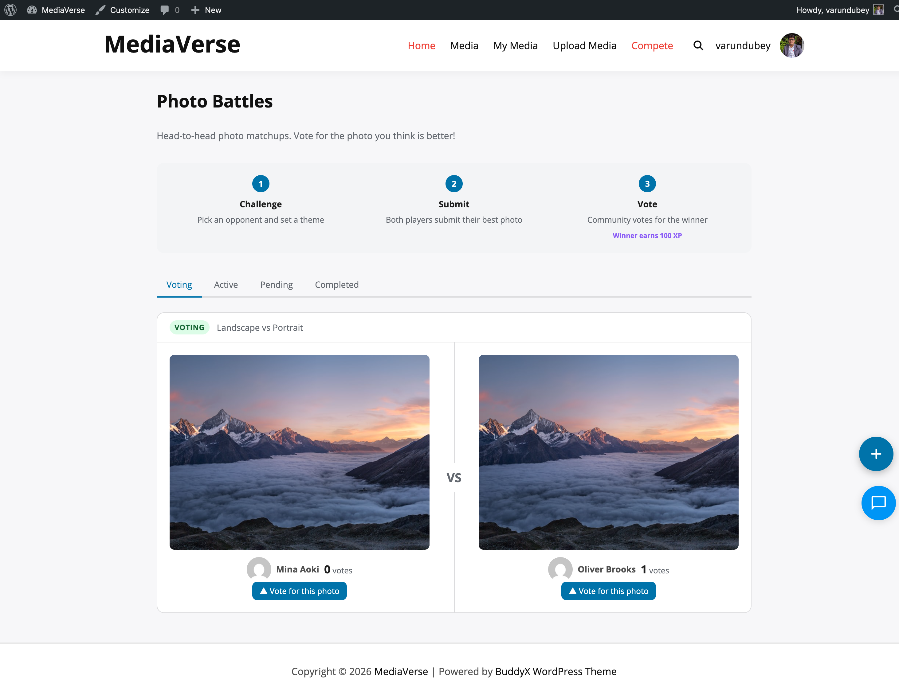

# Media Upload

> **Free + Pro** - Core functionality is included free. Features marked with **(Pro)** require WPMediaVerse Pro.


Share photos, videos, and audio with your community - no admin access needed, straight from any page on your site.

## What You Can Do

- Drag and drop files directly onto the upload zone
- Paste an image from your clipboard to upload instantly
- Select multiple files at once for bulk upload
- Set a title, description, and tags for each file before submitting
- Choose who can see each file: public, members only, friends, or private
- Upload JPEG, PNG, GIF, WebP images; MP4 and WebM videos; MP3 and OGG audio

## How It Works (for Users)

1. Go to the upload page your site administrator set up (often `/upload/` or `/media/upload/`)
2. Drag your files onto the upload zone, or click **Browse** to pick files from your device
3. To paste a screenshot or copied image, click inside the upload zone and press Ctrl+V (Cmd+V on Mac)
4. For each file, enter a title and optional tags. Select a privacy level from the dropdown
5. Click **Upload** - a progress bar shows each file uploading
6. When finished, your files appear in your media dashboard and your profile page
7. Find all your uploads anytime under **My Media** or your profile's Media tab



## For Site Owners

1. Go to **Media > Settings > General** and confirm the allowed file types match what your community needs
2. Add the upload form to any page: in the block editor, insert the **WPMediaVerse: Media Upload** block; in the classic editor, add `[mvs_upload]`
3. Set the default privacy level and maximum file size for your site
4. Enable **Strip EXIF Data** (on by default) to automatically remove GPS coordinates from photos before storage
5. Users see the upload form immediately on that page when logged in

## Supported File Formats

| Type | Formats |
|------|---------|
| Images | JPEG, PNG, GIF, WebP |
| Video | MP4, WebM |
| Audio | MP3 (MPEG), OGG |

Customize allowed types in **Media > Settings > General**.

## Upload Modal (1.9.0, 2.0.0)

The upload modal no longer asks you to pick a media type tab first - drop in an image, video, or audio file and WPMediaVerse auto-detects the type (1.9.0).

When uploading into an album, you can create a brand-new album right from the upload modal instead of leaving to create one first, then switching back to upload into it (2.0.0).

## Bulk Album Upload (1.2.0)

When uploading multiple files at once into an album, WPMediaVerse now creates **one** activity entry for the whole batch ("Varun uploaded 3 photos to album Portrait Series") with a thumbnail grid, instead of one separate activity per file. Single-file uploads and ad-hoc photo posts retain their existing per-post behaviour.

## Per-Media Edit Modal (1.2.0)

The settings cog on dashboard cards now opens a prefilled edit modal - change title, description, privacy level, and per-media **Allow Downloads** in place. Save updates the row live without a page reload. The matching `PUT /mvs/v1/media/{id}` REST endpoint accepts an `allow_download` boolean.

When you change the title, the URL slug stays stable by default. Tick the new **Update URL slug** checkbox if you want the slug regenerated from the new title - the page redirects to the new URL automatically so existing tabs and bookmarks don't 404.

## What Happens After Upload

- Thumbnails are generated automatically for images and videos (videos: ffmpeg poster extraction; run `wp mvs generate-video-thumbnails` to backfill any uploaded before 1.2.0)
- EXIF GPS data is stripped from JPEG files (other metadata like camera model is kept)
- A SHA-256 hash is computed to detect duplicate files
- If AI moderation is enabled, the file is queued for automatic review
- BuddyPress activity is recorded if BuddyPress is active on your site

## Adding the Upload Form

**Gutenberg Block:** Add the **WPMediaVerse: Media Upload** block to any page or post.

**Shortcode:**
```
[mvs_upload]
[mvs_upload max_files="5" show_privacy="true"]
```

| Attribute | Default | Description |
|-----------|---------|-------------|
| `max_files` | `10` | Maximum number of files the user can upload at once |
| `show_privacy` | `true` | Whether to show the privacy level selector |

## Upload Validation

Every upload goes through these checks in order:

1. **MIME type check** - file content is inspected (not just the extension) against your allowed types list.
2. **File size check** - measured server-side against `mvs_max_upload_size` (default 100 MB).
3. **Extension block list** - blocks PHP, shell, and other executable extensions even if the MIME passes.
4. **Double extension block** - rejects filenames like `photo.php.jpg`.
5. **Duplicate detection** - computes a SHA-256 hash and compares against existing uploads. Behavior depends on your **Duplicate Detection** setting (warn, skip, or allow).

## EXIF Stripping

When **Strip EXIF Data** is enabled (default), GPS coordinates and device metadata are removed from JPEG images before storage. Non-GPS EXIF data (camera model, focal length) is retained.

## Storage Path

Files are stored at:

```
wp-content/uploads/wpmediaverse/YYYY/MM/filename.ext
```

WordPress's `wp_unique_filename()` prevents filename collisions.

## Programmatic Upload

Use the `UploadService` to upload files from code:

```php
$upload_service = WPMediaVerse\Core\Plugin::container()->get( 'upload' );

$result = $upload_service->handle(
    $_FILES['my_file'],
    get_current_user_id(),
    array(
        'title'       => 'My File',
        'privacy'     => 'public',
        'description' => 'Optional description',
    )
);

if ( is_wp_error( $result ) ) {
    // Handle error.
} else {
    $media_id = $result; // int - new mvs_media post ID.
}
```

## Actions Fired During Upload

- `mvs_before_media_insert` - fires before the `mvs_media` post is created.
- `mvs_before_upload_form` - fires before the upload form HTML is rendered (used by Pro for quota display).
- `mvs_media_uploaded` - fires after the post is created and indexed. Passes `$media_id` (int), an array of file metadata (`file_url`, `file_path`, `file_size`, `file_type`, `file_hash`, `media_type`, `privacy`, etc.), `$user_id` (int), and `$media_type` (string).

## Media Metadata

Media metadata is stored in WPMediaVerse's own `mvs_media_meta` table (keyed by media ID), not in WordPress post meta. Access it through the `MediaRepository` (`->get( $media_id, $key )`). Common keys:

| Meta Key | Type | Description |
|----------|------|-------------|
| `file_url` | string | Public URL of the stored file |
| `file_path` | string | Relative storage path |
| `media_type` | string | `image`, `video`, `audio`, or `document` |
| `file_type` | string | Full MIME type (e.g., `image/jpeg`) |
| `file_size` | int | File size in bytes |
| `privacy` | string | Privacy level (see Privacy & Access Control) |
| `file_hash` | string | SHA-256 hash for duplicate detection |
| `group_id` | int | BuddyPress group ID (for group privacy) |
