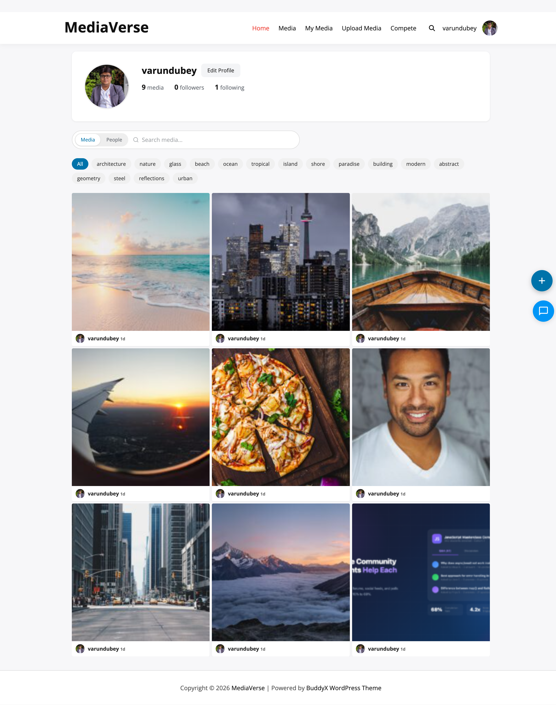

# Shortcodes

> **Included in Free** - This feature is available in the free version of WPMediaVerse.


WPMediaVerse provides **12** shortcodes for embedding media features in pages, posts, and classic editor content.

## [mvs_gallery]

Displays a filterable media grid. Columns and items-per-page come from **Media > Settings > Display** and cannot be overridden by shortcode attributes.

```
[mvs_gallery]
[mvs_gallery type="image" category="nature" tag="summer" orderby="date"]
```

| Attribute | Default | Description |
|-----------|---------|-------------|
| `type` | (all types) | Filter by media type: `image`, `video`, or `audio` |
| `category` | (all) | Filter by `mvs_category` slug |
| `tag` | (all) | Filter by `mvs_tag` slug |
| `user_id` | (all authors) | Filter to a single author. Pair with `orderby="popular"` for a "Top media by this member" embed. |
| `orderby` | `date` | Sort order: `date`, `title`, `views`, `popular`, `reactions`, or `random`. |
| `order` | `desc` | Sort direction: `asc` or `desc`. |

## [mvs_upload]

Displays the frontend file upload form. The form is only functional for logged-in users.

```
[mvs_upload]
[mvs_upload max_files="5" show_privacy="true"]
```

| Attribute | Default | Description |
|-----------|---------|-------------|
| `max_files` | `10` | Maximum number of files selectable at once |
| `show_privacy` | `true` | Show privacy level selector on the form |

This shortcode fires the `mvs_before_upload_form` action before rendering.

## [mvs_album]

Displays a single album by ID.

```
[mvs_album id="123"]
[mvs_album id="123" columns="4" show_title="true" show_description="false"]
```

| Attribute | Default | Description |
|-----------|---------|-------------|
| `id` | (required) | Album post ID |
| `columns` | `3` | Grid columns |
| `show_title` | `true` | Show album title |
| `show_description` | `true` | Show album description |

## [mvs_player]

Embeds a single media item in an interactive player.

```
[mvs_player id="456"]
[mvs_player id="456" autoplay="false" loop="false" download="false"]
```

| Attribute | Default | Description |
|-----------|---------|-------------|
| `id` | (required) | Media post ID |
| `autoplay` | `false` | Start playback automatically (audio/video) |
| `loop` | `false` | Loop the media after it finishes |
| `download` | `false` | Show a download button |

## [mvs_stats]

Displays site-wide media statistics.

```
[mvs_stats]
[mvs_stats views="true" downloads="true" reactions="true" top="true" top_count="5"]
```

| Attribute | Default | Description |
|-----------|---------|-------------|
| `views` | `true` | Show total view count |
| `downloads` | `true` | Show total download count |
| `reactions` | `true` | Show total reaction count |
| `top` | `true` | Show the top media list |
| `top_count` | `5` | Number of items in the top media list |

## [mvs_dashboard]

Displays a personal media dashboard for the logged-in user. Shows the user's own uploads, albums, and stats. Redirects to login if the user is not logged in.

```
[mvs_dashboard]
```

No configurable attributes. The dashboard uses the `dashboard-view` Interactivity API block store.

## [mvs_collection]

Displays a collection by ID. Works for both manual and smart collections.

```
[mvs_collection id="789"]
[mvs_collection id="789" columns="3" per_page="20"]
```

| Attribute | Default | Description |
|-----------|---------|-------------|
| `id` | (required) | Collection post ID |
| `columns` | `3` | Grid columns |
| `per_page` | `20` | Maximum items to show |

## [mvs_profile_edit]

Displays a profile edit form for the logged-in user, allowing them to update their first name, last name, display name, bio, and avatar. Redirects to login if not logged in.

```
[mvs_profile_edit]
```

No configurable attributes. The form is powered by the `mvs/profile-edit` Interactivity API store and saves to `/mvs/v1/profile`.



## [mvs_explore_feed]

Embeds the explore archive - infinite-scroll public media feed with filter chips and the new search autocomplete dropdown. Use this when you want the explore experience on a custom page rather than the dedicated archive route.

```
[mvs_explore_feed]
[mvs_explore_feed layout="grid" columns="3" per_page="12" filters="true" search="true"]
```

| Attribute | Default | Description |
|-----------|---------|-------------|
| `layout` | `grid` | Feed layout. |
| `columns` | `3` | Grid columns. |
| `per_page` | `12` | Items per page. |
| `filters` | `true` | Show the filter chips. |
| `search` | `true` | Show the search input with autocomplete. |

## [mvs_lock_overlay]

Renders a privacy lock overlay for a single media item. If the current user has access, the overlay falls through and renders the player or image inline. If they do not, the overlay shows the configured restriction message.

```
[mvs_lock_overlay id="456"]
[mvs_lock_overlay id="456" blur="20" overlay_opacity="60" unlock_label="Restricted Content"]
```

| Attribute | Default | Description |
|-----------|---------|-------------|
| `id` | (required) | Media post ID to evaluate access against. |
| `blur` | `20` | Blur amount applied to the locked preview. |
| `overlay_opacity` | `60` | Overlay opacity (0–100). |
| `unlock_label` | (empty) | Custom restriction label. |

## [mvs_member_photos]

Renders a member's media grid. Auto-resolves the user - explicit `user_id` attribute first, then the BuddyPress displayed user, then the post author, then the current user - so the same shortcode works on profile pages, member-specific landing pages, and author archives.

> Added in 1.2.0.

```
[mvs_member_photos]
[mvs_member_photos user_id="42" columns="3" per_page="12" type="image" show_header="true" actions="true"]
```

| Attribute | Default | Description |
|-----------|---------|-------------|
| `user_id` | (auto-detect) | Force a specific user. Leave empty to use the four-step resolution chain. |
| `columns` | `3` | Grid columns. |
| `per_page` | `12` | Items per page. |
| `type` | (all types) | Filter by media type: `image`, `video`, or `audio`. |
| `show_header` | `true` | Show the member header above the grid. |
| `actions` | `true` | Show per-item action controls. |

## [mvs_pdf_viewer]

Embeds a PDF using the browser-native viewer (the `#view=FitH` URL fragment). No third-party JS, no licensing concerns.

> Added in 1.2.0.

```
[mvs_pdf_viewer id="123"]
[mvs_pdf_viewer id="123" height="800" toolbar="false"]
```

| Attribute | Default | Description |
|-----------|---------|-------------|
| `id` | (required) | Media ID of the PDF. |
| `height` | `600` | Viewer height in pixels. Range: 200–1400. |
| `toolbar` | `true` | Show or hide the browser PDF toolbar. `true` to show, `false` to hide. |

## Usage History

> Free. Requires a logged-in visitor - renders nothing for guests.

Shows the current member's own upload usage ledger. Useful on an account page beside the quota widget when you sell upload packages with Pro.

```
[mvs_usage_history]
[mvs_usage_history limit="50"]
```

| Attribute | Default | Description |
|-----------|---------|-------------|
| `limit` | `20` | Number of ledger rows to show, most recent first. |

## [mvs_documents]

> Free shortcode, Pro engine. With the Documents master toggle off it renders nothing (an administrator sees a one-line notice saying why). Folder listings need Pro; without it an editor sees "Folder listings need WPMediaVerse Pro" and a visitor sees nothing.

Lists the current member's documents. Paginates through the `doc_page` query parameter and accepts a `doc_type` query parameter that overrides the `type` attribute.

```
[mvs_documents]
[mvs_documents per_page="50" type="pdf"]
[mvs_documents folder="12"]
```

| Attribute | Default | Description |
|-----------|---------|-------------|
| `per_page` | `20` | Rows per page. Clamped to 1-100. |
| `type` | (all) | Named document type to filter on. Overridden by a `doc_type` query parameter. |
| `folder` | `0` | Scope the list to one folder. Requires Pro. |

## Pro: [mvs_document]

> Requires WPMediaVerse Pro.

Embeds one document inline. A non-document media ID is refused, so the shortcode cannot become a second unguarded route to a photo.

```
[mvs_document id="123"]
[mvs_document id="123" download_only="1"]
```

| Attribute | Default | Description |
|-----------|---------|-------------|
| `id` | `0` | Document media ID. Required. |
| `download_only` | `0` | `1` renders a download card instead of the inline viewer. |

## Pro: Compete shortcodes

> These require WPMediaVerse Pro, and each one needs its feature toggle enabled. With the toggle off the shortcode renders nothing rather than an error.

Every block in the Compete set has a matching shortcode, so you can place competitions on a classic-editor page or inside a page builder.

| Shortcode | Feature toggle | Purpose |
|-----------|----------------|---------|
| `[mvs_pro_compete_hub]` | any Compete feature | The combined hub - challenges, battles, tournaments and leaderboard in one tabbed surface. |
| `[mvs_pro_challenge id="12"]` | `mvs_challenges_enabled` | One challenge, with its entry or voting interface. |
| `[mvs_pro_challenges_list]` | `mvs_challenges_enabled` | All challenges, grouped by state. |
| `[mvs_pro_battle id="8"]` | `mvs_battles_enabled` | One head-to-head battle with its voting UI. |
| `[mvs_pro_battles_active]` | `mvs_battles_enabled` | Every battle currently open for voting. |
| `[mvs_pro_tournament id="3"]` | `mvs_tournaments_enabled` | One tournament bracket. |
| `[mvs_pro_tournaments_list]` | `mvs_tournaments_enabled` | All tournaments, grouped by state. |
| `[mvs_pro_leaderboard]` | - | Top creators ranking. |

The single-item shortcodes (`mvs_pro_challenge`, `mvs_pro_battle`, `mvs_pro_tournament`) take a required `id` attribute and render nothing when it is missing or zero.

### Leaderboard attributes

```
[mvs_pro_leaderboard source="reactions" window="month" per-page="25"]
```

| Attribute | Default | Description |
|-----------|---------|-------------|
| `source` | `reactions` | What to rank by. |
| `window` | `all` | Time window for the ranking. `all` counts everything. |
| `per-page` | `10` | Number of creators listed. |

### Presentation attributes

All eight Compete shortcodes accept the same optional presentation attributes, which map to the equivalent block settings. Leave them empty to inherit your theme's styling.

| Attribute | Description |
|-----------|-------------|
| `padding-desktop`, `padding-tablet`, `padding-mobile` | Per-breakpoint padding. |
| `margin-desktop`, `margin-tablet`, `margin-mobile` | Per-breakpoint margin. |
| `border-width`, `border-color`, `border-radius` | Border styling. |
| `shadow-enabled`, `shadow-offset-x`, `shadow-offset-y`, `shadow-blur` | Drop shadow. |

Use hyphens in shortcode attributes (`padding-desktop`); they are converted to the camelCase block attributes internally.

## Pro: Layout feed shortcodes

> Require WPMediaVerse Pro. See [Layout Modes](../pro-features/layout-modes.md) for what each layout looks like.

| Shortcode | Layout |
|-----------|--------|
| `[mvs_pro_instagram_feed]` | Instagram-style square grid |
| `[mvs_pro_flickr_feed]` | Flickr-style justified rows |
| `[mvs_pro_pinterest_feed]` | Pinterest-style masonry columns |
| `[mvs_pro_dribbble_feed]` | Dribbble-style cards with stats |

These accept the same presentation attributes as the Compete shortcodes.
