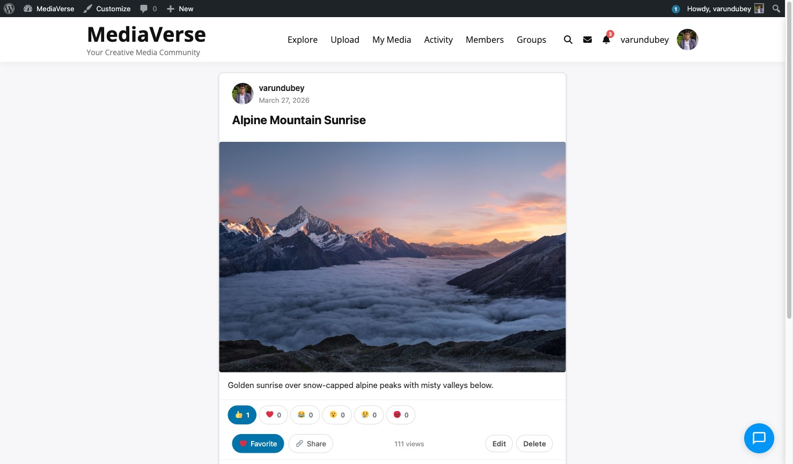

# Social Features

> **Included in Free** — This feature is available in the free version of WPMediaVerse.


React, comment, follow, and share — WPMediaVerse turns your media site into a living community where every photo starts a conversation.

## What You Can Do

- React to any photo or video with emoji reactions (like, love, wow, and more)
- Comment on media and edit your comment within 15 minutes of posting
- Follow photographers you love — their new uploads appear in your feed
- Save media to your favorites for quick access later
- @mention other members in comments to notify them directly
- Share any public media item to social networks or copy a direct link
- Report inappropriate content directly from the media page

## How It Works (for Users)

### Following Someone

1. Visit any member's profile page
2. Click **Follow** — their public uploads now appear in your feed
3. To stop following, click **Unfollow** on their profile
4. See everyone you follow under **My Media > Following**

### Reacting to Media

1. Open any media item
2. Click the reaction bar below the photo
3. Choose your reaction — like, love, wow, haha, sad, or angry
4. Your reaction is shown instantly. Click the same reaction to remove it
5. Click a different reaction to change yours



### Commenting

1. Scroll to the comments section below any media item
2. Type your comment in the text box and press Enter or click **Post**
3. To @mention someone, type `@` followed by their username — they receive a notification
4. To edit your comment, click the pencil icon next to it (available within 15 minutes of posting)
5. To delete your comment, click the trash icon

### Saving to Favorites

1. Click the heart icon on any media item
2. The item is added to your favorites list
3. Find all your favorites under **My Media > Favorites** in your dashboard
4. To save to a named collection instead, click the bookmark icon and choose or create a collection

### Sharing Media

1. Open any public media item
2. Click **Share** to see options: copy the direct link, or share to social networks
3. The share link respects the media's privacy — private media returns an error for unauthorized viewers

## For Site Owners

1. All social features are enabled by default
2. Configure reaction types and moderation in **Media > Settings > Social**
3. Set the comment edit window (default: 15 minutes) in **Media > Settings > Social**
4. Set the auto-hide threshold: when a media item receives a certain number of reports, it is automatically hidden and sent to the moderation queue
5. BuddyPress notifications fire automatically for reactions, comments, and mentions when BuddyPress is active

## Reactions

WPMediaVerse uses a custom reactions system stored in a dedicated database table, separate from WordPress post meta.

### REST API

| Method | Endpoint | Description |
|--------|----------|-------------|
| `GET` | `/mvs/v1/media/{id}/reactions` | Get reaction counts for a media item |
| `POST` | `/mvs/v1/media/{id}/reactions` | Add or change your reaction |
| `DELETE` | `/mvs/v1/media/{id}/reactions` | Remove your reaction |

### Action: `mvs_reaction_added`

Fires when a reaction is added. BuddyPress integration uses this to send notifications.

```php
do_action( 'mvs_reaction_added', $media_id, $user_id, $reaction_type );
```

## Comments

WPMediaVerse uses a custom comments system stored in a dedicated table, separate from WordPress's `wp_comments`.


### REST API

| Method | Endpoint | Description |
|--------|----------|-------------|
| `GET` | `/mvs/v1/media/{id}/comments` | List comments on a media item |
| `POST` | `/mvs/v1/media/{id}/comments` | Post a new comment |
| `PUT` | `/mvs/v1/media/{id}/comments/{comment_id}` | Edit a comment |
| `DELETE` | `/mvs/v1/media/{id}/comments/{comment_id}` | Delete a comment |

### Action: `mvs_comment_created`

```php
do_action( 'mvs_comment_created', $comment_id, $media_id, $user_id );
```

BuddyPress integration uses this to record activity and send notifications.

## Favorites

Users can save media items to their favorites or to a named collection.

### REST API

| Method | Endpoint | Description |
|--------|----------|-------------|
| `POST` | `/mvs/v1/media/{id}/favorite` | Add to favorites |
| `DELETE` | `/mvs/v1/media/{id}/favorite` | Remove from favorites |
| `GET` | `/mvs/v1/favorites` | List the current user's favorites |

## Follows

Users can follow other users to see their public media in a feed.

### REST API

| Method | Endpoint | Description |
|--------|----------|-------------|
| `POST` | `/mvs/v1/users/{id}/follow` | Follow a user |
| `DELETE` | `/mvs/v1/users/{id}/follow` | Unfollow a user |
| `GET` | `/mvs/v1/users/{id}/followers` | List a user's followers |
| `GET` | `/mvs/v1/users/{id}/following` | List who a user follows |

## Mentions

Users can @mention each other in comments. Mentioned users receive a notification.

### Action: `mvs_mentions_created`

```php
do_action( 'mvs_mentions_created', $mentioned_user_ids, $comment_id );
```

## Sharing

The `ShareService` provides share URL generation for media items. Shareable links respect the media's privacy level — private media returns a 403 when accessed via a share link by an unauthorized user.

## Reports

Users can report inappropriate media content.

### REST API

| Method | Endpoint | Description |
|--------|----------|-------------|
| `POST` | `/mvs/v1/media/{id}/report` | Submit a content report |

When the number of reports for a single media item reaches the **Auto-Hide Threshold** (set in AI & Moderation settings), the media is automatically hidden and added to the moderation queue.
