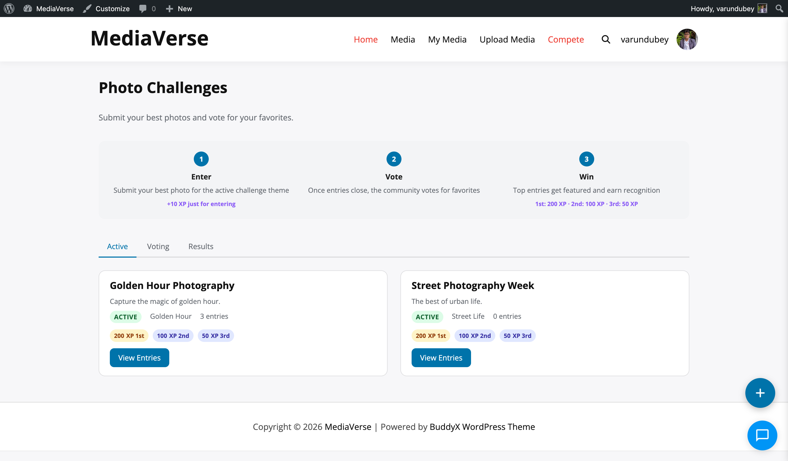

# User Blocking & Reporting

> **Included in Free** - This feature is available in the free version of WPMediaVerse.


WPMediaVerse includes a blocking system that prevents specific users from interacting with you and a reporting system that lets users flag abusive content or accounts for moderator review.



## Blocking a User

You can block a user from two places:

- **From their profile page** - Open the action menu on the user's profile card and select **Block User**.
- **From the report flow** - After submitting a report against a user, you are offered the option to also block them.

### What Blocking Does

When you block a user, they cannot:

- View your media items (media items are hidden from them on all browse pages and their direct URLs return a 403)
- Send you direct messages (your profile shows no Message button for them; any existing conversation is locked)
- Follow you (the Follow button is removed for them)
- Comment on your media
- React to your media

Blocking is one-directional. You can still view the blocked user's public media unless you also choose to hide it.

Blocks are stored per-user and do not require any admin action.


## Unblocking a User

Go to **Account Settings > Blocked Users** to see your full block list and remove individual blocks. You can also unblock via the REST API.

## User Reporting

Reporting a user notifies the site moderators. It does not automatically take any action on the reported account.

To report a user, open the action menu on their profile card and select **Report User**. Choose a reason from the dropdown and optionally add a note.

### Report Reasons

| Value | Label |
|-------|-------|
| `spam` | Spam or fake account |
| `inappropriate` | Inappropriate behavior |
| `harassment` | Harassment or bullying |
| `impersonation` | Impersonating someone |
| `other` | Other |

Reports appear in **Media > Moderation Queue** under the Users tab. Moderators with the `moderate_mvs_media` capability can review, dismiss, or act on reports.

## Media Reporting

Any logged-in user can report a media item from the media card or the media detail page using the flag icon.

### Report Reasons

| Value | Label |
|-------|-------|
| `spam` | Spam or misleading |
| `inappropriate` | Sexually inappropriate |
| `copyright` | Copyright violation |
| `harassment` | Harassment or hate speech |
| `other` | Other |

When a media item accumulates reports equal to the **Auto-Hide Threshold** set in **Media > Settings > AI & Moderation**, it is automatically hidden and added to the moderation queue.


## REST API

**Base URL:** `/wp-json/mvs/v1/`

All endpoints require a logged-in user. Pass the `X-WP-Nonce` header with a nonce from `wp_create_nonce( 'wp_rest' )`.

### POST /users/{id}/block

Block a user.

**Response:** `200 OK`

```json
{ "blocked": true }
```

---

### DELETE /users/{id}/block

Unblock a user.

**Response:** `200 OK`

```json
{ "blocked": false }
```

---

### GET /me/blocked

List users blocked by the current user.

**Parameters:**

| Parameter | Type | Default | Description |
|-----------|------|---------|-------------|
| `per_page` | int | `20` | Blocked users per page |
| `page` | int | `1` | Page number |

**Response:** Array of user objects with `id`, `name`, and `avatar_url`.

---

### POST /users/{id}/report

Report a user account.

**Body:**

| Field | Required | Description |
|-------|----------|-------------|
| `reason` | Yes | One of: `spam`, `inappropriate`, `harassment`, `impersonation`, `other` |
| `note` | No | Optional free-text note visible to moderators (max 500 characters) |

**Response:** `201 Created`

```json
{ "report_id": 17, "status": "pending" }
```

---

### POST /media/{id}/report

Report a media item.

**Body:**

| Field | Required | Description |
|-------|----------|-------------|
| `reason` | Yes | One of: `spam`, `inappropriate`, `copyright`, `harassment`, `other` |
| `note` | No | Optional free-text note (max 500 characters) |

**Response:** `201 Created`

```json
{ "report_id": 24, "status": "pending" }
```

---

## Actions and Filters

### `mvs_user_blocked`

Fires after a user is blocked.

```php
add_action( 'mvs_user_blocked', function( $blocker_id, $blocked_id ) {
    // Perform additional cleanup or logging.
}, 10, 2 );
```

### `mvs_user_reported`

Fires after a user report is submitted.

```php
add_action( 'mvs_user_reported', function( $report_id, $reported_user_id, $reporter_id, $reason ) {
    // Notify a Slack channel, send to an external moderation service, etc.
}, 10, 4 );
```

### `mvs_media_reported`

Fires after a media report is submitted.

```php
add_action( 'mvs_media_reported', function( $report_id, $media_id, $reporter_id, $reason ) {
    // Custom post-report logic.
}, 10, 4 );
```

### `mvs_block_query_args`

Filter the WP_Query arguments used to exclude blocked-user content from browse pages.

```php
add_filter( 'mvs_block_query_args', function( $args, $viewer_id ) {
    // Adjust how blocked content is filtered.
    return $args;
}, 10, 2 );
```
