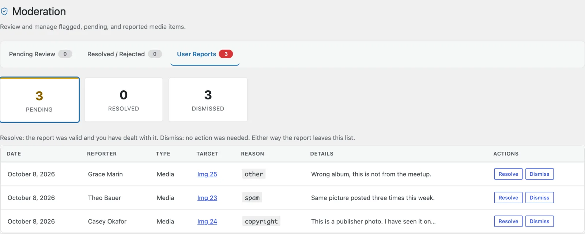

# User Blocking & Reporting

> **Included in Free** - This feature is available in the free version of MediaVerse.

MediaVerse includes a blocking system that prevents specific users from interacting with you and a reporting system that lets users flag abusive content or accounts for moderator review.

## Blocking a User

Open the member's profile, open the action menu (the three dots) and select **Block**. The same menu has **Unblock** once you have blocked them.

### What Blocking Does

When you block a user, they cannot:

- View your media items (media items are hidden from them on all browse pages and their direct links show as not found)
- Send you direct messages (your profile shows no Message button for them; any existing conversation is locked)
- Follow you (the Follow button is removed for them)
- Comment on your media
- React to your media

A block hides media both ways in lists: neither of you sees the other's media on browse pages, profiles or feeds. The person who blocked can still open a direct link to the blocked member's public media; the blocked member cannot open the blocker's.

Blocks are stored per-user and do not require any admin action.

## Unblocking a User

Open **Blocked members** in your profile settings (the profile edit page, or the profile panel of your media dashboard) to see everyone you have blocked and remove individual blocks. You can also unblock from the member's profile action menu or via the REST API.

## User Reporting

Reporting a user notifies the site moderators. It does not automatically take any action on the reported account.

To report a user, open the action menu on their profile and select **Report**. Choose a reason from the dropdown and optionally add details.

### Report Reasons

The same reason whitelist applies to both user and media reports:

| Value |
|-------|
| `spam` |
| `harassment` |
| `nudity` |
| `violence` |
| `copyright` |
| `misinformation` |
| `other` |

Reports appear in **MediaVerse > Moderation** on the **Reports** tab. Moderators with the `moderate_mvs_media` capability can review, dismiss, or act on reports.

## Media Reporting



Any logged-in member can also report a comment or a chat message. Any logged-in user can report a media item from the media card or the media detail page using the flag icon.

### Report Reasons

Media reports use the same whitelist as user reports: `spam`, `harassment`, `nudity`, `violence`, `copyright`, `misinformation`, `other`.

When a media item accumulates reports equal to the **Auto-Hide Threshold** set in **MediaVerse > Settings > Moderation**, it is automatically hidden and added to the moderation queue.

### Reporting settings

Found on **MediaVerse > Settings > Moderation**.

| Setting | What it does | Default |
|---------|--------------|---------|
| Member Reporting | Lets members report media and members. Turning it off hides every Report control and refuses incoming reports. | On |
| Auto-Hide Threshold | Number of reports before media is hidden automatically. 0 turns it off. | 3 |
| Community Guidelines URL | Link to your rules, shown in the app and next to the Report control. | Empty |

## REST API

**Base URL:** `/wp-json/mvs/v1/`

All endpoints require a logged-in user. Pass the `X-WP-Nonce` header with a nonce from `wp_create_nonce( 'wp_rest' )`.

### POST /users/{id}/block

Block a user.

**Response:** `200 OK`

```json
{ "blocked": true }
```

---

### DELETE /users/{id}/block

Unblock a user.

**Response:** `200 OK`

```json
{ "blocked": false }
```

---

### GET /me/blocked

List users blocked by the current user.

**Parameters:**

| Parameter | Type | Default | Description |
|-----------|------|---------|-------------|
| `per_page` | int | `20` | Blocked users per page |
| `page` | int | `1` | Page number |

**Response:** Array of user objects with `id`, `name`, and `avatar_url`.

---

### POST /users/{id}/report

Report a user account.

**Body:**

| Field | Required | Description |
|-------|----------|-------------|
| `reason` | Yes | One of: `spam`, `harassment`, `nudity`, `violence`, `copyright`, `misinformation`, `other` |
| `details` | No | Optional free-text note visible to moderators |

**Response:** `200 OK`

```json
{ "reported": true }
```

---

### POST /media/{id}/report

Report a media item.

**Body:**

| Field | Required | Description |
|-------|----------|-------------|
| `reason` | Yes | One of: `spam`, `harassment`, `nudity`, `violence`, `copyright`, `misinformation`, `other` |
| `details` | No | Optional free-text note |

**Response:** `200 OK`

```json
{ "reported": true }
```

---

## Actions and Filters

### `mvs_user_blocked`

Fires after a user is blocked.

```php
add_action( 'mvs_user_blocked', function( $blocker_id, $blocked_id ) {
    // Perform additional cleanup or logging.
}, 10, 2 );
```

### `mvs_report_submitted`

Fires after a report is submitted. The `$target_type` is `user`, `media`, `comment` or `message`.

```php
add_action( 'mvs_report_submitted', function( $report_id, $reporter_id, $target_type, $target_id, $reason ) {
    // Notify a Slack channel, send to an external moderation service, etc.
}, 10, 5 );
```
