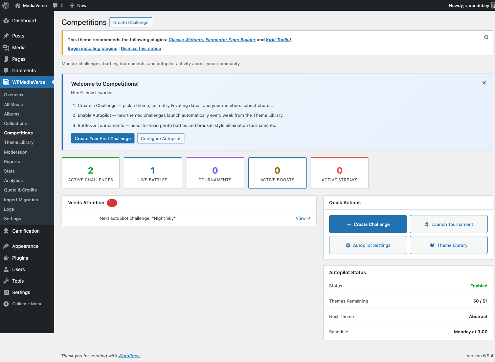
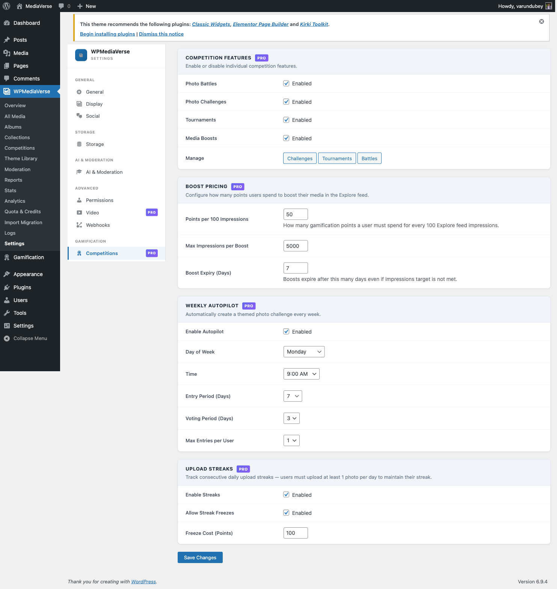

# Gamification Admin Dashboard

> **Requires WPMediaVerse Pro** - This feature is available exclusively in the Pro version.

The Gamification admin area is accessible at **Competitions**. It provides a unified view of all active and pending competitions, plus dedicated managers for challenges, tournaments, and battles.

Gamification admin screens only appear when at least one gamification feature is enabled in Settings.

## Competitions Overview Table

The main Competitions page lists every challenge, battle, and tournament in a single table.

| Column | Description |
|--------|-------------|
| Title | Competition name - click to open the detail view |
| Type | `Challenge`, `Battle`, or `Tournament` |
| Status | Current lifecycle stage with a color-coded badge |
| Entries | Number of participants or entries submitted |
| Created | Date the competition was created |
| Start / End | Active date range |
| Actions | Quick action buttons for the row |

**Quick Actions:**

- **View** - Opens the frontend competition page in a new tab
- **Edit** - Opens the admin edit form for this competition
- **Finalize** - Manually force a competition to the Finalized/Resolved stage. Use this when the scheduled action has not run yet or to end a competition early.

You can filter the table by Type and Status using the dropdowns above the table.

## Challenge Manager

Go to **Competitions > Challenge Manager** to create and edit photo challenges.

The Challenge Manager list shows all challenges sorted by start date descending. Click **Add Challenge** to open the create form, or click any challenge title to edit it.

From the edit form you can:

- Change the theme, dates, and XP prize amounts for a challenge that has not yet started
- View the current entry count for a challenge that is Active or in Voting
- Manually trigger finalization before the voting deadline

> You cannot edit entry windows or XP prizes after a challenge reaches Active stage. Changing dates for an Active challenge requires manually editing the database.

### Theme Library

Click **Competitions > Theme Library** to manage the pool of challenge themes used by Autopilot.

| Column | Description |
|--------|-------------|
| Theme Name | The challenge title displayed to users |
| Category | Organizational category (Nature, Urban, Portrait, etc.) |
| Used Count | How many times Autopilot has used this theme |
| Status | Active (available to Autopilot) or Disabled |

Add a custom theme by clicking **Add Theme**. Set the name, category, and optional description. Mark a theme as Disabled to exclude it from Autopilot selection without deleting it.

## Tournament Manager

Go to **Competitions > Tournament Manager** to create and manage tournaments.

From the Tournament Manager you can:

- Create a new tournament with bracket size, dates, and XP prizes
- View the generated bracket for any in-progress tournament
- Manually advance a round if the scheduled action has not yet run
- View per-match vote counts and participant photos

Clicking a tournament title opens the admin bracket view, which mirrors the frontend bracket but adds vote count detail and a manual resolve button per match.

## Battle Monitor

Go to **Competitions > Battle Monitor** to oversee all active battles.

The Battle Monitor table includes every battle that is not in a terminal state (Declined, Expired, Resolved). Columns show:

| Column | Description |
|--------|-------------|
| Challenger | Username and photo thumbnail |
| Opponent | Username and photo thumbnail |
| Stage | Current stage (Pending, Accepted, Submitting, Voting) |
| Votes | Vote count for each side (visible once in Voting stage) |
| Submit Deadline | When the submit window closes |
| Vote Deadline | When the vote window closes |
| Actions | Resolve (force resolution) or Delete |

**Resolve disputes** - If a battle is stuck due to a bug or edge case, use the Resolve button to manually set a winner or mark the battle as expired.

## Gamification Settings Page

Go to **WPMediaVerse > Settings > Gamification** to configure all gamification features.

### Feature Toggles

| Toggle | Setting Key | What It Controls |
|--------|-------------|-----------------|
| Enable Photo Challenges | `mvs_challenges_enabled` | Shows the challenges frontend page and enables the REST API routes |
| Enable Photo Battles | `mvs_battles_enabled` | Shows the battles frontend page and enables the REST API routes |
| Enable Tournaments | `mvs_tournaments_enabled` | Shows the tournaments frontend page and enables the REST API routes |
| Enable Media Boosts | `mvs_boosts_enabled` | Shows Boost buttons on media items and enables the REST API routes |
| Enable Upload Streaks | `mvs_streaks_enabled` | Activates streak tracking on media upload and the daily cron check |

### Autopilot Configuration

| Setting | Key | Default |
|---------|-----|---------|
| Enable Autopilot | `mvs_autopilot_enabled` | Off |
| Autopilot Day | `mvs_autopilot_day` | `monday` |
| Autopilot Hour | `mvs_autopilot_hour` | `9` |

### XP Reward Amounts

These fields set the default XP prizes applied when creating new challenges and tournaments. Existing competitions are not affected when you change these values.

| Field | Description |
|-------|-------------|
| Challenge 1st Place XP | Default XP for challenge winner |
| Challenge 2nd Place XP | Default XP for challenge runner-up |
| Challenge 3rd Place XP | Default XP for third place |
| Challenge Participation XP | Default XP for all entrants |
| Tournament Winner XP | Default XP for tournament champion |
| Tournament Runner-Up XP | Default XP for tournament finalist |
| Tournament Round Win XP | Default XP per round win |

### Boost Configuration

| Setting | Key | Default |
|---------|-----|---------|
| Max Impressions Per Boost | `mvs_boost_max_impressions` | `5000` |
| Cost Per 100 Impressions | `mvs_boost_cost_per_100` | `50` |

> Saving the Settings page does not restart any scheduled actions. If you enable a feature that was previously disabled, existing scheduled actions will pick up the new state on the next hourly run.
