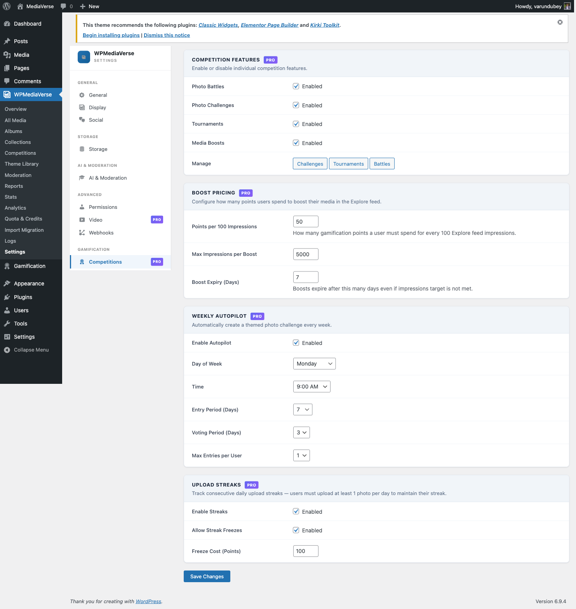

# Gamification Admin Dashboard

> **Requires MediaVerse Pro** - This feature is available exclusively in the Pro version.

The competition admin screens are at **MediaVerse > Competitions**. It is one menu entry with a tab strip: **Overview**, **Photo Challenges**, **Tournaments**, **Photo Battles** and **Challenge Themes**. A tab shows only when its feature is switched on. Older direct links to each screen still work. You need the permission to manage MediaVerse settings.

These screens only appear when **Competitions** and at least one competition type are switched on in Settings.

## Competitions Overview

The **Overview** tab is a summary of what is happening.

| Part | What it shows |
|------|---------------|
| Stat cards | Active Challenges, Live Battles, Tournaments, Active Boosts and Active Streaks |
| Needs Attention | Items that need you, each with a **View** link. When all is well it says nothing needs attention |
| Quick Actions | **Create Challenge**, **Launch Tournament**, **Autopilot Settings** and **Challenge Themes**. **Enable Competitions** shows while the master switch is off |
| Autopilot Status | Whether Autopilot is running and when it runs next |

The first time you open it, a short welcome panel explains how competitions work.

## Challenge Manager

Go to **MediaVerse > Photo Challenges** to create and edit photo challenges.

The Challenge Manager has tabs for **Active**, **Scheduled**, **Voting**, **Finalized** and **All**, each with a count. Click **Create Challenge** to open the create form. The form offers **Quick Start: Choose a Preset**, which fills in the dates and points so you only add a title and theme.

On each row you can:

- **Edit** the title, theme, dates, entries per member and point prizes
- **Start Now** on a scheduled challenge
- **End Entries** on an active challenge, which moves it to voting
- **Finalize Now** on a challenge in voting, which ranks the winners, closes voting and awards points
- **Cancel Challenge**
- **View on frontend**

You can edit a challenge, including its dates and point prizes, until it is finalized or cancelled. A finalized or cancelled challenge cannot be edited.

### Challenge Themes

Open the **Challenge Themes** tab to manage the pool of themes used by Autopilot and when you create a challenge by hand. MediaVerse ships 52 themes.

| Column | Description |
|--------|-------------|
| Name | The challenge title displayed to users |
| Category | Color, Concept, Creative, Life, Nature, People, Seasonal or Urban |
| Tags | Suggested tags for the theme |
| Status | Enabled (available to Autopilot) or Disabled, and whether the theme is Used or Unused |

Add a custom theme with **Add Theme**. Set the name, category, optional description and tags. Use **Disable** to exclude a theme from Autopilot without deleting it, and **Enable** to bring it back. Only custom themes can be deleted. You can filter the list by category and status.

## Tournament Manager

Open the **Tournaments** tab to create and manage tournaments. It has tabs for **Registration**, **Active** and **Finalized**.

From the Tournament Manager you can:

- Create a new tournament with **Create Tournament**: title, description, bracket size, registration start and end, round duration, and point rewards. Presets fill these in for you
- **Start Now** to close registration early and generate the bracket
- **View Bracket** for any in-progress tournament
- **Resolve now** on a match, to settle it by the current votes and advance the bracket
- **Cancel Tournament**

The bracket size cannot be changed after the tournament is created.

## Battle Monitor

Open the **Photo Battles** tab to oversee battles. Members start battles from the front end, so there is no create button. The tabs are **Voting**, **Active**, **Pending**, **Completed** and **All**.

The Battle Monitor table columns are:

| Column | Description |
|--------|-------------|
| ID | The battle number |
| Theme | The optional theme the challenger set |
| Challenger | The member who started the battle |
| Opponent | The member who was challenged |
| Status | Pending, Active, Voting or Completed |
| Votes | Vote count for each side |
| Winner | The winner, once resolved |
| Created | When the battle started |
| Actions | **Resolve**, **Cancel** or **Delete** |

**Resolve** is offered while a battle is in the Voting stage. It closes voting now and declares the winner by the current votes. Use **Cancel** to stop a battle that has not finished, and **Delete** to remove a battle and all its data.

## Gamification Settings Page

Go to **MediaVerse > Settings > Competitions** to configure all competition features.

### Feature Toggles

The first switch is **Competitions** (`mvs_competitions_enabled`, off by default). While it is off, it is the only competition row on the screen. Turn it on to see the rest.

| Toggle | Setting Key | What It Controls |
|--------|-------------|-----------------|
| Competitions | `mvs_competitions_enabled` | Master switch. Off means no competition pages, menus, routes or scheduled jobs |
| Photo Battles | `mvs_battles_enabled` | Shows the battles frontend page and enables the REST API routes |
| Photo Challenges | `mvs_challenges_enabled` | Shows the challenges frontend page and enables the REST API routes |
| Tournaments | `mvs_tournaments_enabled` | Shows the tournaments frontend page and enables the REST API routes |
| Media Boosts | `mvs_boosts_enabled` | Shows Boost buttons on media items and enables the REST API routes |
| Enable Streaks | `mvs_streaks_enabled` | Activates streak tracking on media upload and the daily check. Sits in its own Upload Streaks section and does not need the master switch |

### Autopilot Configuration

The **Weekly Autopilot** section shows while Photo Challenges is on. The other fields appear once Autopilot is enabled.

| Setting | Key | Default |
|---------|-----|---------|
| Enable Autopilot | `mvs_autopilot_enabled` | Off |
| Day of Week | `mvs_autopilot_day` | `monday` |
| Time | `mvs_autopilot_hour` | `9` (site timezone) |
| Entry Period (Days) | `mvs_autopilot_entry_days` | `7` |
| Voting Period (Days) | `mvs_autopilot_voting_days` | `3` |
| Max Entries per User | `mvs_autopilot_max_entries` | `1` |

### Point Reward Amounts

Settings > Competitions has two reward fields. Points for a challenge or tournament you create by hand are set on that competition's own form. Changing these values does not change competitions that already exist. Points are paid out by the free WB Gamification plugin.

| Field | Key | Description |
|-------|-----|-------------|
| Battle win reward (points) | `mvs_pro_battle_win_xp` | Points the winner of a photo battle earns (default 100). Shows only while Photo Battles is on. |
| Points rewards | `mvs_autopilot_xp_1st`, `_2nd`, `_3rd`, `_participation` | Points each autopilot challenge awards for 1st, 2nd and 3rd place and to everyone who entered (defaults 200, 100, 50, 10). Shows only while Enable Autopilot is on. |

### Boost Configuration

The **Boost Pricing** section shows while Media Boosts is on.

| Setting | Key | Default |
|---------|-----|---------|
| Points per 100 Impressions | `mvs_pro_boost_cost_per_100` | `50` |
| Max Impressions per Boost | `mvs_pro_boost_max_impressions` | `5000` |
| Boost Expiry (Days) | `mvs_pro_boost_expiry_days` | `7` |

### Streak Configuration

| Setting | Key | Default |
|---------|-----|---------|
| Allow Streak Freezes | `mvs_streak_freezes_enabled` | Off. Shows while streaks are on |
| Freeze Cost (Points) | `mvs_pro_streak_freeze_cost` | `100`. Shows while freezes are allowed |

> Saving the Settings page does not restart any scheduled actions. If you enable a feature that was previously disabled, existing scheduled actions will pick up the new state on their next run.
