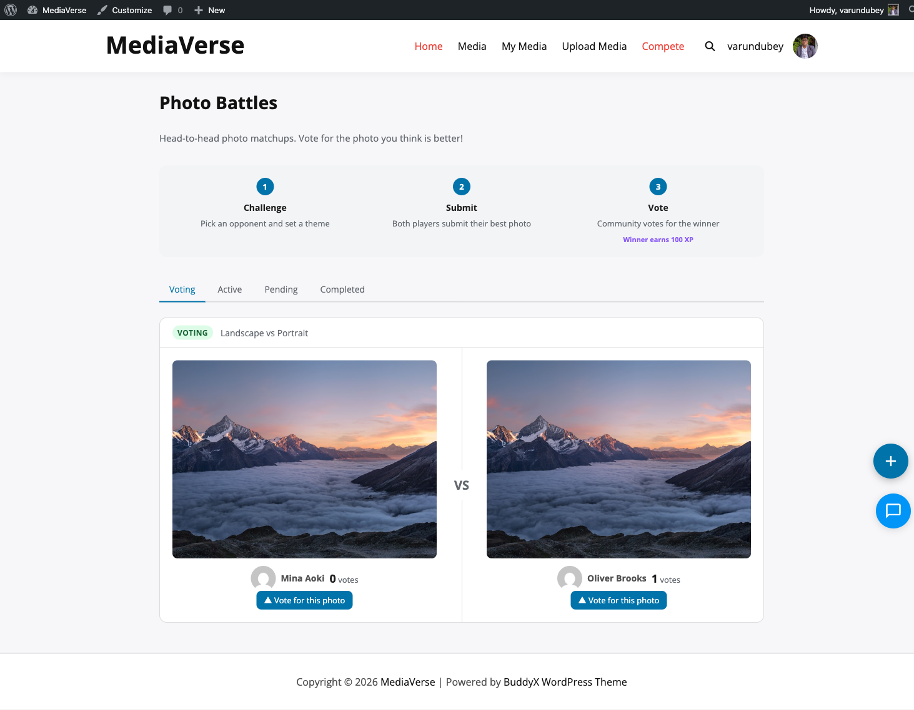
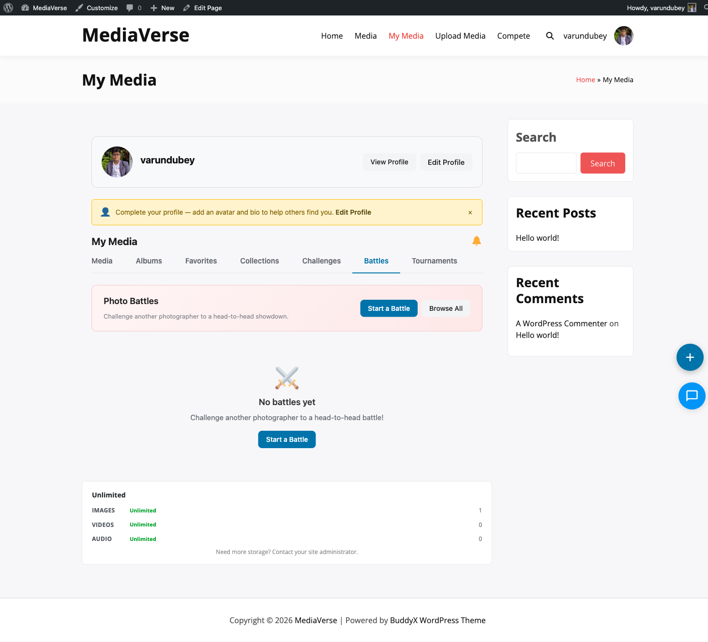

# Photo Battles

Challenge any photographer on the site to a head-to-head photo duel — your best shot vs. theirs, side by side, with the community deciding the winner.

## What You Can Do (as a User)

- Challenge any member to a 1v1 photo battle directly from a media item page
- Pick your strongest photo as your battle entry
- Accept or decline incoming battle challenges from your notifications
- Watch the live vote count during the voting period
- See your win/loss record on your media dashboard

## How It Works (for Users)

### Challenging Someone

1. Open any of your uploaded photos on the site
2. Click **Challenge to Battle**
3. Search for a member by username to challenge them
4. Your photo is set as your battle entry and the invite is sent
5. Your opponent receives a notification to accept or decline

### After the Challenge is Accepted

1. Both you and your opponent have 48 hours to confirm or change your battle photo
2. Choose one photo from your uploads — click **Submit My Photo**
3. Once both photos are submitted, the battle opens for community voting
4. The VS layout shows both photos side by side with a vote button under each
5. Any logged-in member (except participants) can cast one vote
6. When the voting period ends, the winner is announced automatically and XP is awarded



### Viewing Your Battles

Go to **My Media > Battles** to see all your battles with win/loss/pending status. Click any battle to see the full vote breakdown.

## For Site Owners

1. Go to **Media > Settings > Gamification** and enable **Photo Battles**
2. Battles are self-service — users challenge each other directly, no admin involvement required
3. Submit and vote windows are currently 48 hours each
4. Monitor all active battles from **Media > Competitions**

## Lifecycle

| Stage | Description |
|-------|-------------|
| **Pending** | Challenger sent the invite — waiting for opponent response |
| **Accepted** | Opponent accepted — both users can now submit their battle photo |
| **Submitting** | Both users have 48 hours (default) to submit photos |
| **Voting** | Both photos submitted — community votes for 48 hours (default) |
| **Resolved** | Vote deadline passed — winner determined, XP awarded |
| **Declined** | Opponent declined the challenge — battle closed |
| **Expired** | Submit or vote deadline passed with incomplete participation |

## Starting a Battle

From any media item page, click **Challenge to Battle**. You can also start a battle from your My Media dashboard.


1. Select the photo you want to use as your battle entry
2. Search for and select your opponent by username
3. Submit the challenge invite

The opponent receives a WPMediaVerse notification and, if BuddyPress notifications are active, a BuddyPress notification.

## Submitting a Photo

After the opponent accepts, both users have 48 hours to submit their battle photo. Each participant selects one photo from their media library or uploads a new one.

If either participant does not submit within the deadline, the battle expires and no XP is awarded.

## Voting

Once both photos are submitted, the battle moves to Voting. Any logged-in user (not just participants) can vote for one photo. Participants cannot vote in their own battle.

Votes are recorded in `mvs_competition_votes`. Each user can cast one vote per battle.

## Settings Reference

| Setting | Key | Default |
|---------|-----|---------|
| Enable Photo Battles | `mvs_battles_enabled` | Off |

Submit and vote deadlines are currently fixed at 48 hours each. Configurable deadline settings are planned for a future release.

## REST API

**Base URL:** `/wp-json/mvs-pro/v1/battles`

| Method | Endpoint | Description |
|--------|----------|-------------|
| `POST` | `/battles` | Create a new battle challenge |
| `GET` | `/battles/{id}` | Get battle details, stage, and vote counts |
| `POST` | `/battles/{id}/accept` | Accept a battle invite. Opponent only. |
| `POST` | `/battles/{id}/decline` | Decline a battle invite. Opponent only. |
| `POST` | `/battles/{id}/submit` | Submit your battle photo |
| `POST` | `/battles/{id}/vote` | Cast a vote for a photo in this battle |

### POST /battles

```json
{
  "challenger_media_id": 456,
  "opponent_user_id": 99
}
```

Returns `403 Forbidden` if battles are disabled. Returns `400 Bad Request` if the challenger does not own the specified media.

### POST /battles/{id}/submit

```json
{
  "media_id": 501
}
```

Returns `403 Forbidden` if the authenticated user is not a participant in this battle. Returns `409 Conflict` if this participant already submitted.

### POST /battles/{id}/vote

```json
{
  "entry_id": 789
}
```

Returns `403 Forbidden` if the battle is not in Voting stage, or if the voter is a participant.

## Frontend Behavior

The `/media/battles/` page shows all battles visible to the logged-in user.


- **Active battles** — Shows the VS card layout with both photos and vote buttons if the battle is in Voting stage
- **Pending battles** — Shows a card with the invite status and accept/decline buttons for the opponent
- **Resolved battles** — Shows final vote counts with a winner badge

The **My Media > Battles** tab shows only the user's own battles with win/loss/pending status.



## Scheduled Actions

| Action Hook | Condition |
|-------------|-----------|
| `mvs_resolve_expired_battles` | Runs hourly — resolves battles where the vote deadline has passed; expires battles where the submit deadline passed without both submissions |
