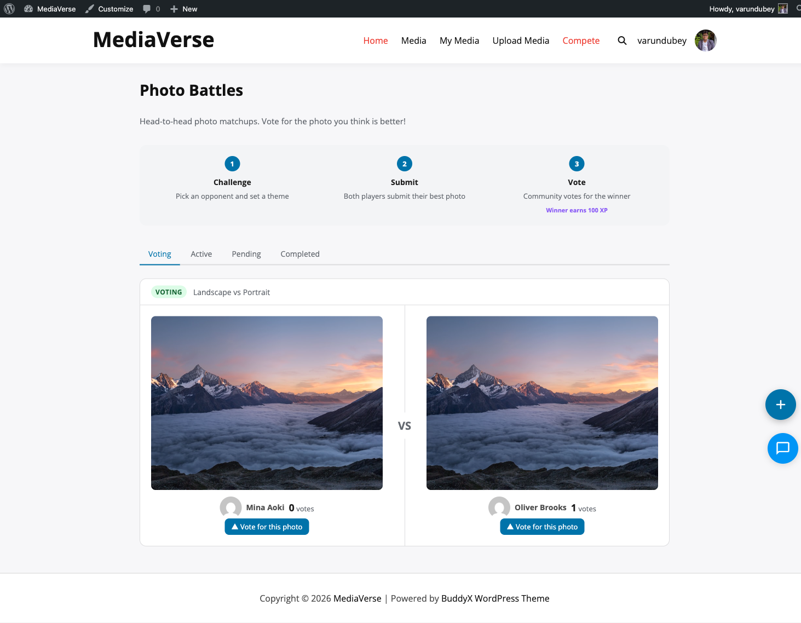

# Photo Battles

> **Requires MediaVerse Pro** - This feature is available exclusively in the Pro version.


Challenge any photographer on the site to a head-to-head photo duel - your best shot vs. theirs, side by side, with the community deciding the winner.

## What You Can Do (as a User)

- Challenge any member to a 1v1 photo battle from the Photo Battles page
- Pick your strongest photo as your battle entry after your opponent accepts
- Accept or decline incoming battle challenges
- Watch the live vote count during the voting period
- See your battles on the Compete hub

## How It Works (for Users)

### Challenging Someone

1. Go to `/media/battles/` (or open the Compete hub and click **Challenge Someone**)
2. Under **Challenge Someone**, search for a member in **Opponent** ("Search by username...")
3. Optionally add a **Theme** (for example "Golden Hour")
4. Click **Send Challenge**. No photo is chosen yet
5. Your opponent receives a notification and can click **Accept Challenge** or **Decline**

You cannot challenge yourself, and you cannot start a second battle with someone you already have an unfinished battle with.

### After the Challenge is Accepted

1. Both you and your opponent submit a photo. Under **Submit Your Photo**, pick one of your photos or upload a new one, then click **Submit Photo**. The 48-hour submit window starts when the challenge is sent, not when it is accepted
2. Once both photos are submitted, the battle opens for community voting
3. The VS layout shows both photos side by side with a **Vote for this photo** button under each
4. Any logged-in member except the two players can cast one vote
5. When the voting period ends, the winner is announced automatically and points are awarded. If the votes are tied (including a battle nobody voted in), the battle is a draw: nobody wins and no points are awarded



### Viewing Your Battles

The Compete hub (`/compete/`) lists your battles under **My Activity** and **My Results**. Open a battle to see the full vote breakdown.

## For Site Owners

1. Go to **MediaVerse > Settings > Competitions**, tick **Competitions**, then enable **Photo Battles**
2. Battles are self-service - members challenge each other directly, no admin involvement required
3. The submit and vote windows are 48 hours each by default
4. Monitor battles from **MediaVerse > Competitions > Photo Battles**
5. Optionally set **Battle win reward (points)** in the same settings (default 100)

## Lifecycle

| Stage | Description |
|-------|-------------|
| **Pending** (shown as Awaiting Response) | Challenger sent the invite - waiting for opponent response |
| **Accepted** | Opponent accepted - both players can now submit their battle photo |
| **Active** (shown as Submissions Open) | At least one photo is in; waiting for the other |
| **Voting** | Both photos submitted - community votes (48 hours by default) |
| **Completed** | Vote deadline passed - winner determined, points awarded |
| **Declined** | Opponent declined the challenge - battle closed |
| **Expired** | The submit deadline passed before both photos were in, so there is no winner and no points |

## Starting a Battle

Battles start from the **Challenge Someone** form on the Photo Battles page, or from the **Challenge Someone** button in the Battle Arena on the Compete hub.

1. Search for and select your opponent by username
2. Optionally add a theme
3. Click **Send Challenge**

The opponent receives a MediaVerse notification. On a BuddyPress site it also appears in the BuddyPress bell.

## Submitting a Photo

Both players have 48 hours from the moment the challenge is sent to submit their battle photo. Each player selects one photo from their media library or uploads a new one. A player can change their photo until the deadline while the battle is still waiting for the other photo.

If either player does not submit within the deadline, the battle expires and no points are awarded.

## Voting

Once both photos are submitted, the battle moves to Voting. Any logged-in member can vote for one photo. The two players cannot vote in their own battle. Each member can cast one vote per battle. A battle ends with the higher vote count. Equal votes is a draw: there is no winner, no win points are given, and both players are told it was a draw.

## Settings Reference

| Setting | Key | Default |
|---------|-----|---------|
| Photo Battles | `mvs_battles_enabled` | Off |
| Battle win reward (points) | `mvs_pro_battle_win_xp` | `100` |

There is no setting for the deadlines. Developers can change the 48-hour submit and vote windows with the `mvs_battle_submit_hours` and `mvs_battle_vote_hours` filters.

## REST API

**Base URL:** `/wp-json/mvs-pro/v1/battles`

| Method | Endpoint | Description |
|--------|----------|-------------|
| `GET` | `/battles` | List battles (optional `user_id`, `status`, `page`, `per_page`) |
| `POST` | `/battles` | Create a new battle challenge |
| `GET` | `/battles/{id}` | Get battle details, stage, and vote counts |
| `POST` | `/battles/{id}/accept` | Accept a battle invite. Opponent only. |
| `POST` | `/battles/{id}/decline` | Decline a battle invite. Opponent only. |
| `POST` | `/battles/{id}/submit` | Submit your battle photo |
| `POST` | `/battles/{id}/vote` | Cast a vote for one of the two players |

### POST /battles

```json
{
  "opponent_id": 99,
  "theme": "Golden Hour"
}
```

`theme` is optional. Returns `409` if you already have an unfinished battle with that member, and an error if you try to challenge yourself.

### POST /battles/{id}/submit

```json
{
  "media_id": 501
}
```

Returns `403` if the authenticated user is not one of the two players. Returns `400` if the battle is not accepting photos, the deadline has passed, or the media is not yours.

### POST /battles/{id}/vote

```json
{
  "voted_for_id": 12
}
```

`voted_for_id` is the user ID of the player you are voting for. Returns `403` if the voter is one of the players, and `400` if the battle is not in the Voting stage, voting has ended, or you already voted.

## Frontend Behavior

The `/media/battles/` page shows battles in tabs: **Voting**, **Active**, **Pending**, **Completed**, plus **All battles**.


- **Voting battles** - Shows the VS card layout with both photos and a **Vote for this photo** button
- **Pending battles** - Shows a card with the invite status and **Accept Challenge** and **Decline** buttons for the opponent
- **Active battles** - Shows **Submit Your Photo** for a player who has not yet submitted
- **Completed battles** - Shows final vote counts with the winner

A visitor who is not logged in sees **Log in to vote**.

## Scheduled Actions

| Action Hook | Condition |
|-------------|-----------|
| `mvs_resolve_expired_battles` | Runs about every 5 minutes - resolves battles where the vote deadline has passed; expires battles where the submit deadline passed without both submissions |
