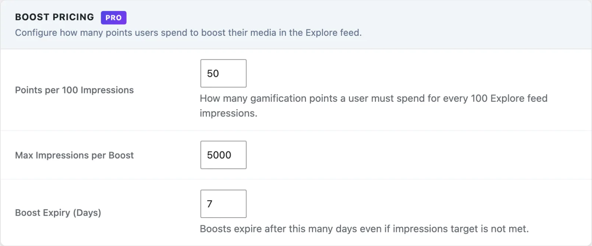

# Media Boosts

> **Requires MediaVerse Pro** - This feature is available exclusively in the Pro version.

Spend your earned points to push a photo to the top of the Explore feed - get more eyes on your best work right when you want it seen. Boosts spend points from the free WB Gamification plugin, which must be active.

## What You Can Do (as a User)

- Boost any of your photos to increase its visibility in the Explore feed
- Choose how many impressions you want to buy (e.g., 500 views)
- See a live point cost preview before committing
- Run boosts on multiple photos at the same time (a boost runs until its impression target or its expiry, 7 days by default; it cannot be cancelled early)

## How It Works (for Users)

1. Open one of your uploaded photos
2. Click **Boost** - the **Boost Your Media** panel shows your point balance (**Balance: N points**)
3. Enter the **Target Impressions** (for example 500, which costs 250 points at the default rate). The **Cost:** line updates as you type
4. Click **Boost** - points are deducted immediately from your balance and **Boost activated!** appears
5. Your photo now appears at the top of the Explore feed
6. When the impression target is reached (or when the boost expires, after 7 days by default), the boost ends automatically and your photo returns to its normal rank

### Where Boosted Content Appears

Boosted photos are placed at the top of the first page of the Explore feed. Up to 5 boosted items are promoted at a time. They are not added to later pages, and not to a search, tag, category, author or type filter. If a visitor chooses their own sort order, such as oldest first, boosts do not change it.

## For Site Owners

1. Go to **MediaVerse > Settings > Competitions**, tick **Competitions**, then enable **Media Boosts**
2. Set **Max Impressions per Boost** (default: 5,000) to control how large a boost can be
3. Set **Points per 100 Impressions** (default: 50 points) to match your community's point economy
4. Set **Boost Expiry (Days)** (default: 7). A boost ends after this long even if its target is not reached
5. Members must earn points through other activity (uploads, challenges, streaks) before they can boost. The Boost button shows to owners on their own media

## How Boosts Work (Technical)

1. The user clicks **Boost** on any media item they own
2. They set an impression target (100 up to the site maximum)
3. The system deducts points from their WB Gamification balance
4. The media item is flagged as boosted in `mvs_boosts`
5. The Explore feed query moves boosted items to the front of the first page
6. When the impression counter reaches the target, or the boost duration expires, the boost auto-expires and the media returns to organic ranking

A user can have multiple media items boosted simultaneously. One media item can only have one active boost at a time.

## Boost Cost Calculation

Cost is based on the impression target:

```
cost = ceil( impression_target / 100 ) × mvs_pro_boost_cost_per_100
```

Example: boosting for 500 impressions at the default cost of 50 points per 100 costs **250 points**.

The points are deducted through WB Gamification at the moment the boost is created. If the member does not have enough points, the boost is not created. If the boost cannot be saved after points were taken, the points are refunded.

## Settings Reference



| Setting | Key | Default | Description |
|---------|-----|---------|-------------|
| Media Boosts | `mvs_boosts_enabled` | Off | Master toggle for the boosts feature |
| Max Impressions per Boost | `mvs_pro_boost_max_impressions` | `5000` | The highest impression target a member can set |
| Points per 100 Impressions | `mvs_pro_boost_cost_per_100` | `50` | Points deducted per 100 impressions purchased |
| Boost Expiry (Days) | `mvs_pro_boost_expiry_days` | `7` | A boost ends after this many days even if the target is not met |

## Database Table: mvs_boosts

| Column | Type | Description |
|--------|------|-------------|
| `id` | bigint | Primary key |
| `media_id` | bigint | The boosted media item |
| `user_id` | bigint | User who created the boost |
| `impressions_target` | int | Impression target set at boost creation |
| `impressions_delivered` | int | Running impression count |
| `points_spent` | int | Points deducted from user balance |
| `boost_type` | varchar | `standard` |
| `status` | varchar | `active` or `expired` |
| `started_at` | datetime | When the boost was created |
| `expires_at` | datetime | Hard expiry datetime (independent of impressions) |

## REST API

**Base URL:** `/wp-json/mvs-pro/v1`

All boost endpoints require an authenticated user. Boosts are created and listed against the current user - there is no per-media boost route and no cancel endpoint; a boost runs until its impression target is met or its expiry passes.

| Method | Endpoint | Description |
|--------|----------|-------------|
| `GET` | `/boosts` | List the current user's boosts (optional `status`, `page`, `per_page`) |
| `POST` | `/boosts` | Create a boost for one of your media items |
| `GET` | `/boosts/balance` | Get the current user's gamification point balance |

### POST /boosts

```json
{
  "media_id": 456,
  "impressions_target": 500
}
```

`impressions_target` defaults to 500. Returns `400 Bad Request` if `impressions_target` is below 100 or exceeds the **Max Impressions per Boost** setting, if the media is not yours (or is a document), or if you do not have enough points. Returns `409 Conflict` if the media item already has an active boost. Returns `503 Service Unavailable` if WB Gamification is not active.

### GET /boosts/balance

```json
{
  "balance": 1240
}
```

Returns `{ "balance": 0 }` when WB Gamification is not active.

## Explore Feed Injection

Boosted media is moved to the front of the first page of an unfiltered Explore feed by a filter on the MediaVerse explore query. Up to 5 boosted items are promoted at a time. Pages after the first do not repeat them.

Impression counts increment server-side each time a boosted item is shown in the feed. Impressions are tracked per page load, not per unique user.

## Expiry

A boost expires when either condition is met:

- `impressions_delivered` reaches `impressions_target`
- The current time passes `expires_at`

The hard expiry datetime is set when the boost is created, using the **Boost Expiry (Days)** setting (default 7 days), regardless of the impression target.

## Scheduled Actions

| Action Hook | Condition |
|-------------|-----------|
| `mvs_expire_boosts` | Runs hourly - sets `status = expired` on boosts where the impression target is reached or `expires_at` has passed |
