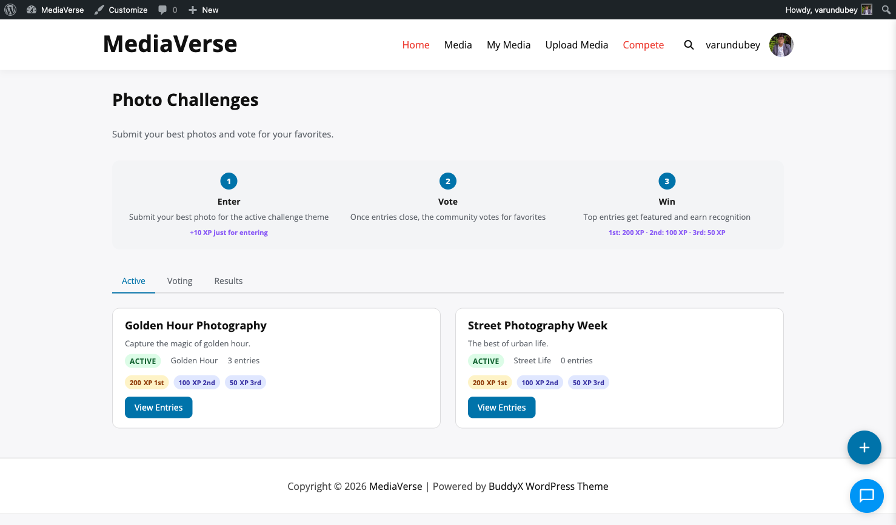
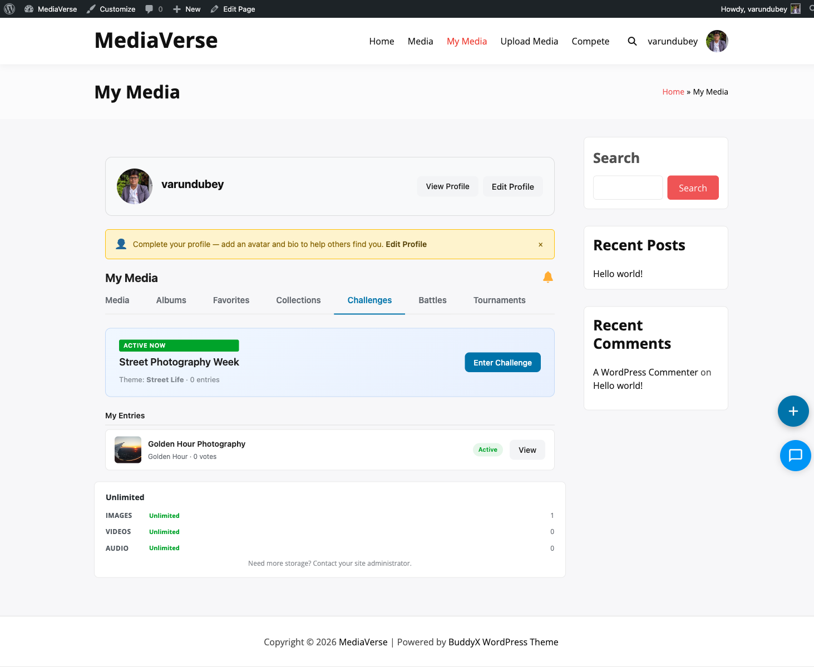

# Photo Challenges

> **Requires WPMediaVerse Pro** — This feature is available exclusively in the Pro version.


> **Requires WPMediaVerse Pro** — This feature is available exclusively in the Pro version.

Run weekly themed photo competitions — your community submits their best shots, votes for their favorites, and the top three photographers win XP prizes.

## What You Can Do (as a User)

- Browse active challenges and see the current theme
- Enter your best photo for any active challenge
- Vote for your favorite entries during the voting window
- Track your standing and see the final rankings with winner badges
- Earn XP for participating, even if you do not place in the top three

## How It Works (for Users)

1. Go to **Media > Challenges** on your site
2. Click the **Active** tab to see the current challenge theme (e.g., "Golden Hour Photography")
3. Click **Enter Challenge** — a media picker opens showing your uploaded photos
4. Select one of your photos or upload a new one, add an optional caption, and click **Submit**
5. Your entry appears in the challenge gallery alongside other participants
6. When the entry window closes, the challenge moves to the **Voting** tab
7. Vote for your single favorite entry — you can only vote once per challenge
8. When voting closes, open the **Finalized** tab to see the ranked results
9. Winner badges (1st, 2nd, 3rd) appear on the top entries and XP is awarded automatically to your account



## For Site Owners

1. Go to **Media > Settings > Gamification** and enable **Photo Challenges**
2. Go to **Media > Competitions > Challenge Manager** and click **Add Challenge**
3. Set a theme title, entry start date, entry end date, and voting end date
4. Set XP prizes for 1st, 2nd, 3rd place and a participation XP amount for all entrants
5. Click **Save** — the challenge appears on the frontend when the start date arrives
6. To run challenges on autopilot without manual creation, enable **Autopilot** in the settings (see below)


## Lifecycle

A challenge moves through four stages. All transitions are handled by Action Scheduler on an hourly schedule.

| Stage | Description |
|-------|-------------|
| **Scheduled** | Challenge is published but the start date has not arrived |
| **Active** | Entry window is open — users can submit photos |
| **Voting** | Entry window closed — community can vote on submissions |
| **Finalized** | Voting closed — winners determined, XP awarded |

## Creating a Challenge

Go to **Media > Competitions > Challenge Manager** and click **Add Challenge**.


| Field | Description |
|-------|-------------|
| Theme | Title or topic for the challenge (e.g., "Golden Hour Photography") |
| Theme Library | Pick from 25+ pre-built themes instead of writing one manually |
| Entry Start | Date and time when photo submissions open |
| Entry End | Date and time when submissions close |
| Voting End | Date and time when voting closes |
| Max Entries Per User | How many photos one user may submit |
| XP — 1st Place | XP awarded to the top vote-getter |
| XP — 2nd Place | XP awarded to the second-highest vote-getter |
| XP — 3rd Place | XP awarded to the third-highest vote-getter |
| XP — Participation | XP awarded to all entrants when the challenge finalizes |

## Autopilot

Autopilot creates and schedules challenges automatically so you do not need to create them manually each week.

| Setting | Key | Description |
|---------|-----|-------------|
| Enable Autopilot | `mvs_autopilot_enabled` | Automatically create a new challenge when the current one enters Voting stage |
| Autopilot Day | `mvs_autopilot_day` | Day of the week to start each new challenge (`0` = Sunday, `6` = Saturday) |
| Autopilot Hour | `mvs_autopilot_hour` | Hour of day (0–23, site timezone) to open entries |

When autopilot runs, it picks the next unused theme from the Theme Library. Once all themes are used, it cycles back to the first theme.

## Theme Library

The Theme Library ships with 25+ pre-built challenge themes. Go to **Media > Competitions > Theme Library** to browse, add, edit, or disable themes.


Themes are categorized (Nature, Urban, Portrait, Abstract, etc.). You can add custom themes and assign them to any category.

## Settings Reference

| Setting | Key | Default |
|---------|-----|---------|
| Enable Photo Challenges | `mvs_challenges_enabled` | Off |
| Enable Autopilot | `mvs_autopilot_enabled` | Off |
| Autopilot Day | `mvs_autopilot_day` | `1` (Monday) |
| Autopilot Hour | `mvs_autopilot_hour` | `9` |

## REST API

**Base URL:** `/wp-json/mvs-pro/v1/challenges`

| Method | Endpoint | Description |
|--------|----------|-------------|
| `POST` | `/challenges` | Create a new challenge. Requires `manage_options`. |
| `GET` | `/challenges/{id}` | Get challenge details including stage, entry count, and dates |
| `POST` | `/challenges/{id}/enter` | Submit a photo entry. Requires authentication. |
| `GET` | `/challenges/{id}/entries` | List submitted entries with vote counts |
| `POST` | `/challenges/{id}/vote` | Cast a vote for an entry. One vote per user. |

### POST /challenges/{id}/enter

```json
{
  "media_id": 456,
  "caption": "Optional entry caption"
}
```

Returns `409 Conflict` if the user has already reached `max_entries_per_user` for this challenge.

### POST /challenges/{id}/vote

```json
{
  "entry_id": 789
}
```

Returns `403 Forbidden` if the challenge is not in Voting stage. Returns `409 Conflict` if the user already voted.

## Frontend Behavior

The `/media/challenges/` page displays challenges in three tabs: **Active**, **Voting**, and **Finalized**.


- **Active tab** — Shows the entry submission form when the user is logged in and has not yet reached the entry limit
- **Voting tab** — Shows all entries as a grid with vote buttons; the user's vote is highlighted after casting
- **Finalized tab** — Shows entries ranked by votes with winner badges for positions 1, 2, and 3

The media picker in the entry form lets users select from their existing uploaded media or upload a new photo directly.



## Scheduled Actions

| Action Hook | Condition |
|-------------|-----------|
| `mvs_activate_challenges` | Runs hourly — sets `Scheduled` challenges to `Active` when start date is past |
| `mvs_close_challenge_entries` | Runs hourly — sets `Active` challenges to `Voting` when entry deadline is past |
| `mvs_finalize_challenges` | Runs hourly — sets `Voting` challenges to `Finalized`, tallies votes, awards XP |
