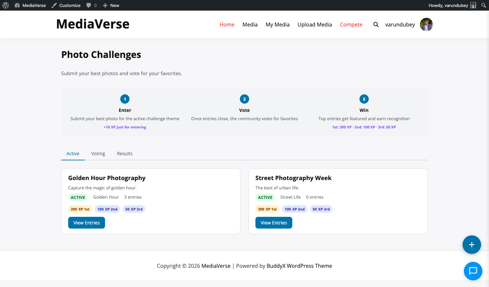
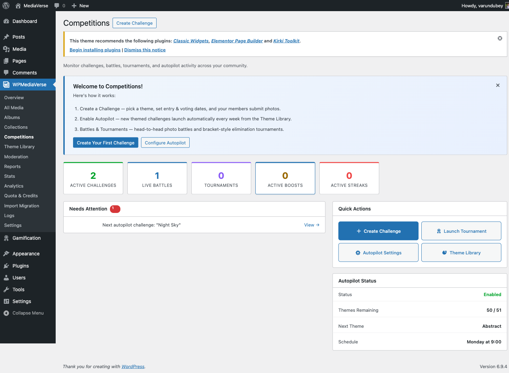
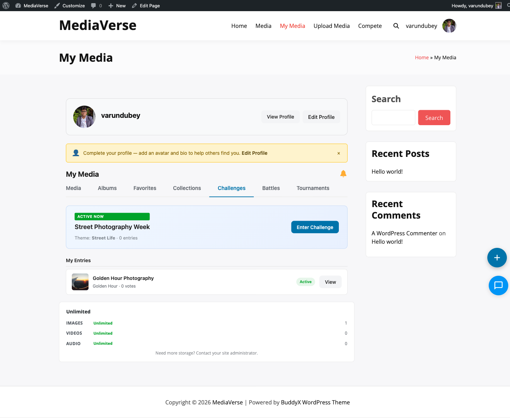

# Photo Challenges

> **Requires MediaVerse Pro** - This feature is available exclusively in the Pro version.


Run themed photo competitions - your community submits their best shots, votes for their favorites, and the top three photographers win point prizes.

## What You Can Do (as a User)

- Browse active challenges and see the current theme
- Enter your best photo for any active challenge
- Vote for your favorite entries during the voting window. You can vote for several entries, but not your own
- Track your standing and see the final rankings with winner badges
- Earn points for participating, even if you do not place in the top three

## How It Works (for Users)

1. Go to `/media/challenges/` on your site
2. Click the **Active** tab to see the current challenge theme (e.g., "Golden Hour Photography")
3. Under **Submit Your Entry**, pick one of your photos or upload a new one, then click **Submit Entry**
4. Your entry appears in the challenge gallery alongside other participants
5. When the entry window closes, the challenge moves to the **Voting** tab
6. Click **Vote** on entries you like. You cannot vote for your own entry. An entry you voted for shows **Voted**
7. When voting closes, open the **Results** tab to see the ranked results
8. Winner badges (1st, 2nd, 3rd) appear on the top entries and points are awarded automatically to your account



## For Site Owners

1. Go to **MediaVerse > Settings > Competitions**, tick **Competitions**, then enable **Photo Challenges**
2. Go to **MediaVerse > Competitions > Photo Challenges** and click **Create Challenge**
3. Set a title, theme, entry start date, entry end date, and voting end date
4. Set point prizes for 1st, 2nd, 3rd place and a participation point amount for all entrants
5. Save - the challenge opens when the start date arrives
6. To run challenges on autopilot without manual creation, enable **Autopilot** in the settings (see below)



## Lifecycle

A challenge moves through four stages (a challenge can also be cancelled). Transitions are handled by a recurring Action Scheduler job that runs about every 5 minutes, so a stage changes shortly after its deadline.

| Stage | Description |
|-------|-------------|
| **Scheduled** | Challenge is published but the start date has not arrived |
| **Active** | Entry window is open - users can submit photos |
| **Voting** | Entry window closed - community can vote on submissions |
| **Finalized** | Voting closed - winners determined, points awarded. Shown to members as **Results** |

## Creating a Challenge

Go to **MediaVerse > Competitions > Photo Challenges** and click **Create Challenge**. You can start from a preset.


| Field | Description |
|-------|-------------|
| Title | The challenge name shown to members |
| Theme / Prompt | The topic (e.g., "Golden Hour Photography") |
| Description | Optional text shown with the challenge |
| Entry Period Start | Date and time when photo submissions open |
| Entry Period End | Date and time when submissions close |
| Voting End | Date and time when voting closes |
| Max Entries per User | How many photos one member may submit |
| Point Rewards: 1st, 2nd, 3rd | Points awarded to the top three entries (defaults 200, 100, 50) |
| Point Rewards: Participation | Points awarded to everyone who entered (default 10) |

The dates must be in order: start, then entry end, then voting end. Times use your site's timezone. The challenge cover image follows the leading entry automatically.

## Autopilot

Autopilot creates a new themed challenge every week so you do not need to create them manually.

| Setting | Key | Description |
|---------|-----|-------------|
| Enable Autopilot | `mvs_autopilot_enabled` | Create a new challenge each week using themes from Challenge Themes |
| Day of Week | `mvs_autopilot_day` | Day of the week a new challenge is created (`monday` through `sunday`) |
| Time | `mvs_autopilot_hour` | Hour of day (0-23, site timezone) the challenge is created |
| Entry Period (Days) | `mvs_autopilot_entry_days` | How many days members have to enter. Default 7 |
| Voting Period (Days) | `mvs_autopilot_voting_days` | How many days voting lasts after entries close. Default 3 |
| Max Entries per User | `mvs_autopilot_max_entries` | Entries each member may submit. Default 1 |
| Points rewards | `mvs_autopilot_xp_1st`, `_2nd`, `_3rd`, `_participation` | Points for each place and for everyone who entered. Defaults 200, 100, 50, 10 |

When autopilot runs, the new challenge opens straight away. It picks an enabled theme that has not been used yet, mixing categories so the same category does not repeat back to back. Once every theme has been used, the list resets and starts over. If every theme is disabled, no challenge is created.

## Challenge Themes

MediaVerse Pro ships with 52 pre-built challenge themes. Go to **MediaVerse > Competitions > Challenge Themes** to browse, add, enable or disable themes.


Themes are grouped into the categories Color, Concept, Creative, Life, Nature, People, Seasonal and Urban. You can add custom themes in any category and delete the custom ones.

## Settings Reference

| Setting | Key | Default |
|---------|-----|---------|
| Enable Photo Challenges | `mvs_challenges_enabled` | Off |
| Enable Autopilot | `mvs_autopilot_enabled` | Off |
| Day of Week | `mvs_autopilot_day` | `monday` |
| Time | `mvs_autopilot_hour` | `9` |

## REST API

**Base URL:** `/wp-json/mvs-pro/v1/challenges`

| Method | Endpoint | Description |
|--------|----------|-------------|
| `GET` | `/challenges` | List challenges (optional `status`, `page`, `per_page`) |
| `POST` | `/challenges` | Create a new challenge. Requires the `manage_mvs_settings` capability. |
| `GET` | `/challenges/{id}` | Get challenge details including stage, entry count, and dates |
| `PUT`/`PATCH` | `/challenges/{id}` | Update a challenge. Requires `manage_mvs_settings`. |
| `POST` | `/challenges/{id}/cancel` | Cancel a challenge. Requires `manage_mvs_settings`. |
| `GET` | `/challenges/{id}/entries` | List submitted entries with vote counts |
| `POST` | `/challenges/{id}/entries` | Submit a photo entry. Requires authentication. |
| `POST` | `/challenges/{id}/entries/{entry_id}/vote` | Vote for an entry. Requires authentication. |
| `DELETE` | `/challenges/{id}/entries/{entry_id}/vote` | Take a vote back (API only; the website has no button for this) |
| `GET` | `/challenges/{id}/results` | Ranked results |

### POST /challenges/{id}/entries

```json
{
  "media_id": 456
}
```

Returns `400` if the media is not yours, the challenge is not accepting entries, or you have reached the maximum entries per user. Returns `409` if that media was already submitted.

### POST /challenges/{id}/entries/{entry_id}/vote

No body is needed. Returns `403` if the challenge is not in Voting stage or the entry is your own. Returns an error if you already voted for that entry.

## Frontend Behavior

The `/media/challenges/` page displays challenges in three tabs: **Active**, **Voting**, and **Results**.


- **Active tab** - Shows the entry submission form when the member is logged in and has not yet reached the entry limit
- **Voting tab** - Shows all entries as a grid with vote buttons; an entry you voted for shows a **Voted** badge
- **Results tab** - Shows entries ranked by votes with winner badges for positions 1, 2, and 3

The entry form lets members select from their existing uploaded media or upload a new photo directly.



## Who Can See Entries (Logged-Out Experience)

- **Entering makes the photo public.** The moment a member submits an entry, that photo is visible in the challenge gallery to everyone - including logged-out visitors - even if the original upload is private. This is by design: challenges are a public competition, so an entered photo can't stay hidden while still being voted on. The entry form tells the member this before they submit.
- **Challenges show when voting opened, not just when it ends.** Each challenge displays both a **Voting opened** and a **Voting ends** timestamp, so visitors can see the full voting window instead of only a deadline with no visible start.
- **Logged-out visitors get a call to action, not a blank area.** On the Active tab, a visitor who is not logged in sees **Create an account** (linking to registration) followed by "to enter challenges." in place of the entry form. On the Voting tab, each entry shows **Log in to vote** (linking to login) instead of a vote button. Neither area is left empty.

## Scheduled Actions

| Action Hook | Condition |
|-------------|-----------|
| `mvs_activate_scheduled_challenges` | Every 5 minutes - sets `Scheduled` challenges to `Active` when start date is past |
| `mvs_close_challenge_entries` | Every 5 minutes - sets `Active` challenges to `Voting` when entry deadline is past |
| `mvs_finalize_expired_challenges` | Every 5 minutes - sets `Voting` challenges to `Finalized`, tallies votes, awards points |
