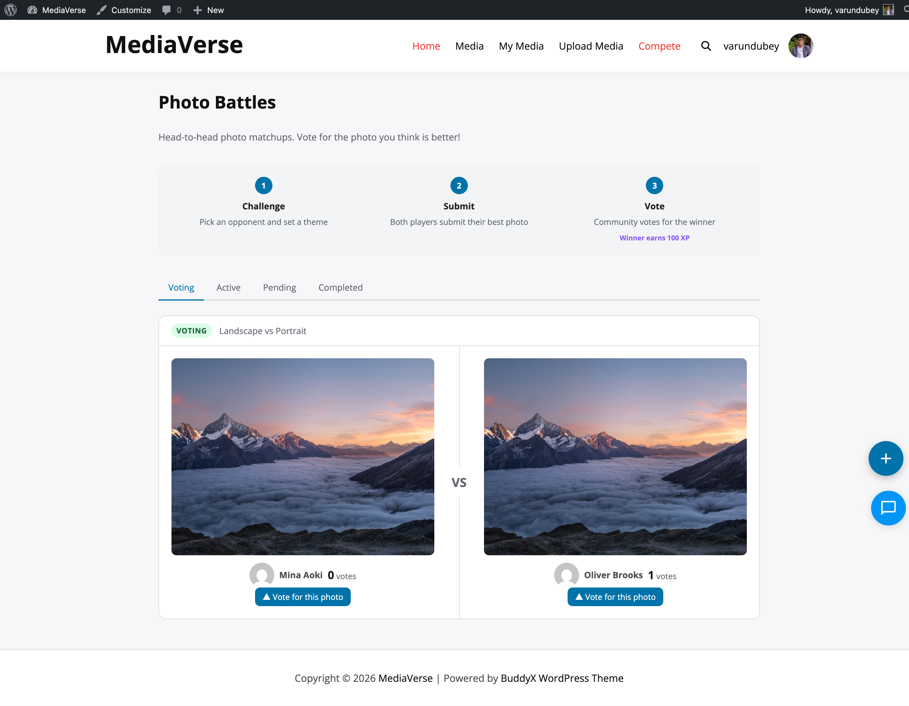

# Gamification Overview

> **Requires WPMediaVerse Pro** - This feature is available exclusively in the Pro version.

WPMediaVerse Gamification turns your media community into a competitive platform. Users earn XP, enter photo competitions, challenge each other to battles, and boost their media visibility - all integrated with the wb-gamification plugin's XP and reward engine.

Gamification requires **WPMediaVerse Pro** and the **wb-gamification plugin** (active and configured). All gamification features are disabled by default. Enable each feature individually at **Media > Settings > Gamification**.

## Requirements

- WPMediaVerse Pro 1.0.0+
- wb-gamification plugin (active)
- WordPress 6.5+
- PHP 7.4+

## Feature Types

| Feature | Description | Setting Key |
|---------|-------------|-------------|
| Photo Challenges | Themed weekly competitions with voting | `mvs_challenges_enabled` |
| Photo Battles | 1v1 head-to-head media matchups | `mvs_battles_enabled` |
| Tournaments | Single-elimination bracket competitions | `mvs_tournaments_enabled` |
| Media Boosts | Spend points to increase media visibility | `mvs_boosts_enabled` |
| Upload Streaks | Track consecutive daily uploads | `mvs_streaks_enabled` |

## Competition Types

All three competition types share a unified database schema. Each type follows its own lifecycle, but they share the same tables.

### Challenges

Themed weekly competitions. Admin creates a challenge with a theme, entry window, and voting window. Users submit a photo, community votes, winners earn XP prizes.

### Battles

1v1 matchups. A challenger picks a photo and invites an opponent. Both submit photos, the community votes, the system resolves the winner.

### Tournaments

Single-elimination brackets for 4 to 64 participants. Users register, the system seeds the bracket, rounds proceed by community vote until a winner is determined.

## Database Schema

| Table | Purpose |
|-------|---------|
| `mvs_competitions` | Master record for all challenges, battles, and tournaments |
| `mvs_competition_entries` | User photo submissions for any competition type |
| `mvs_competition_matches` | Individual head-to-head pairings (battles and tournament rounds) |
| `mvs_competition_votes` | Per-user votes on entries or matches |
| `mvs_boosts` | Active and expired media boost records |

The `mvs_competitions.type` column distinguishes between `challenge`, `battle`, and `tournament` records.

## XP Integration

WPMediaVerse registers 14 gamification actions with the wb-gamification manifest. These actions fire automatically as users interact with competitions.

XP is awarded via `do_action( 'wbgam_award_xp', $user_id, $action_slug, $reference_id )`. The manifest file ships with the plugin and can be filtered using `mvs_gamification_manifest`.

## Frontend Pages

| URL | Description |
|-----|-------------|
| `/media/challenges/` | Browse and enter photo challenges |
| `/media/battles/` | View active and completed battles |
| `/media/tournaments/` | Browse tournaments and view brackets |
| `/compete/` | Unified competition hub showing all active competitions |

The My Media dashboard adds **Challenges**, **Battles**, and **Tournaments** tabs showing the logged-in user's entries, results, and active matches.

## Scheduled Actions

All competition lifecycle transitions run via Action Scheduler on an hourly recurrence. No competition state changes happen in real time - transitions occur at the next hourly tick after a deadline passes.

| Scheduled Action | Trigger Condition |
|-----------------|------------------|
| `mvs_activate_challenges` | Challenge start date reached |
| `mvs_close_challenge_entries` | Entry deadline reached |
| `mvs_finalize_challenges` | Voting deadline reached |
| `mvs_resolve_expired_battles` | Battle vote deadline reached |
| `mvs_start_tournaments` | Tournament registration deadline reached |
| `mvs_resolve_tournament_matches` | Match vote deadline reached |
| `mvs_expire_boosts` | Boost impression target or duration reached |
| `mvs_check_streaks` | Daily at 2 AM - break streaks for missed uploads |

> Action Scheduler must be running for gamification to function. If you use a managed host that blocks WP-Cron, configure Action Scheduler with a server-level cron trigger.
