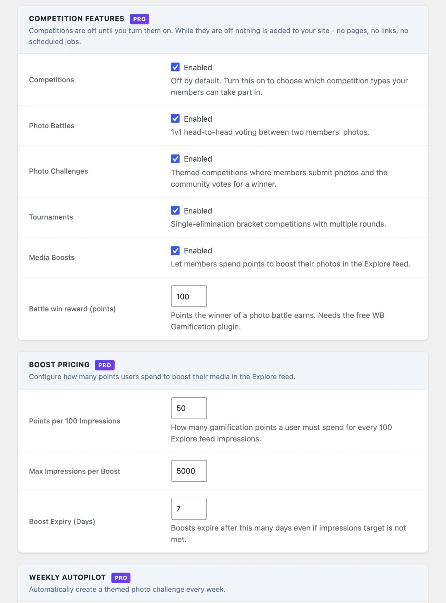
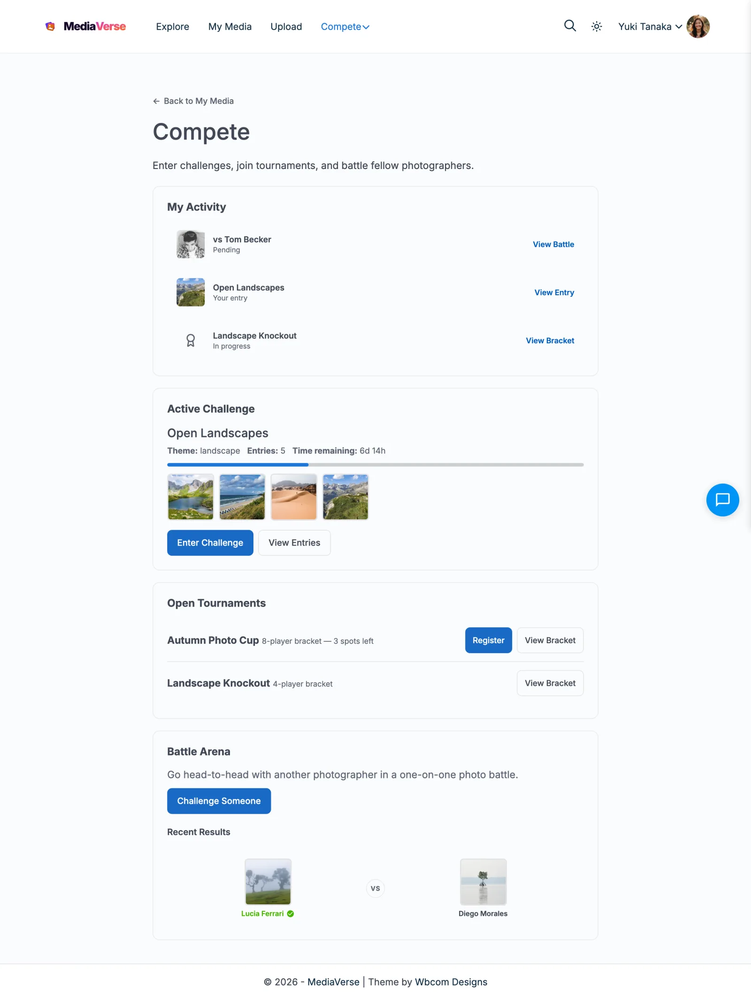

# Gamification Overview

> **Requires MediaVerse Pro** - This feature is available exclusively in the Pro version.

MediaVerse Gamification turns your media community into a competitive platform. Members enter photo challenges and tournaments, challenge each other to battles, build upload streaks, and boost their media visibility. Points come from the separate free **WB Gamification** plugin.

Gamification is part of **MediaVerse Pro**. Competitions run without WB Gamification, but points are only earned and spent when it is active. Everything is off by default. Turn it on at **MediaVerse > Settings > Competitions**: tick **Competitions** first, then choose which types to switch on.

## Requirements

- MediaVerse Pro
- WB Gamification plugin (active) for points. Needed for earning points, and for Media Boosts and streak freezes, which spend points
- WordPress 6.5+
- PHP 7.4+

## Feature Types

| Feature | Description | Setting Key |
|---------|-------------|-------------|
| Competitions (master switch) | Nothing below exists on the site until this is on | `mvs_competitions_enabled` |
| Photo Challenges | Themed competitions with voting | `mvs_challenges_enabled` |
| Photo Battles | 1v1 head-to-head media matchups | `mvs_battles_enabled` |
| Tournaments | Single-elimination bracket competitions | `mvs_tournaments_enabled` |
| Media Boosts | Spend points to increase media visibility | `mvs_boosts_enabled` |
| Upload Streaks | Track consecutive daily uploads (has its own switch, outside the master switch) | `mvs_streaks_enabled` |

While **Competitions** is off, MediaVerse adds no competition pages, links, admin menus or scheduled jobs.

## Competition Types

All three competition types share a unified database schema. Each type follows its own lifecycle, but they share the same tables.

### Challenges

Themed competitions. An admin (or Autopilot) creates a challenge with a theme, an entry window, and a voting window. Members submit photos, the community votes, and the top three earn point prizes.

### Battles

1v1 matchups. A challenger picks a photo and invites an opponent. Both submit photos, the community votes, the system resolves the winner.

### Tournaments

Single-elimination brackets for 4 to 64 participants. Members register, the bracket is seeded at random when registration closes, and each round is decided by community vote until a champion is found.

## Database Schema

| Table | Purpose |
|-------|---------|
| `mvs_competitions` | Master record for all challenges, battles, and tournaments |
| `mvs_competition_entries` | User photo submissions for any competition type |
| `mvs_competition_matches` | Individual head-to-head pairings (battles and tournament rounds) |
| `mvs_competition_votes` | Per-user votes on entries or matches |
| `mvs_boosts` | Active and expired media boost records |

The `mvs_competitions.type` column distinguishes between `challenge`, `battle`, and `tournament` records.

## Points Integration

Points are not awarded by MediaVerse itself. The separate free **WB Gamification** plugin is the points engine. WB Gamification ships the MediaVerse integration: it registers 15 actions, with its own default point values, which you manage in WB Gamification. They cover a photo upload, adding items to an album, likes, comments, follows and favorites received, writing a comment, following a member, bookmarking a photo, winning a battle, entering a challenge, placing in a challenge, winning a tournament round, winning a tournament, and reaching a streak milestone.

MediaVerse fires the matching events as members use the site, and WB Gamification awards the points. The prizes you set on a challenge, a tournament or the battle reward are applied through the `wb_gam_points_for_action` filter, so the points a member earns match the prize shown on the page.

> Without WB Gamification active, competitions still run end to end - members enter, vote, and win - but no points are earned or spent, Media Boosts cannot be bought, and streak freezes cannot be bought.

## Frontend Pages

| URL | Description |
|-----|-------------|
| `/media/challenges/` | Browse and enter photo challenges |
| `/media/battles/` | Start, accept, submit to and vote on battles |
| `/media/tournaments/` | Browse tournaments and view brackets |
| `/compete/` | Compete hub: your points, your activity and results, the active challenge, open tournaments and the battle arena |

The My Media dashboard has no competition tabs. Members reach their competition activity on the Compete hub, which has a **Back to My Media** link.

## Scheduled Actions

Competition lifecycle changes are not real time. One recurring job runs about every 5 minutes and moves each competition on once a deadline has passed. Boost expiry runs hourly, and the streak check runs once a day.

| Scheduled Action | Trigger Condition |
|-----------------|------------------|
| `mvs_activate_scheduled_challenges` | Challenge start date reached |
| `mvs_close_challenge_entries` | Entry deadline reached |
| `mvs_finalize_expired_challenges` | Voting deadline reached |
| `mvs_resolve_expired_battles` | Battle vote deadline reached |
| `mvs_start_registered_tournaments` | Tournament registration deadline reached |
| `mvs_resolve_expired_matches` | Match vote deadline reached |
| `mvs_expire_boosts` | Boost impression target or duration reached (hourly) |
| `mvs_daily_streak_check` | Daily at 2 AM - break streaks for missed uploads |

> Action Scheduler must be running for competitions to move on. If your host blocks WP-Cron, configure Action Scheduler with a server-level cron trigger.
