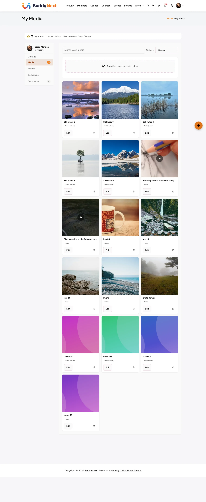
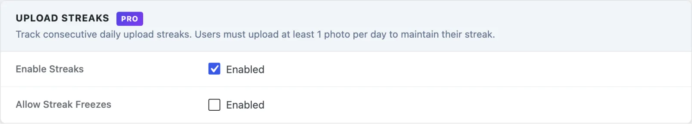

# Upload Streaks

> **Requires MediaVerse Pro** - This feature is available exclusively in the Pro version.

Upload one photo a day and watch your streak grow - hit milestones to earn point rewards, and use freeze tokens, if the site allows them, to protect your streak on days you miss.

## What You Can Do (as a User)

- Build a streak simply by uploading at least one file each day
- See your current streak count and your all-time best streak in the streak card on My Media
- Earn points automatically when you hit streak milestones: 7 days, 30 days, 100 days, 365 days (needs the free WB Gamification plugin)
- Buy freeze tokens with points, when the site allows them, to cover a missed day without losing your streak

## How It Works (for Users)

### Building Your Streak

1. Upload any photo or video on your site - that counts as your streak day
2. Your streak counter increments once per calendar day, no matter how many files you upload
3. Come back the next day and upload again to keep your streak alive
4. Your streak card on the My Media dashboard shows your current streak, your longest streak, the next milestone and your freeze tokens. It appears after your first upload

### Streak Milestones

When your streak reaches a milestone, points are awarded automatically to your account:

| Milestone | Points Awarded |
|-----------|-----------|
| 7 days | 50 points |
| 30 days | 250 points |
| 100 days | 1,000 points |
| 365 days | 5,000 points |

These are the amounts MediaVerse passes to WB Gamification when you reach each milestone.

### Using Freeze Tokens

When the site owner enables **Allow Streak Freezes**, a freeze token protects your streak if you miss a day. Each missed day uses one token. If you have no tokens and miss a day, your streak resets to zero (your all-time best is never reset).

To get tokens, click **Buy Freeze** in the streak card. It costs points from the free WB Gamification plugin, so that plugin must be active. Freezes are off by default - if the owner has not enabled them, a missed day always resets your streak.

## For Site Owners

1. Go to **MediaVerse > Settings > Competitions** and, in the **Upload Streaks** section, tick **Enable Streaks**. Streaks do not need the **Competitions** master switch
2. Streaks run automatically - no manual management needed
3. Optionally tick **Allow Streak Freezes** and set **Freeze Cost (Points)** (default 100)
4. The daily streak check runs around 2 AM via Action Scheduler - confirm Action Scheduler is processing jobs

There is no screen for granting freeze tokens to a member by hand.

## How Streaks Work (Technical)

A streak increments by 1 when a user uploads at least one media item on a calendar day (site timezone). If the user uploads multiple times on the same day, the streak still only increments once.

If a user misses a day with no upload, the `mvs_daily_streak_check` job (runs daily at 2 AM) resets their current streak to 0. The longest streak value is never reset.

When freezes are allowed, a freeze token covers one missed day. If the user has a token and misses a day, the job uses one token and does not reset the streak. If the user returns after several missed days, they need one token for each missed day to keep the streak.

## User Meta Keys

| Meta Key | Type | Description |
|----------|------|-------------|
| `_mvs_current_streak` | int | Number of consecutive days with at least one upload |
| `_mvs_longest_streak` | int | The user's all-time highest streak |
| `_mvs_last_upload_date` | string | `YYYY-MM-DD` of the user's most recent upload (site timezone) |
| `_mvs_streak_freezes` | int | Number of unused freeze tokens |

## Milestone Point Rewards

MediaVerse tells WB Gamification when a member's streak reaches exactly 7, 30, 100 or 365 days, and WB Gamification awards the points. Whether a milestone can pay out again after a broken streak is decided by WB Gamification.

| Milestone | Points Awarded |
|-----------|-----------|
| 7 days | 50 points |
| 30 days | 250 points |
| 100 days | 1,000 points |
| 365 days | 5,000 points |

## Streak Freeze Tokens

When the **Allow Streak Freezes** setting is enabled (and WB Gamification is active), members can buy freeze tokens with their points from the streak card - the cost is set by **Freeze Cost (Points)** (`mvs_pro_streak_freeze_cost`, default 100). The whole freeze feature is off by default; with it disabled, a missed day always resets the streak.

When the `mvs_daily_streak_check` job runs and finds a user missed yesterday:

1. Check `_mvs_streak_freezes`
2. If freezes are allowed and the count is greater than 0 - decrement by 1, leave streak intact
3. Otherwise - reset `_mvs_current_streak` to 0

Each missed day uses one token, so a member with two tokens can cover two missed days in a row.

## Settings Reference

| Setting | Key | Default |
|---------|-----|---------|
| Enable Streaks | `mvs_streaks_enabled` | Off |
| Allow Streak Freezes | `mvs_streak_freezes_enabled` | Off |
| Freeze Cost (Points) | `mvs_pro_streak_freeze_cost` | `100` |

## Scheduled Actions

| Action Hook | Schedule | Description |
|-------------|----------|-------------|
| `mvs_daily_streak_check` | Daily at 2 AM | Compares `_mvs_last_upload_date` to yesterday for every user with a streak greater than 0. Applies freezes or resets streaks. |

> The daily streak check runs via Action Scheduler, not WP-Cron. If Action Scheduler is not processing jobs, streaks will not break on time.
