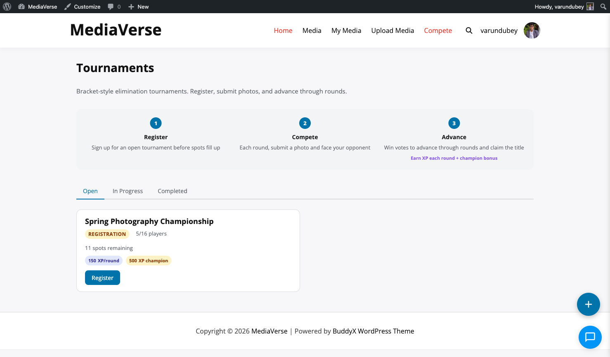
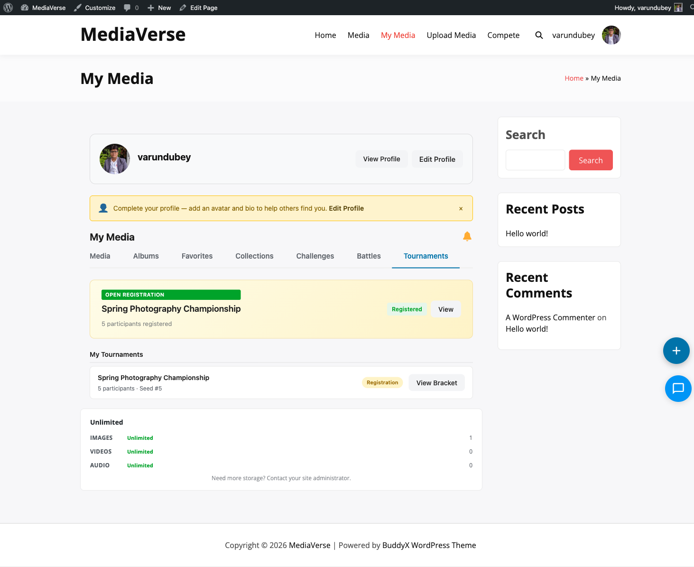

# Tournaments

> **Requires WPMediaVerse Pro** — This feature is available exclusively in the Pro version.


> **Requires WPMediaVerse Pro** — This feature is available exclusively in the Pro version.

Enter a single-elimination bracket competition — submit your best photo, survive each round of community voting, and claim the championship title.

## What You Can Do (as a User)

- Register for an open tournament with one of your photos
- Watch the bracket fill up as other photographers register
- Vote in active round matches — any member can vote (except in their own match)
- Track your bracket position round by round
- Earn XP for every match you win and a large XP prize if you win the tournament

## How It Works (for Users)

### Registering

1. Go to **Media > Tournaments** on your site
2. Find a tournament in the **Registration** stage and click **Register**
3. Pick one photo from your uploads to represent you in the tournament
4. Click **Submit Registration** — your photo appears in the participant list
5. Once registration closes, the bracket is generated automatically

### Following the Bracket

1. Open the tournament detail page to see the full bracket visualization
2. Completed rounds are shown in grey; the active round's matches are highlighted
3. Each matchup shows two photos side by side with the current vote count
4. Click **Vote** on the photo you think should advance — you get one vote per match
5. You cannot vote in a match where you are a participant
6. When all matches in a round are resolved, the next round opens automatically

### What Happens If You Win or Lose

- **Win a match:** You advance to the next round and earn **Round Win XP**
- **Lose a match:** You are eliminated but keep any XP already earned
- **Win the tournament:** You earn the **Winner XP** prize and a tournament champion badge
- **Reach the final but lose:** You earn the **Runner-Up XP** prize



## For Site Owners

1. Go to **Media > Settings > Gamification** and enable **Tournaments**
2. Go to **Media > Competitions > Tournament Manager** and click **Add Tournament**
3. Set the title, bracket size (4, 8, 16, 32, or 64 participants), registration window, and match vote duration
4. Set XP prizes for the winner, runner-up, and each round win
5. Click **Save** — the tournament appears on the frontend when registration opens
6. The bracket generates automatically when registration closes


## Bracket Sizes

Supported sizes: **4, 8, 16, 32, 64** participants.

If registrations do not fill the bracket exactly, the system assigns **byes** to the highest-seeded empty slots. Bye recipients automatically advance to the next round without a match.

Seeding is random at bracket generation time.

## Lifecycle

| Stage | Description |
|-------|-------------|
| **Registration** | Tournament is open — users can register with a photo |
| **In Progress** | Registration closed — bracket generated, rounds underway |
| **Finals** | Only two participants remain |
| **Complete** | Winner determined, XP awarded to all placers |

The system generates the bracket when the registration deadline passes (hourly Action Scheduler check). Each round's matches open for voting simultaneously. A new round begins after all matches in the current round are resolved.

## Creating a Tournament

Go to **Media > Competitions > Tournament Manager** and click **Add Tournament**.


| Field | Description |
|-------|-------------|
| Title | Tournament name displayed to users |
| Bracket Size | Maximum participants: 4, 8, 16, 32, or 64 |
| Registration Opens | Date and time users can start registering |
| Registration Closes | Deadline for registrations — bracket generates after this |
| Match Vote Duration | How long each round's matches are open for votes (in hours) |
| XP — Winner | XP awarded to the tournament winner |
| XP — Runner-Up | XP awarded to the finalist who loses |
| XP — Round Win | XP awarded each time a participant wins a match |

## Settings Reference

| Setting | Key | Default |
|---------|-----|---------|
| Enable Tournaments | `mvs_tournaments_enabled` | Off |

## REST API

**Base URL:** `/wp-json/mvs-pro/v1/tournaments`

| Method | Endpoint | Description |
|--------|----------|-------------|
| `POST` | `/tournaments` | Create a tournament. Requires `manage_options`. |
| `GET` | `/tournaments/{id}` | Get tournament details, stage, and participant count |
| `POST` | `/tournaments/{id}/register` | Register for a tournament with a photo |
| `GET` | `/tournaments/{id}/bracket` | Get the full bracket structure with all matches and results |
| `POST` | `/tournaments/{id}/vote` | Cast a vote in an active tournament match |

### POST /tournaments/{id}/register

```json
{
  "media_id": 456
}
```

Returns `409 Conflict` if the user is already registered. Returns `400 Bad Request` if registration is closed or the bracket is full.

### GET /tournaments/{id}/bracket

Returns the full bracket as a nested structure by round.

```json
{
  "tournament_id": 12,
  "size": 16,
  "current_round": 2,
  "rounds": [
    {
      "round": 1,
      "matches": [
        {
          "match_id": 101,
          "entry_a": { "entry_id": 5, "media_id": 456, "user_id": 11, "votes": 14 },
          "entry_b": { "entry_id": 9, "media_id": 502, "user_id": 22, "votes": 8 },
          "winner_entry_id": 5,
          "status": "resolved"
        }
      ]
    }
  ]
}
```

### POST /tournaments/{id}/vote

```json
{
  "match_id": 201,
  "entry_id": 789
}
```

Returns `403 Forbidden` if the match is not in the current active round. Returns `409 Conflict` if the user already voted in this match. Participants cannot vote in matches they are part of.

## Frontend Behavior

The `/media/tournaments/` page lists all tournaments with their current stage and participant count.


Clicking a tournament opens the detail page with the bracket visualization. Active matches show vote buttons directly inside the bracket.



- **Registration stage** — Shows a Register button and the current participant count relative to bracket size
- **In Progress** — Shows the bracket with completed rounds greyed out and active round matches highlighted
- **Complete** — Shows the full bracket with the winner highlighted at the top

The **My Media > Tournaments** tab shows tournaments the user is registered in, with their current bracket position.

## Bye Handling

When registrations do not fill the bracket exactly, byes are assigned before round 1 begins. A bye appears in the bracket as an automatic win — the real participant advances and their slot shows "Bye" for the opposing side. Bye participants do not earn a Round Win XP award.

## Scheduled Actions

| Action Hook | Condition |
|-------------|-----------|
| `mvs_start_tournaments` | Runs hourly — generates brackets when registration deadline passes |
| `mvs_resolve_tournament_matches` | Runs hourly — resolves matches where the vote deadline has passed; advances winners to next round; detects when all matches in a round are resolved and opens the next round |
