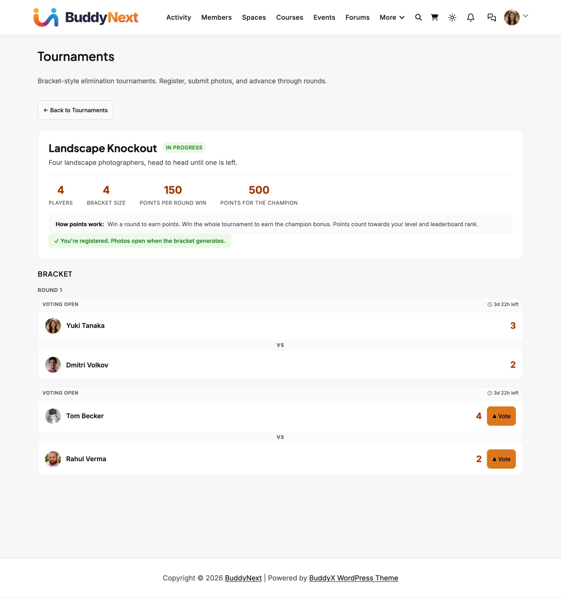
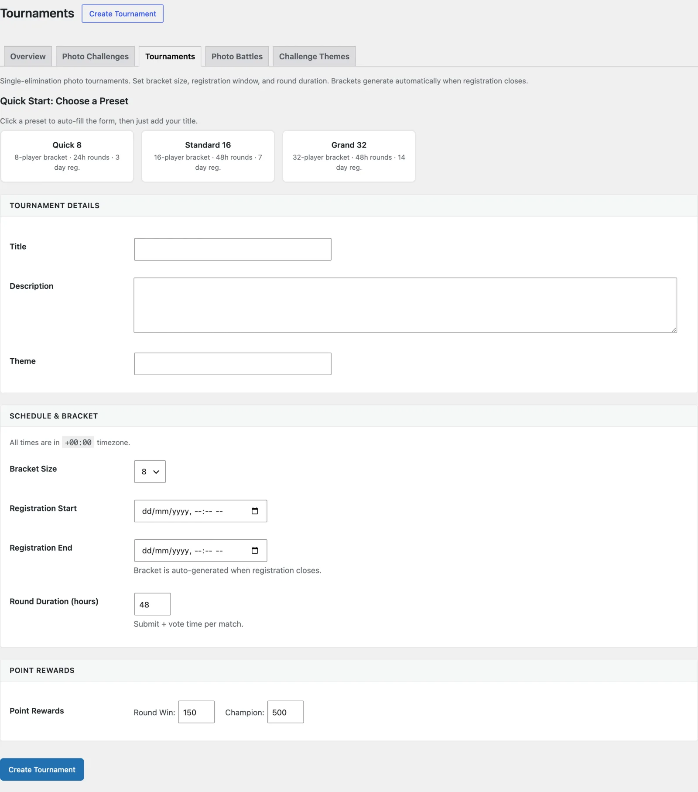

# Tournaments

> **Requires MediaVerse Pro** - This feature is available exclusively in the Pro version.

Enter a single-elimination bracket competition - submit your best photo, survive each round of community voting, and claim the championship title.

## What You Can Do (as a User)

- Register for an open tournament
- Submit a photo for each of your matches
- Vote in other members' matches - any member can vote (except in their own match)
- Track your bracket position round by round
- Earn points for every match you win and a larger prize if you win the tournament

## How It Works (for Users)

### Registering

1. Go to `/media/tournaments/` on your site
2. Open a tournament that shows **Registration Open** and click **Register for this tournament**
3. You see "You're registered. Photos open when the bracket generates."
4. Once registration closes, the bracket is generated automatically. A tournament needs at least 2 registered players to start

You do not pick a photo when you register. You submit a photo for each match.

### Playing Your Matches

1. When the bracket is generated, open the tournament and find your match
2. Click **Submit Your Photo**, choose one of your photos, and click **Submit Photo**
3. When both players have submitted, the match opens for voting

### Following the Bracket

1. Open the tournament detail page to see the full bracket, round by round
2. Each match shows its status: **Awaiting Start**, **Submissions Open**, **Voting Open** or **Match Complete**. A bye shows **Automatic Advance**
3. Each matchup shows two photos side by side
4. Click **Vote** on the photo you think should advance - you get one vote per match
5. You cannot vote in a match where you are a player
6. When all matches in a round are resolved, the next round opens automatically

### What Happens If You Win or Lose

- **Win a match:** You advance to the next round and earn the **Round Win** points
- **Lose a match:** You are eliminated but keep any points already earned
- **Win the tournament:** You earn the **Champion** points and are shown as the champion

There is no separate prize for the runner-up.



## For Site Owners

1. Go to **MediaVerse > Settings > Competitions**, tick **Competitions**, then enable **Tournaments**
2. Go to **MediaVerse > Competitions > Tournaments** and click **Create Tournament**
3. Set the title, bracket size (4, 8, 16, 32, or 64 participants), registration window, and round duration
4. Set point rewards for each round win and for the champion
5. Save - the tournament appears on the frontend when registration opens
6. The bracket generates automatically when registration closes



## Bracket Sizes

Supported sizes: **4, 8, 16, 32, 64** participants.

If registrations do not fill the bracket exactly, the empty places become **byes**. A player who meets a bye advances to the next round without a match.

Seeding is random at bracket generation time.

## Lifecycle

| Stage | Description |
|-------|-------------|
| **Registration Open** | Tournament is open - members can register |
| **In Progress** | Registration closed - bracket generated, rounds underway |
| **Completed** | Champion determined, points awarded |
| **Cancelled** | An admin cancelled the tournament |

The system generates the bracket when the registration deadline passes (a recurring job that runs about every 5 minutes), or when an admin clicks **Start Now**. A new round begins after all matches in the current round are resolved.

## Creating a Tournament

Go to **MediaVerse > Competitions > Tournaments** and click **Create Tournament**. You can start from a preset.

| Field | Description |
|-------|-------------|
| Title | Tournament name displayed to users |
| Description | Optional text |
| Bracket Size | Maximum participants: 4, 8, 16, 32, or 64. Cannot be changed after creation |
| Registration Start | Date and time members can start registering |
| Registration End | Deadline for registrations - the bracket generates after this |
| Round Duration (hours) | Default 48. Players get this long to submit a photo in each match, and then the same length of time again for voting |
| Point Rewards: Round Win | Points awarded each time a player wins a match (default 150) |
| Point Rewards: Champion | Points awarded to the tournament winner (default 500) |

## Settings Reference

| Setting | Key | Default |
|---------|-----|---------|
| Tournaments | `mvs_tournaments_enabled` | Off |

## REST API

**Base URL:** `/wp-json/mvs-pro/v1/tournaments`

| Method | Endpoint | Description |
|--------|----------|-------------|
| `POST` | `/tournaments` | Create a tournament. Requires the `manage_mvs_settings` capability. |
| `GET` | `/tournaments` | List tournaments (optional `status`, `page`, `per_page`) |
| `GET` | `/tournaments/{id}` | Get tournament details, stage, and participant count |
| `POST` | `/tournaments/{id}/register` | Register for a tournament. No body is needed |
| `DELETE` | `/tournaments/{id}/register` | Withdraw your registration, before the tournament starts |
| `GET` | `/tournaments/{id}/participants` | List registered participants |
| `GET` | `/tournaments/{id}/bracket` | Get the full bracket structure with all matches and results |
| `POST` | `/tournaments/{id}/matches/{match_id}/submit` | Submit your photo (`media_id`) for your match |
| `POST` | `/tournaments/{id}/matches/{match_id}/vote` | Cast a vote in a match (`voted_for_id`, the user ID of the player) |

### POST /tournaments/{id}/register

Returns an error if registration has not started or has closed, if the bracket is full, or if you are already registered.

### GET /tournaments/{id}/bracket

Returns the full bracket as a nested structure by round.

```json
{
  "tournament_id": 12,
  "size": 16,
  "current_round": 2,
  "rounds": [
    {
      "round": 1,
      "matches": [
        {
          "match_id": 101,
          "entry_a": { "entry_id": 5, "media_id": 456, "user_id": 11, "votes": 14 },
          "entry_b": { "entry_id": 9, "media_id": 502, "user_id": 22, "votes": 8 },
          "winner_entry_id": 5,
          "status": "resolved"
        }
      ]
    }
  ]
}
```

### POST /tournaments/{id}/matches/{match_id}/vote

```json
{
  "voted_for_id": 12
}
```

Returns `400` if the match is not in its voting phase. Returns `403` if you are one of the players in the match. You can vote once per match.

## Frontend Behavior

The `/media/tournaments/` page lists all tournaments with their current stage and participant count.

Clicking a tournament opens the detail page with the bracket visualization. Active matches show vote buttons directly inside the bracket.

- **Registration stage** - Shows **Register for this tournament**, how long registration stays open, and the player count relative to bracket size. A full tournament says registration is full
- **In Progress** - Shows the bracket with each match's status and **Submit Your Photo** or **Vote** where they apply
- **Completed** - Shows the full bracket with the champion shown at the top

The Compete hub (`/compete/`) shows the tournaments you are in under **My Activity**, and open ones under **Open Tournaments**.

## Bye Handling

When registrations do not fill the bracket exactly, byes are assigned before round 1 begins. A bye appears in the bracket as an automatic advance: the real player moves on and the opposing slot shows "BYE".

## Scheduled Actions

| Action Hook | Condition |
|-------------|-----------|
| `mvs_start_registered_tournaments` | Runs about every 5 minutes - generates brackets when registration deadline passes |
| `mvs_resolve_expired_matches` | Runs about every 5 minutes - resolves matches where the vote deadline has passed; advances winners to next round; detects when all matches in a round are resolved and opens the next round |
