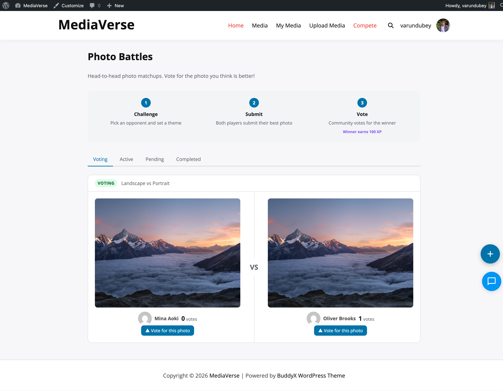

# Your First Upload

Upload your first photo in two minutes - drag, drop, set privacy, done. Here is exactly how it works.

## Option 1: Use the Upload Block or Shortcode

Add the upload form to any page using either the Gutenberg block or shortcode.

**In the Block Editor:** Add the **Media Upload** block (in the **MediaVerse** block category) to your page.

**In the Classic Editor or any text area:**
```
[mvs_upload]
```

MediaVerse already creates an **Upload Media** page (`/upload-media/`) with this form when you activate the plugin. Members who can upload also see a **+** button on MediaVerse pages and an upload button in **My Media**. Which roles can upload is set under **MediaVerse > Settings > General > Who can upload media**.



## Option 2: Upload via REST API

Use the REST endpoint directly (for custom integrations):

```bash
curl -X POST https://yoursite.com/wp-json/mvs/v1/media \
  -H "X-WP-Nonce: YOUR_NONCE" \
  -F "file=@/path/to/image.jpg" \
  -F "title=My First Upload" \
  -F "privacy=public"
```

## The Upload Process

When you upload a file, MediaVerse:

1. **Validates** the MIME type against your allowed file types list.
2. **Checks the file size** against your configured maximum (**Max Upload Size**, default: 100 MB).
3. **Checks for duplicates** using a SHA-256 hash of the file. Only the member's own earlier uploads count. By default the upload goes ahead with a warning; **Duplicate Detection** can block it or turn the check off.
4. **Removes the GPS location** from photos (the **Remove location from photos** setting, on by default). Camera details stay.
5. **Stores the file** where **MediaVerse > Settings > Storage** says (this server by default; cloud storage needs Pro). New files get a random file name.
6. **Creates a record in the `mvs_media_index` table** with the title, privacy level, and file metadata (media is not stored as a WordPress post).
7. **Runs AI analysis** if **Auto-Analyze Uploads** is on (needs an AI provider key).
8. **Runs AI moderation** if **AI Moderation** is on.
9. **Records BuddyPress activity** if BuddyPress is active. On a BuddyNext community, BuddyNext publishes the feed card.

If a member has a storage limit, an upload that would go over it is refused with a message.

## Supported File Types

By default, MediaVerse accepts:

| Type | Formats |
|------|---------|
| Images | JPEG, PNG, GIF, WebP |
| Video | MP4, WebM |
| Audio | MP3 (MPEG), OGG |

You can change the allowed file types in **MediaVerse > Settings > General > Allowed File Types**.

## Setting Privacy on Upload

The upload form offers these privacy levels:

| Level | Who Can See It |
|-------|---------------|
| Public: anyone can see | Everyone, including logged-out visitors |
| Members: logged-in users only | Any logged-in WordPress user |
| Friends: your friends only | The uploader's BuddyPress friends. Only offered when the BuddyPress Friends component is active |
| Only me: hidden from everyone else | Only the uploader and administrators |

Media posted into a BuddyPress group is limited to that group's members automatically. MediaVerse also honours Group, Space and Custom levels that come from an import or the API, but the upload form does not offer them.

The default privacy level is set in **MediaVerse > Settings > General > Default Privacy Level** (Public, Members Only or Private). It starts as Public, or Members Only on a private community. If you turn off **Allow Users to Set Privacy** on the same screen, the form does not show the choice. It tells the member who will see the upload instead.

## After Uploading

Your uploaded media appears:
- On the **Explore Media** page (`/explore-media/`), if its privacy allows
- In the **MediaVerse > All Media** list in your admin dashboard
- In the **Media** tab on your BuddyPress profile (if BuddyPress is active)
- In your **My Media** page (`/my-media/`, or the `[mvs_dashboard]` shortcode on another page)
