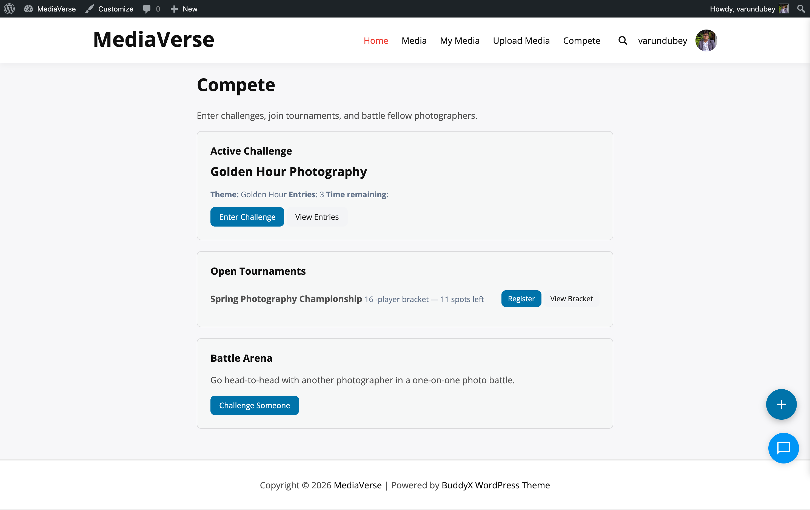

# Installation

Get WPMediaVerse running on your WordPress site in under five minutes — install, activate, and your community is ready to start uploading.

## Requirements

- WordPress 6.5+
- PHP 7.4+
- MySQL 5.7+ or MariaDB 10.4+
- BuddyPress 12.0+ (optional, for social integration)

## Installing via WordPress Admin

1. Go to **Plugins > Add New Plugin** in your WordPress dashboard.
2. Search for **WPMediaVerse**.
3. Click **Install Now**, then **Activate**.

## Installing via ZIP Upload

1. Download the `wpmediaverse.zip` file from [wbcomdesigns.com](https://wbcomdesigns.com/downloads/wpmediaverse/).
2. Go to **Plugins > Add New Plugin > Upload Plugin**.
3. Choose the ZIP file and click **Install Now**.
4. Click **Activate Plugin**.

## Installing via FTP

1. Unzip the downloaded archive.
2. Upload the `wpmediaverse` folder to `/wp-content/plugins/`.
3. Go to **Plugins** in your dashboard and activate **WPMediaVerse**.

## What Happens on Activation

When you activate WPMediaVerse, the plugin automatically:

- Creates 8 custom database tables for stats, reactions, favorites, media index, collections, access grants, webhooks, and view tracking.
- Registers the `mvs_media`, `mvs_album`, and `mvs_collection` custom post types.
- Registers the `mvs_tag` and `mvs_category` taxonomies.
- Adds default capabilities to the Administrator, Editor, Author, Contributor, and Subscriber roles.
- Redirects you to the **Setup Wizard** for initial configuration.

## Deactivation and Uninstall

**Deactivation** stops all plugin functionality but keeps your data intact.

**Uninstall** (deleting the plugin) removes all plugin data including:
- All `mvs_media`, `mvs_album`, and `mvs_collection` posts
- All custom database tables
- All plugin options and transients

To preserve data after uninstalling, export your media library first.
