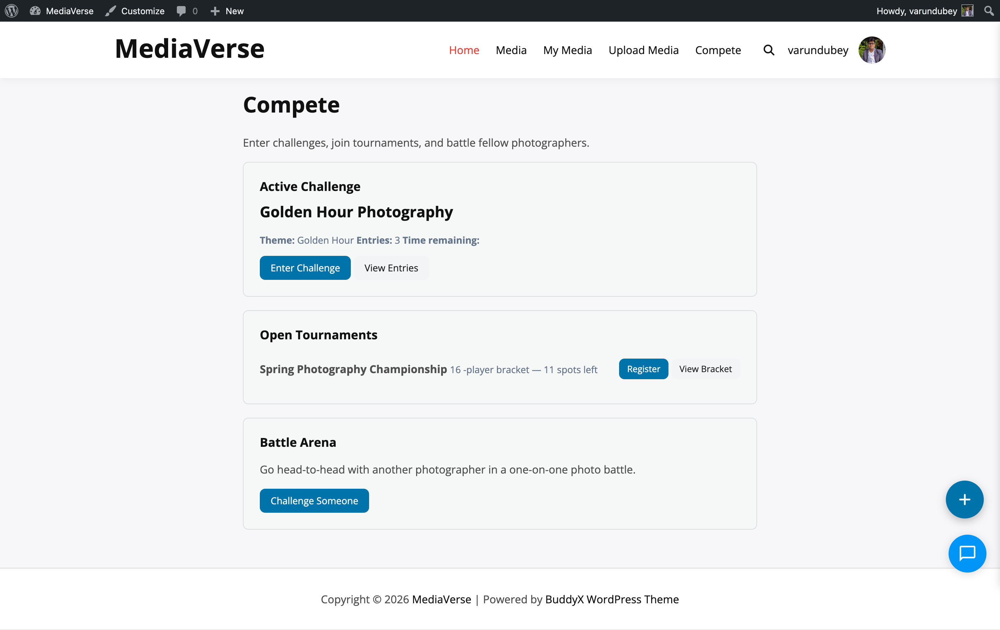

# Installation

Get MediaVerse running on your WordPress site in under five minutes - install, activate, and your community is ready to start uploading.

## Requirements

- WordPress 6.5+
- PHP 7.4+
- MySQL 5.7+ or MariaDB 10.4+
- BuddyPress 12.0+ (optional, for social integration)

## Installing via WordPress Admin

1. Go to **Plugins > Add New Plugin** in your WordPress dashboard.
2. Search for **MediaVerse**.
3. Click **Install Now**, then **Activate**.

## Installing via ZIP Upload

1. Download the `wpmediaverse.zip` file from [wbcomdesigns.com](https://wbcomdesigns.com/downloads/mediaverse/).
2. Go to **Plugins > Add New Plugin > Upload Plugin**.
3. Choose the ZIP file and click **Install Now**.
4. Click **Activate Plugin**.

## Installing via FTP

1. Unzip the downloaded archive.
2. Upload the `wpmediaverse` folder to `/wp-content/plugins/`.
3. Go to **Plugins** in your dashboard and activate **MediaVerse**.

## What Happens on Activation

When you activate MediaVerse, the plugin automatically:

- Creates 23 custom database tables for the media index, stats, reactions, favorites, follows, notifications, reports, blocks, album items, conversations, messages and more - all separate from wp_posts for maximum performance. Comments use WordPress comments, and webhooks are stored as a setting.
- Creates the **Explore Media** (`/explore-media/`), **My Media** (`/my-media/`) and **Upload Media** (`/upload-media/`) pages if they do not exist.
- Registers the `mvs_album` and `mvs_collection` custom post types (media itself uses the custom `mvs_media_index` table, not wp_posts).
- Registers the `mvs_tag` and `mvs_category` taxonomies.
- Adds default capabilities to the Administrator, Editor, Author, Contributor, and Subscriber roles.
- Redirects you to the **Setup Wizard** for initial configuration, until you finish it. A bulk activation or WP-CLI activation does not redirect.

## Deactivation and Uninstall

**Deactivation** stops all plugin functionality but keeps your data intact.

**Uninstall** (deleting the plugin) keeps your media records, albums, messages and settings by default. This means you can delete and re-upload the plugin to update it without losing anything. Uploaded files and the pages MediaVerse created are never deleted.

To remove everything on delete, turn on **Remove Data on Delete** under **MediaVerse > Settings > General** before you delete the plugin. Then deleting the plugin also removes:
- All `mvs_album` and `mvs_collection` posts
- All custom database tables (including the `mvs_media_index` media records)
- All plugin options, member settings, tags and categories

Removed data cannot be restored, so export what you need first.
