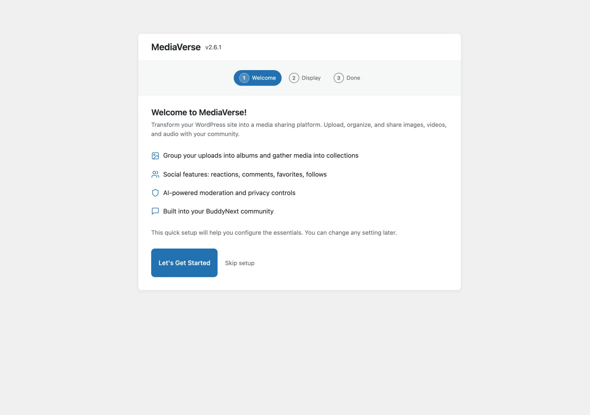
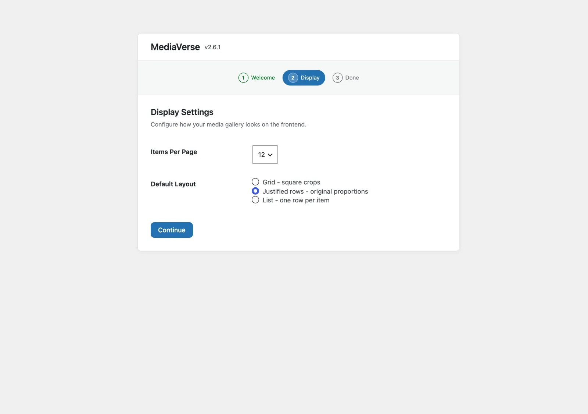

# Setup Wizard

After you activate MediaVerse, a short wizard guides you through the only settings you need to make your first upload possible. The whole thing takes about two minutes.

## Step 1: Welcome

A quick overview of what MediaVerse does - albums and collections, the social layer (reactions, comments, favorites, follows), AI moderation and privacy controls, and whether it is connected to BuddyNext or BuddyPress. Click **Let's Get Started** to continue, or **Skip setup** to jump straight to the dashboard.

## Step 2: Display

Configure how media appears on your site.

| Option | Choices | Default |
|--------|---------|---------|
| Items Per Page | 12, 24, 48 | 12 |
| Default Layout | Grid (square crops), Justified rows (original proportions), List (one row per item) | Justified rows |

Click **Continue** to save these two choices. Grid columns are not part of the wizard. You can set them, and change the options above, any time under **MediaVerse > Settings > Display**.

The frontend pages (Explore Media, My Media, Upload Media) are created automatically when you activate the plugin, so the wizard no longer has a step for them. The **Frontend Pages** panel on the MediaVerse Overview screen shows whether each one is in place.

## Step 3: Done

The last screen says "Your Media Hub is Ready!" and offers **Visit Explore Page** and **My Dashboard** buttons. Click **Go to Overview** to mark setup as complete and open the **MediaVerse Overview** screen.

From there you can:
- Upload your first media file (see [Your First Upload](first-upload.md))
- Turn on AI features under **MediaVerse > Settings > AI**, and AI moderation under **MediaVerse > Settings > Moderation**
- Check the **Integrations** card for Wbcom plugins that work with MediaVerse

## Role Capabilities

The wizard itself does not configure roles. On activation, MediaVerse adds default media capabilities to the Administrator, Editor, Author, Contributor, and Subscriber roles. To choose which roles can upload, use **Who can upload media** under **MediaVerse > Settings > General**.

## Skipping the Wizard

The **Skip setup** link on the Welcome screen takes you to the MediaVerse Overview without saving anything. Skipping does not mark setup as complete, so the wizard opens again the next time you activate the plugin. Once you click **Go to Overview** on the last screen, setup is complete and the wizard no longer opens after activation. You can still open it from its address (`/wp-admin/admin.php?page=mvs-setup`).
