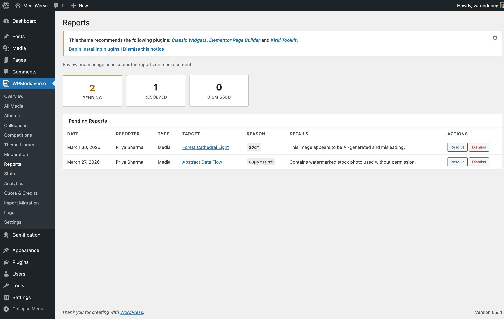

# AI Providers

> **Requires MediaVerse Pro** - This feature is available exclusively in the Pro version.

MediaVerse Pro adds Google Cloud Vision, AWS Rekognition, and Claude (Anthropic) as AI analysis providers alongside the built-in OpenAI Vision option. All four providers support auto-tagging and content moderation.

## Supported Providers

| Provider | Auto-Tag | Content Moderation | Configuration Location |
|----------|----------|--------------------|----------------------|
| OpenAI (GPT-4 Vision) (free + Pro) | Yes | Yes | MediaVerse > Settings > AI |
| Google Vision | Yes | Yes | MediaVerse > Settings > AI, Google Cloud Vision section |
| AWS Rekognition | Yes | Yes | MediaVerse > Settings > AI, AWS Rekognition section |
| Claude (Anthropic) | Yes | Yes | MediaVerse > Settings > AI, Anthropic (Claude) section |

Only one provider is active at a time. Select it under **MediaVerse > Settings > AI > AI Provider**. The section for the chosen provider appears once you select it.

---

## Google Cloud Vision

### Requirements

- A Google Cloud project with the Cloud Vision API enabled
- A Google Cloud API key (created in the Google Cloud Console, under APIs and services, Credentials)

### Settings

| Option | Option Key | Description |
|--------|-----------|-------------|
| Google Cloud API Key | `mvs_pro_google_vision_key` | Google Cloud API key. The project must have the Cloud Vision API enabled and billing on |

### What Google Vision Returns

- **Labels:** Object and scene descriptions, mapped to `mvs_tag` terms when Auto-Apply Tags is on
- **Safe Search:** Likelihood scores for adult, violence, racy, medical, and spoof categories
- **Web Detection:** Public web entities that match the image (used as supplemental tags)

---

## AWS Rekognition

### Requirements

- AWS account with the Rekognition service enabled in your chosen region
- IAM user or role with `rekognition:DetectLabels` and `rekognition:DetectModerationLabels` permissions

### Settings

| Option | Option Key | Description |
|--------|-----------|-------------|
| AWS Access Key ID | `mvs_pro_aws_access_key` | AWS IAM access key ID |
| AWS Secret Access Key | `mvs_pro_aws_secret_key` | AWS IAM secret access key |
| AWS Region | `mvs_pro_aws_region` | Pick from the regions where Rekognition is available. Default `us-east-1` |

### What Rekognition Returns

- **Labels:** Hierarchical object and scene labels with confidence scores, mapped to `mvs_tag` terms
- **Moderation Labels:** Content categories (nudity, violence, drugs, etc.) with confidence scores used by the moderation threshold settings

---

## Claude (Anthropic) **(New in 1.8.0)**

### Requirements

- An Anthropic account and API key with billing enabled

### Settings

| Option | Option Key | Description |
|--------|-----------|-------------|
| Anthropic API Key | `mvs_pro_anthropic_key` | Your Anthropic API key |

The model is **Claude Haiku 4.5**, chosen for tagging speed and cost. Since 2.6.0 there is no model picker on the screen; a site that picked Claude Sonnet 4.6 or Claude Opus 4.8 before then keeps that choice.

### What Claude Returns

- **Description + tags:** same natural-language description and comma-separated tag suggestions as the OpenAI path, mapped to `mvs_tag` terms when Auto-Apply Tags is on
- **Moderation:** flags content against the site's configured [AI Flag Criteria and Custom Flag Terms](../settings/ai-moderation.md#ai-flag-criteria-and-custom-flag-terms-new-in-180) - the same category checkboxes and custom-terms field the free plugin's OpenAI path uses

---

## Circuit Breaker

MediaVerse Pro implements a circuit breaker for all AI providers. If a provider records 5 consecutive failures (network timeout, invalid API key, rate limit), the circuit opens and no further API calls are made to that provider for a cooldown period of 1 hour. This prevents quota exhaustion during outages.

While the circuit is open, calls to that provider are skipped. The failure counter is stored in a transient that expires after the cooldown, and a successful call resets the counter immediately. There is no separate half-open/retry phase or manual reset command.

---

## Auto-Tagging Behaviour

All providers map their returned labels to `mvs_tag` taxonomy terms. Terms are created if they do not exist. Auto-tagging and the confidence/threshold controls that govern it are configured through the free plugin's AI settings (Auto-Apply Tags under **MediaVerse > Settings > AI**, and the flag settings under **MediaVerse > Settings > Moderation**) - the Pro providers feed into that same pipeline rather than adding their own tag-confidence option keys.

---

## Content Moderation Settings

Moderation settings are shared by every provider and live on **MediaVerse > Settings > Moderation**:

- **AI Moderation** - check new uploads with AI and act on what it flags.
- **When AI Flags Content** - what happens to a flagged upload, such as hiding it until you review it.
- **AI Flag Criteria** - which content categories the AI flags.
- **Custom Flag Terms** - extra terms the AI should also flag.

The separate **Auto-Hide Threshold** setting on that tab counts member reports, not AI scores.

