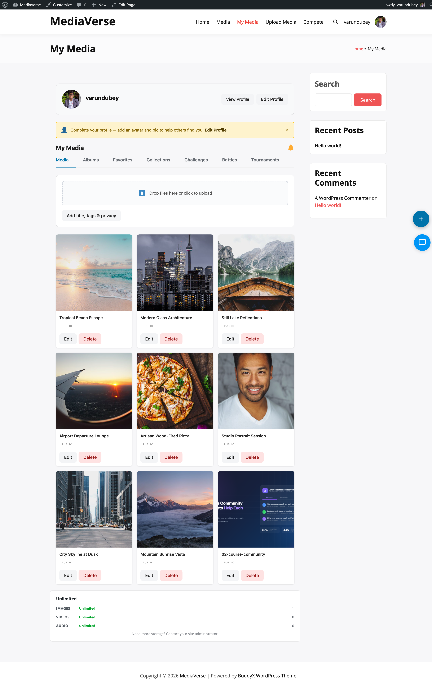

# Auto-Captions

> **Requires WPMediaVerse Pro** - This feature is available exclusively in the Pro version.


WPMediaVerse Pro transcribes video and audio files using the OpenAI Whisper API and attaches the result as a WebVTT caption file. Captions are served with the media player and can be edited via the REST API.


## Requirements

- An OpenAI API key with access to the Whisper transcription endpoint
- The media file must be a supported audio or video format (MP3, MP4, M4A, WAV, WEBM, OGG)

## Enabling Auto-Captions

Go to **Media > Settings > Video** and configure the following options.

| Option | Option Key | Default | Description |
|--------|-----------|---------|-------------|
| Auto-Generate Captions | `mvs_pro_captions_auto` | `0` | Automatically transcribe each uploaded video or audio file |
| Whisper API Key | `mvs_pro_whisper_api_key` | (empty) | Your OpenAI API key |


When **Auto-Generate Captions** is on, WPMediaVerse Pro queues a transcription job via Action Scheduler immediately after a file is stored. The caption file is saved once the Whisper API responds.

## Caption File Storage

WebVTT files are stored at:

```
/wp-content/uploads/mvs-captions/{media_id}/captions.vtt
```

If cloud storage is active, the VTT file is also uploaded alongside the media file.

## REST API

**Base URL:** `/wp-json/mvs-pro/v1/`

### GET /media/{id}/captions

Retrieve the caption file content and metadata for a media item.

**Response:**

```json
{
  "status": "complete",
  "language": "en",
  "vtt_url": "https://example.com/wp-content/uploads/mvs-captions/123/captions.vtt",
  "generated_at": "2025-03-28T10:00:00Z"
}
```

`status` can be `none`, `pending`, `complete`, or `failed`.

### POST /media/{id}/captions

Trigger Whisper transcription manually, or upload a custom VTT file.

**To trigger automatic transcription (no body required):**

```bash
curl -X POST https://yoursite.com/wp-json/mvs-pro/v1/media/123/captions \
  -H "X-WP-Nonce: NONCE"
```

**To upload your own VTT file (multipart/form-data):**

| Field | Required | Description |
|-------|----------|-------------|
| `file` | Yes | A `.vtt` file |
| `language` | No | BCP 47 language code, e.g. `en`, `fr`, `de` |

**Response:** `202 Accepted` when queuing transcription, `201 Created` when uploading a custom file.

### PUT /media/{id}/captions

Replace the caption content with edited VTT text. Use this to correct transcription errors.

**Body (JSON):**

```json
{
  "content": "WEBVTT\n\n00:00:00.000 --> 00:00:04.000\nHello and welcome.\n\n00:00:04.500 --> 00:00:09.000\nToday we are covering...",
  "language": "en"
}
```

**Response:** `200 OK` with the updated caption metadata.

### DELETE /media/{id}/captions

Remove the caption file and reset the caption status to `none`.

**Response:** `204 No Content`.

## WebVTT Format

WPMediaVerse Pro always stores captions in WebVTT format. If you upload an SRT file, it is automatically converted to VTT before saving.

Example VTT file:

```
WEBVTT

00:00:00.000 --> 00:00:04.000
Hello and welcome to this video.

00:00:04.500 --> 00:00:09.000
Today we are covering the main topic.
```

## Editing Captions in WP Admin

1. Open the media item in **Media > All Media**.
2. Scroll to the **Captions** meta box.
3. The VTT content is displayed in an editable text area.
4. Make your corrections and click **Update**.


