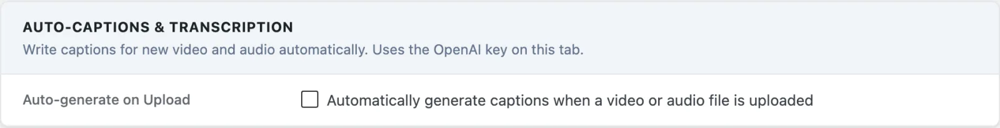

# Auto-Captions

> **Requires MediaVerse Pro** - This feature is available exclusively in the Pro version.

MediaVerse Pro transcribes video and audio files using the OpenAI Whisper API and attaches the result as a WebVTT caption file. Captions show in the website's video players through the browser's captions control (the lightbox, the single media page and the Media Player block), and can be edited via the REST API.

## Requirements

- An OpenAI API key with access to the Whisper transcription endpoint
- The media file must be a supported audio or video format (MP3, MP4, M4A, WAV, WEBM, OGG) and no larger than 25 MB, the Whisper limit

## Enabling Auto-Captions

Go to **MediaVerse > Settings > AI**. The **Auto-Captions & Transcription** section has two options.

| Option | Default | Description |
|--------|---------|-------------|
| Auto-generate on Upload | Off | Automatically generate captions when a video or audio file is uploaded |
| Default Language | English | The language most of your videos are spoken in, passed to Whisper as a hint. Choose Auto-detect if it varies. Shown once auto-generate is on |

The OpenAI API key is read from the free plugin's existing **OpenAI API Key** setting (the `mvs_openai_api_key` option, configured under **MediaVerse > Settings > AI**). There is no separate Pro Whisper key field - captions reuse the same key as the rest of the AI features.



When **Auto-generate on Upload** is on, MediaVerse Pro queues a transcription job via Action Scheduler immediately after a file is stored. The caption file is saved once the Whisper API responds.

## Caption File Storage

WebVTT files are stored at:

```
/wp-content/uploads/mvs-captions/{media_id}.vtt
```

If cloud storage is active, the VTT file is also uploaded alongside the media file.

## REST API

**Base URL:** `/wp-json/mvs-pro/v1/`

### GET /media/{id}/captions

Retrieve the caption metadata for a media item. Returns `404` when the item has no captions.

**Response:**

```json
{
  "media_id": 123,
  "vtt_url": "https://example.com/wp-content/uploads/mvs-captions/123.vtt",
  "language": "en",
  "provider": "whisper",
  "word_count": 412,
  "duration": 187.4,
  "generated_at": "2025-03-28T10:00:00Z"
}
```

### POST /media/{id}/captions/generate

Queue Whisper transcription for the media item. Requires ownership or admin (`manage_mvs_settings`). No body is required. Only video and audio items are accepted, and the OpenAI key must be set (otherwise the answer is `503`).

```bash
curl -X POST https://yoursite.com/wp-json/mvs-pro/v1/media/123/captions/generate \
  -H "X-WP-Nonce: NONCE"
```

**Response:** `202 Accepted` with `media_id`, `status` (`queued`) and a message.

### GET /media/{id}/captions/status

Poll the transcription job status for a media item.

**Response:** `200 OK` with `media_id` and `status`. While a job is in flight the status is `queued` or `processing`; otherwise `complete`, `failed` or `none`. A complete status also includes `vtt_url`, and a failed one includes a `reason`.

### PUT /media/{id}/captions

Replace the caption content with edited VTT text. Use this to correct transcription errors.

**Body (JSON):**

```json
{
  "vtt_content": "WEBVTT\n\n00:00:00.000 --> 00:00:04.000\nHello and welcome.\n\n00:00:04.500 --> 00:00:09.000\nToday we are covering..."
}
```

**Response:** `200 OK` with `media_id`, the new `vtt_url` and a message. The captions are then marked as manual.

### DELETE /media/{id}/captions

Remove the caption file and reset the caption status to `none`.

**Response:** `204 No Content`.

## WebVTT Format

MediaVerse Pro always stores captions in WebVTT format. Caption content you submit through the API must begin with the `WEBVTT` header - content that does not start with that header is rejected. There is no automatic SRT-to-VTT conversion; convert SRT to WebVTT before uploading.

Example VTT file:

```
WEBVTT

00:00:00.000 --> 00:00:04.000
Hello and welcome to this video.

00:00:04.500 --> 00:00:09.000
Today we are covering the main topic.
```

## Editing Captions

To correct a transcription, replace the stored VTT through the REST API with `PUT /media/{id}/captions`, passing the edited WebVTT content in the `vtt_content` field (see the REST API section above). The content must begin with the `WEBVTT` header.
