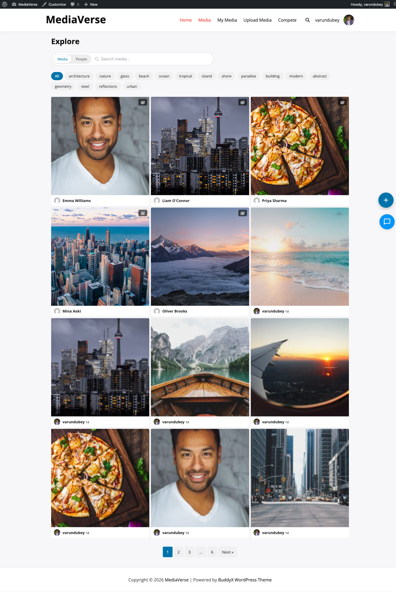

# Layout Modes

> **Requires WPMediaVerse Pro** — This feature is available exclusively in the Pro version.


> **Requires WPMediaVerse Pro** — This feature is available exclusively in the Pro version.

Transform your media community's look with one click — choose the visual style that fits your audience, from Instagram-style grids to Pinterest masonry boards.

## What You Can Do

- Switch between four distinct visual layouts without touching code
- Match your community's purpose: photo sharing, discovery, portfolios, or design showcases
- Override the global layout for any individual gallery using a shortcode attribute
- Conditionally switch layouts by page context using the `mvs_pro_feed_layout` filter

## The Four Layouts at a Glance

| Mode | Best For |
|------|----------|
| Instagram | Photo-sharing communities, daily uploads, stories |
| Pinterest | Inspiration boards, discovery-focused sites |
| Flickr | Photography portfolios, camera clubs |
| Dribbble | Design showcases, creative portfolios |

## How to Switch Layouts (for Site Owners)

1. Go to **Media > Settings > Display**
2. Find the **Feed Layout** option and select your preferred mode
3. Click **Save Settings** — the explore page, all profile media tabs, and gallery shortcodes update immediately

The setting is stored in the `mvs_pro_feed_layout` option.

## What Changes for Users When You Switch Layouts

- The explore/browse page re-renders in the new layout style
- All user profile media tabs switch to the new layout automatically
- The lightbox updates: Flickr mode shows EXIF camera data in the sidebar; Instagram shows the swipe carousel
- Stories appear above the grid in Instagram mode only


---

## Choosing a Layout Mode

The selected mode applies to the explore archive, user profile media tab, and any `[mvs_gallery]` shortcode or Media Grid block that does not override it with a `layout` attribute.

---

## Instagram Mode

Perfect for photo-sharing communities, daily uploads, and story-driven sites.


The Instagram layout renders a uniform square grid. Each thumbnail is cropped to a 1:1 ratio regardless of the original file dimensions.

- Stories appear as circular avatar-style thumbnails above the grid
- Clicking a grid item opens the lightbox with a swipe-enabled carousel
- Profile page shows a pinned highlight reel of the user's most-reacted media above the grid

**Feed template:** `templates/feed/instagram.php`
**Profile template:** `templates/profile/instagram.php`

---

## Pinterest Mode

Ideal for inspiration boards, discovery-focused sites, and mixed-format content.


The Pinterest layout uses a masonry algorithm that preserves each image's original proportions. Cards include the media title and a truncated description below the image.

- Column count is controlled by the **Grid Columns** display setting (2–4)
- Hovering a card reveals a save-to-collection button
- Infinite scroll loads the next page of results automatically

**Feed template:** `templates/feed/pinterest.php`
**Profile template:** `templates/profile/pinterest.php`

---

## Flickr Mode

Best for photography portfolios, camera clubs, and image-quality-focused communities.


The Flickr layout uses a justified gallery algorithm: images in each row are resized to fill the full container width while maintaining a consistent row height. The default row height is 200px and is configurable per shortcode.

- Clicking an image opens the lightbox with EXIF data displayed in the sidebar
- Profile page shows a filmstrip-style contact sheet view

**Feed template:** `templates/feed/flickr.php`
**Profile template:** `templates/profile/flickr.php`

**Shortcode override:**

```
[mvs_gallery layout="flickr" row_height="240"]
```

| Attribute | Default | Description |
|-----------|---------|-------------|
| `layout` | (site setting) | Force a specific layout for this shortcode instance |
| `row_height` | `200` | Target row height in pixels (Flickr mode only) |

---

## Dribbble Mode

Great for design showcases, creative portfolios, and high-resolution work.



The Dribbble layout presents media as large portfolio shots in a 2-column grid. Each card shows the title, view count, and reaction count on hover. This layout is optimised for high-resolution PNG and GIF files.

- Animated GIFs play on hover
- Profile page shows featured work prominently at the top before the full grid

**Feed template:** `templates/feed/dribbble.php`
**Profile template:** `templates/profile/dribbble.php`

---

## Overriding the Layout Per Shortcode

You can force any layout mode on a per-shortcode basis without changing the global setting:

```
[mvs_gallery layout="pinterest"]
[mvs_gallery layout="flickr" row_height="180"]
[mvs_gallery layout="dribbble"]
```

The `layout` attribute accepts: `instagram`, `pinterest`, `flickr`, `dribbble`.

## Overriding the Layout in Code

```php
add_filter( 'mvs_pro_feed_layout', function( $layout ) {
    // Force Flickr layout on archive pages.
    if ( is_post_type_archive( 'mvs_media' ) ) {
        return 'flickr';
    }
    return $layout;
} );
```
