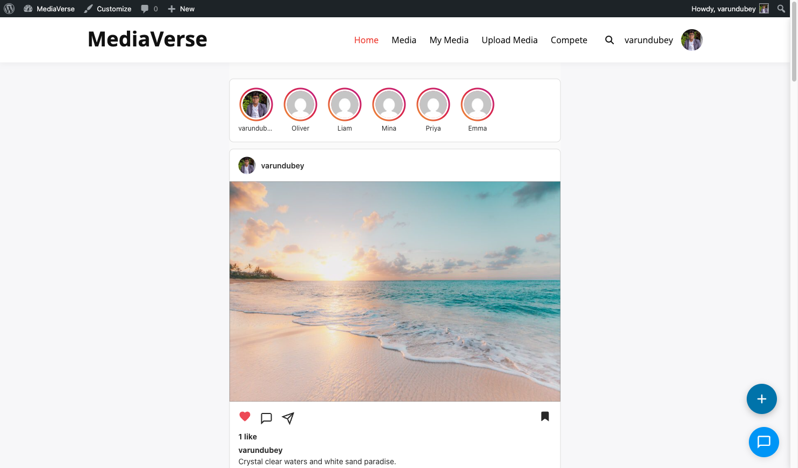
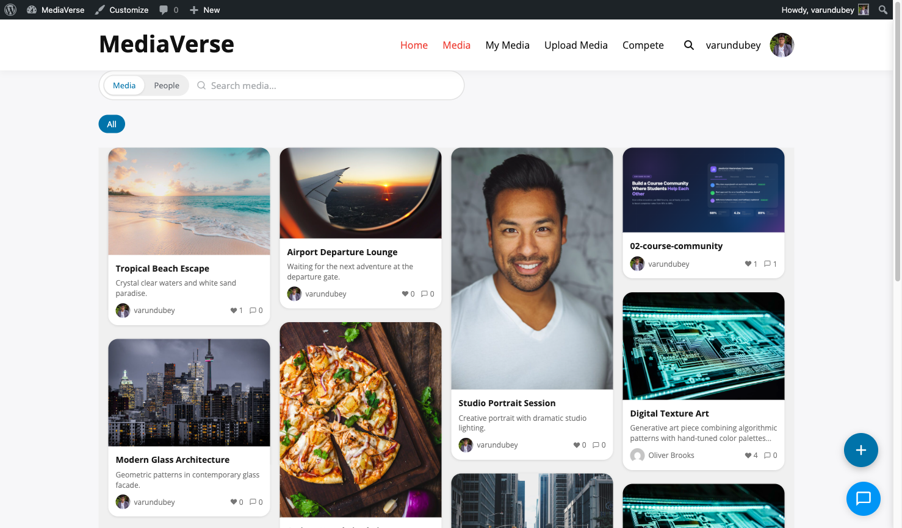
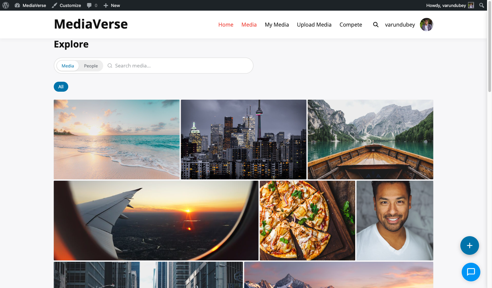

# Layout Modes

> **Requires WPMediaVerse Pro** - This feature is available exclusively in the Pro version.


Transform your media community's look with one click - choose the visual style that fits your audience, from Instagram-style grids to Pinterest masonry boards.

## What You Can Do

- Switch between four distinct visual layouts without touching code
- Match your community's purpose: photo sharing, discovery, portfolios, or design showcases
- Drop a specific layout on any page with its dedicated block or shortcode (Instagram, Flickr, Pinterest, Dribbble feed)
- Conditionally switch the active layout by page context using the `mvs_active_layout` filter

## The Four Layouts at a Glance

| Mode | Best For |
|------|----------|
| Instagram | Photo-sharing communities, daily uploads, stories |
| Pinterest | Inspiration boards, discovery-focused sites |
| Flickr | Photography portfolios, camera clubs |
| Dribbble | Design showcases, creative portfolios |

## How to Switch Layouts (for Site Owners)

1. Go to **Media > Settings > Display**
2. Find the **Feed Layout** option and select your preferred mode
3. Click **Save Settings** - the explore page and all profile media tabs update immediately

The setting is stored in the `mvs_pro_feed_layout` option.

## What Changes for Users When You Switch Layouts

- The explore/browse page re-renders in the new layout style
- All user profile media tabs switch to the new layout automatically
- The lightbox updates: Flickr mode shows EXIF camera data in the sidebar; Instagram shows the swipe carousel
- Stories appear above the grid in Instagram mode only


---

## Choosing a Layout Mode

The selected mode applies to the explore archive and the user profile media tab. For a specific layout on a specific page, use that layout's own block (e.g. **Instagram Feed**) or shortcode (e.g. `[mvs_pro_instagram_feed]`) instead of relying on the global setting.

---

## Instagram Mode

Perfect for photo-sharing communities and daily uploads.



The Instagram layout renders a vertical card feed. Each post shows the author avatar, full-width photo, reaction/comment/share buttons, like count, caption, and inline comment box - identical to the Instagram experience.

- Recent uploaders appear as circular avatars above the feed (links to their profiles)
- Each card has heart, comment, share, and bookmark buttons
- Clicking "Expand" opens the lightbox with the full media detail view
- Other users' posts show a "Following" button in the card header

**Feed template:** `templates/layouts/instagram/feed.php`
**Profile template:** `templates/layouts/instagram/profile.php`

---

## Pinterest Mode

Ideal for inspiration boards, discovery-focused sites, and mixed-format content.



The Pinterest layout uses a masonry algorithm that preserves each image's original proportions. Cards include the media title and a truncated description below the image.

- Column count is controlled by the **Grid Columns** display setting (2–4)
- Hovering a card reveals a save-to-collection button
- Infinite scroll loads the next page of results automatically

**Feed template:** `templates/layouts/pinterest/feed.php`
**Profile template:** `templates/layouts/pinterest/profile.php`

---

## Flickr Mode

Best for photography portfolios, camera clubs, and image-quality-focused communities.



The Flickr layout uses a justified gallery algorithm: images in each row are resized to fill the full container width while maintaining a consistent row height.

- Clicking an image opens the lightbox with EXIF data displayed in the sidebar
- Profile page shows a filmstrip-style contact sheet view

**Feed template:** `templates/layouts/flickr/feed.php`
**Profile template:** `templates/layouts/flickr/profile.php`

Drop the Flickr layout on a specific page with the **Flickr Feed** block or the `[mvs_pro_flickr_feed]` shortcode.

---

## Dribbble Mode

Great for design showcases, creative portfolios, and high-resolution work.


The Dribbble layout presents media as large portfolio shots in a 2-column grid. Each card shows the title, view count, and reaction count on hover. This layout is optimised for high-resolution PNG and GIF files.

- Animated GIFs play on hover
- Profile page shows featured work prominently at the top before the full grid

**Feed template:** `templates/layouts/dribbble/feed.php`
**Profile template:** `templates/layouts/dribbble/profile.php`

---

## Putting a Specific Layout on a Specific Page

Each layout ships as its own block and shortcode, so you can mix layouts across pages without changing the global setting:

| Layout | Block | Shortcode |
|--------|-------|-----------|
| Instagram | Instagram Feed | `[mvs_pro_instagram_feed]` |
| Flickr | Flickr Feed | `[mvs_pro_flickr_feed]` |
| Pinterest | Pinterest Feed | `[mvs_pro_pinterest_feed]` |
| Dribbble | Dribbble Feed | `[mvs_pro_dribbble_feed]` |

## Overriding the Active Layout in Code

The global active-layout slug (read from the `mvs_pro_feed_layout` option) passes through the `mvs_active_layout` filter, so you can switch it by context:

```php
add_filter( 'mvs_active_layout', function( $layout ) {
    // Force the Flickr layout on archive pages.
    if ( is_post_type_archive( 'mvs_media' ) ) {
        return 'flickr';
    }
    return $layout;
} );
```
