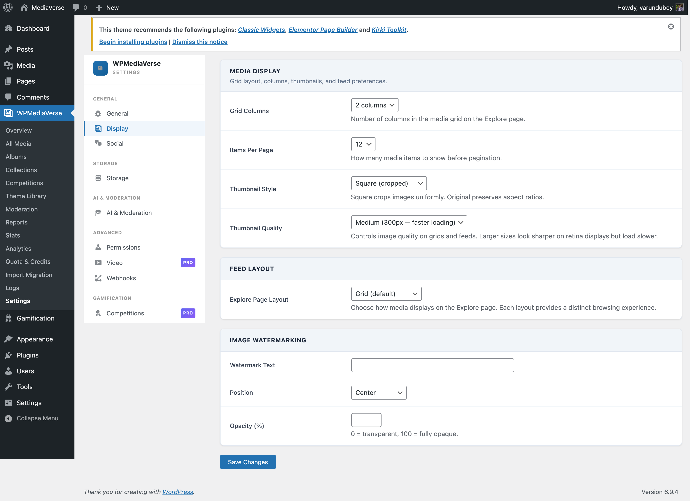

# Mobile App (White-Label & Push)

> **Requires WPMediaVerse Pro** - This feature is available exclusively in the Pro version.

WPMediaVerse Pro powers a native mobile app for your community. Pro supplies the app's branding, feature flags, feed layout, push notifications, and leaderboard through the REST API - the same data your site already manages, delivered in the shape a native client needs.

## White-Label Branding

Brand the app for your own community: your logo, your accent color, your login screen. Every member who connects the app to your site sees your brand, not a generic MediaVerse skin.

Go to **Media > Settings > Display > Mobile App Branding**.

| Option | Option Key | Default | Description |
|--------|-----------|---------|-------------|
| Accent Color | `mvs_app_accent_color` | `#7C3AED` | Primary brand color for buttons, links, and active states in the app |
| App Logo | `mvs_app_logo_id` | (none) | Media Library attachment shown on the app login screen. PNG with transparency recommended. Falls back to the site name as text when empty |
| Login Background | `mvs_app_login_bg_id` | (none) | Optional full-bleed image behind the app login screen. Plain background when empty |
| Default to Dark Mode | `mvs_app_dark_mode_default` | Off | New installs open in dark mode; members can still switch |

## Feed Layout

The app mirrors the feed layout you picked for the web Explore page - grid, Instagram, Pinterest, Flickr, or Dribbble - so the app matches the browsing experience you configured. This is the same `mvs_pro_feed_layout` setting on **Media > Settings > Display > Feed Layout** described in [Layout Modes](layout-modes.md); there is no separate app-only layout setting.

## Feature Flags

The app also learns which competitive and video features are switched on for your site - battles, challenges, tournaments, boosts, streaks, and stories - so it only mounts the screens you've actually enabled. Each flag mirrors the matching admin toggle (e.g. `mvs_challenges_enabled`); there is nothing extra to configure for the app itself.

## How the App Gets This (Developers)

A native or headless client calls `GET /wp-json/mvs/v1/app/config` once, before theming itself and deciding which screens to mount. This is a Free-plugin route (public, no authentication) that Pro contributes branding, layout, and feature flags into via filters. The filters themselves (`mvs_app_config_branding`, `mvs_app_config_features`, `mvs_app_config_layout`) are documented in the Free plugin's [Hooks & Filters reference](../developer-guide/hooks-filters.md) - this page covers the feature, not the filter contract.

Full request/response details for `/app/config` plus the Pro-only push and leaderboard routes below are in the [Pro REST API Reference](../developer-guide/pro-rest-api.md#app-mobile-app-new-in-190).

## Push Notifications

Once a member is logged in, the app registers its Expo push token with your site so it can push notifications for events like new messages, challenge results, and battle/tournament outcomes.

- `POST /mvs-pro/v1/push/register-device` - register (or refresh) a device token for the current user.
- `DELETE /mvs-pro/v1/push/register-device` - remove a device token (e.g. on logout).

Both require a logged-in user. See the [Pro REST API Reference](../developer-guide/pro-rest-api.md#app-mobile-app-new-in-190) for the full parameter list.

## Leaderboard

`GET /mvs-pro/v1/leaderboard` powers the app's gamification screen. It's backed by the same `LeaderboardService` as the `pro-leaderboard` block, so the ranking the app shows is identical to the one on your site - ranked by reactions, upload count, or gamification XP, over all time, the last 30 days, or the last 7 days. The response includes the ranked page plus the current viewer's own rank in one round trip, so the app doesn't need a second request to show "your rank."

## Requirements

- WPMediaVerse Pro 1.9.0 or higher.
- A native or headless client (e.g. the official MediaVerse app) that calls `/app/config`, the push routes, and the leaderboard route.
