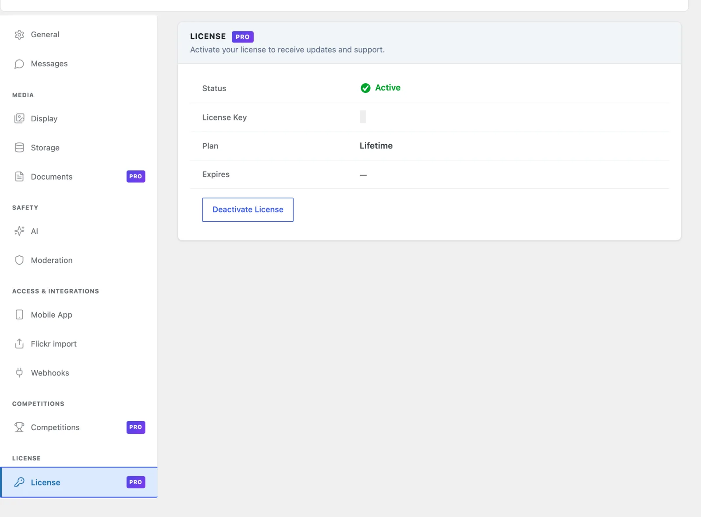

# MediaVerse Pro

> **Requires MediaVerse Pro** - This feature is available exclusively in the Pro version.

MediaVerse Pro extends the free plugin with advanced layout modes, cloud storage, document drives, photo competitions, video analytics, chapters and auto-captions, AI providers, and granular privacy controls.

> Pro does not transcode video. The FFmpeg pipeline was removed in 2.4.0 - MediaVerse embeds media, it does not process it. The player uses the original file.

> Storage limits are not a Pro feature. Free's Settings > General has one optional "Fair-use storage limit per member (MB)" (0 = no limit), with a per-member override on the member's wp-admin profile. Pro's quota packages, credits and membership-plugin quota mapping were removed in 2.6.0 - see [Free vs Pro](../getting-started/free-vs-pro.md).

## Requirements

- MediaVerse (free) 2.6.0 or higher installed and activated (Pro halts with an admin notice on older Free). Free and Pro are released together at the same version, so update both at once
- WordPress 6.5+
- PHP 7.4+
- MySQL 5.7+ or MariaDB 10.4+

## Installation

1. Install and activate the free **MediaVerse** plugin first.
2. Go to **Plugins > Add New Plugin > Upload Plugin**.
3. Upload the `wpmediaverse-pro.zip` file and click **Install Now**.
4. Click **Activate Plugin**.
5. Go to **MediaVerse > Settings > License** and enter your license key.
6. Click **Activate License**.

All Pro features run as soon as the plugin is activated. The license key unlocks automatic updates; it is not a feature switch.

There is exactly one exception: **Documents writes**. On a site whose licence has lapsed, existing documents stay readable, downloadable and previewable, but uploading, replacing, moving, sharing and folder changes are refused until the licence is active again. Nothing is migrated, converted or lost. See [Documents](documents.md). Every other Pro capability works regardless of license state.

## Updating Pro

When an update is available, WordPress shows it in the standard **Plugins** screen. The updater requires a valid active license. If your license has expired, your installed Pro features keep working - only automatic updates are paused. Download the latest ZIP from your account at [wbcomdesigns.com](https://wbcomdesigns.com/my-account/) and upload it manually.

## 1.2.0: All Pro features now Gutenberg blocks

Every Pro feature ships as a Gutenberg block, configurable in the editor. The competition, layout and leaderboard blocks have a matching `[mvs_pro_*]` shortcode for the classic editor. The Stories block has no shortcode. Documents have their own `[mvs_document]` shortcode.

| Block | Handle | Notes |
|-------|--------|-------|
| Tournament | `mvs/pro-tournament` | Configurable `tournamentId` attribute. |
| Tournaments List | `mvs/pro-tournaments-list` | Lists active tournaments. |
| Challenge | `mvs/pro-challenge` | Configurable `challengeId` attribute. |
| Challenges List | `mvs/pro-challenges-list` | Lists active and upcoming challenges. |
| Battle | `mvs/pro-battle` | Configurable `battleId` attribute. |
| Battles Active | `mvs/pro-battles-active` | Currently running battles. |
| Instagram Feed | `mvs/pro-instagram-feed` | Instagram-style square grid layout. |
| Flickr Feed | `mvs/pro-flickr-feed` | Flickr-style justified rows layout. |
| Pinterest Feed | `mvs/pro-pinterest-feed` | Pinterest-style masonry layout. |
| Dribbble Feed | `mvs/pro-dribbble-feed` | Dribbble-style card grid layout. |
| Leaderboard | `mvs/pro-leaderboard` | Top performers across competitions. |
| Compete Hub | `mvs/pro-compete-hub` | Combined challenges + battles + tournaments dashboard. |
| Stories | `mvs/pro-stories` | 24-hour ephemeral stories bar + fullscreen viewer, with a same-screen "Your story" upload tile. Added in 1.9.0. |
| Document | `mvs/pro-document-embed` | Embeds one document. See [Documents](documents.md). |
| Document List | `mvs/pro-document-list` | Lists documents. See [Documents](documents.md). |

**Layout flexibility:** because each layout (Instagram, Flickr, Pinterest, Dribbble) is its own block, admins can mix layouts on different pages - e.g. a Pinterest feed on the home page and an Instagram feed on a member directory - instead of being locked to one site-wide layout setting.

### Migration page

The migration tool admin page has one card per platform (rtMedia, MediaPress, BuddyBoss). Each card shows accurate imported counts and skips items that were already imported.

## Pro Feature Categories

| Category | Page | What It Adds |
|----------|------|--------------|
| Layout Modes | [layout-modes.md](layout-modes.md) | Instagram, Pinterest, Flickr, and Dribbble feed layouts |
| Cloud Storage | [cloud-storage.md](cloud-storage.md) | Amazon S3, BunnyCDN, Cloudflare R2 and DigitalOcean Spaces storage drivers |
| Documents | [documents.md](documents.md) | Member document drives with folders, sharing, search and previews |
| Photo competitions | [Competitions overview](../gamification/overview.md) | Photo challenges, battles, tournaments, boosts and streaks |
| Video Chapters | [video-chapters.md](video-chapters.md) | Chapter markers and resume playback |
| Auto-Captions | [auto-captions.md](auto-captions.md) | OpenAI Whisper transcription and WebVTT captions |
| Watermarking | [watermarking.md](watermarking.md) | GD-based text and logo watermarks on media |
| Video Analytics | [video-analytics.md](video-analytics.md) | Play event tracking, heatmaps, and retention reports |
| AI Providers | [ai-providers.md](ai-providers.md) | Google Cloud Vision, AWS Rekognition, and Claude (Anthropic) support |
| Advanced Privacy | [advanced-privacy.md](advanced-privacy.md) | Multi-level privacy, presets, album inheritance, and bulk updates |
| Connected Accounts | [connected-accounts.md](connected-accounts.md) | Connect Flickr to import/export photos and auto-push new uploads |
| Stories | [stories.md](stories.md) | 24-hour ephemeral stories with a tap-to-advance viewer and "seen by" receipts |
| Save to Collections | [collections.md](collections.md) | A dedicated Save control for adding media to any number of named collections, separate from favoriting |
| Mobile App | [mobile-app.md](mobile-app.md) | White-label branding, feed layout, push notifications, and a leaderboard endpoint for the native app |

## User Reports (Pro Moderation)

Pro adds a **Reports** view that surfaces user-submitted abuse reports on media and members - the complaints your community files, as opposed to the free [Moderation Queue](../features/ai-moderation.md), which is about AI/auto-flagged content awaiting an approve/reject decision.

- **Where:** **MediaVerse > Moderation**, in the **User Reports** tab.
- **Who:** any user with the `moderate_mvs_media` capability.
- **What it lists:** every report row - date, reporter, target type (media or user), the target, the reason code, and a details excerpt. A status filter switches between **Pending**, **Resolved**, and **Dismissed**, each with a live count.
- **Actions:** on a pending report you can **Resolve** (mark handled) or **Dismiss** (no action needed). Both are nonce-protected and capability-checked.

## License Management

| Setting | Location | Description |
|---------|----------|-------------|
| License Key | MediaVerse > Settings > License | Your product license key from wbcomdesigns.com |
| Activation Status | MediaVerse > Settings > License | Shows active, inactive, or expired |
| Deactivate License | MediaVerse > Settings > License | Release the activation to use on another site |

A single license activates one site. Purchase additional activations from your account dashboard if you need to run Pro on multiple sites.
