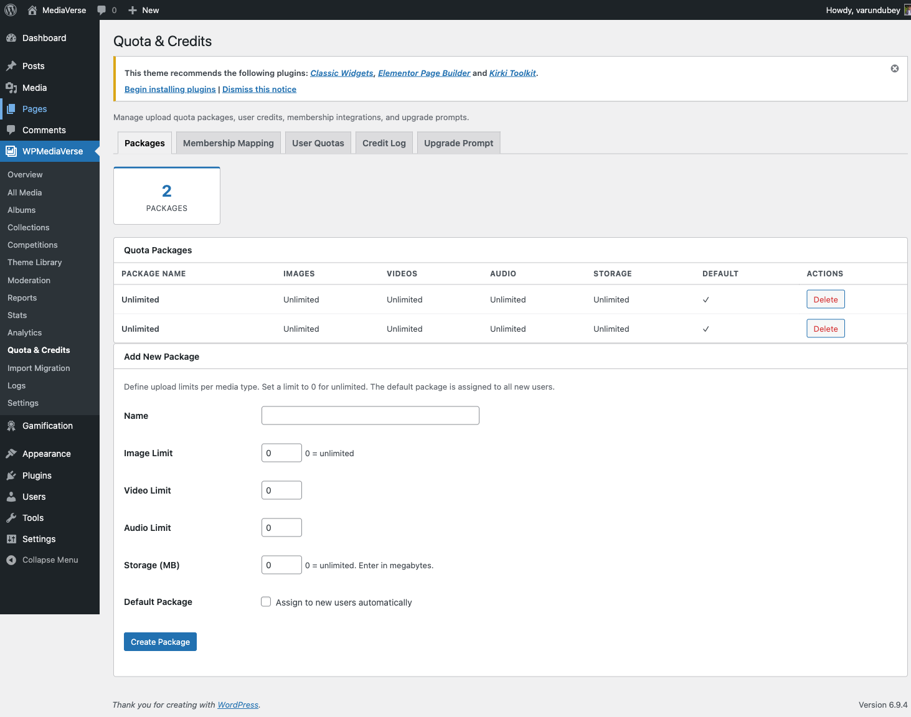

# Quotas

> **Requires WPMediaVerse Pro** - This feature is available exclusively in the Pro version.


Limit free users to 50 photos, give premium members unlimited uploads - quota packages let you build a tiered media community where upgrades have real value.

## What Users See

When a user goes to upload media, a usage widget appears at the top of the upload page. It shows a progress bar for each limit in their active package: how many images they have used out of their allowed total, the same for video and audio, and overall storage used versus their storage cap. When a limit is reached, the upload form shows a friendly message explaining which limit was hit and how to upgrade.


## Use Cases

- **Free tier:** 50 photos, 5 videos, 100 MB storage. Upgrade to Pro for unlimited.
- **Club membership:** 500 photos, 50 videos, 5 GB storage for paying members.
- **Content creator plan:** Unlimited photos and videos, 50 GB storage.

## Setting Up Quotas (for Site Owners)

1. Go to **Media > Quota Packages** and click **Add New Package**
2. Enter a name (e.g., "Free", "Pro Member", "Content Creator")
3. Set the limits for image count, video count, audio count, and total storage. Use `-1` for unlimited
4. Click **Save**
5. Go to the **Assignments** tab to map the package to a membership level or user role
6. Set a **Default Package** at **Media > Quota Packages > Settings** - this applies to users with no membership

Repeat to create as many packages as your membership tiers require.



## Membership Integrations

WPMediaVerse Pro detects active membership plugins and maps their levels to quota packages automatically.

| Plugin | How to Map |
|--------|-----------|
| MemberPress | Media > Quota Packages > Assignments > MemberPress tab |
| Paid Memberships Pro | Media > Quota Packages > Assignments > PMPro tab |
| WooCommerce Memberships | Media > Quota Packages > Assignments > WooCommerce tab |

When a user holds multiple memberships, WPMediaVerse Pro applies the highest limits across each dimension independently.

---

## How Quotas Work (Technical)

When a user uploads a file, WPMediaVerse Pro checks the user's active quota package before accepting the upload. If the upload would exceed any limit in the package, the API returns `403 Forbidden` with the error code `mvs_quota_exceeded`.

Users with the `manage_options` capability are never subject to quota limits.

## Database Tables

### mvs_quota_packages

Stores the quota package definitions.

| Column | Type | Description |
|--------|------|-------------|
| `id` | bigint | Primary key |
| `name` | varchar | Human-readable package name |
| `max_image_count` | bigint | Maximum image files allowed, `-1` for unlimited |
| `max_video_count` | bigint | Maximum video files allowed, `-1` for unlimited |
| `max_audio_count` | bigint | Maximum audio files allowed, `-1` for unlimited |
| `max_storage_bytes` | bigint | Total storage cap across all file types, `-1` for unlimited |
| `created_at` | datetime | UTC creation timestamp |

### mvs_credit_log

Logs every quota deduction and addition for auditing and rollback on delete.

| Column | Type | Description |
|--------|------|-------------|
| `id` | bigint | Primary key |
| `user_id` | bigint | WordPress user ID |
| `media_id` | bigint | Related `mvs_media` post ID |
| `type` | varchar | `image`, `video`, or `audio` |
| `bytes` | bigint | File size in bytes (positive = deduct, negative = restore) |
| `reason` | varchar | `upload`, `delete`, `admin_adjust` |
| `created_at` | datetime | UTC timestamp |

## REST API

**Base URL:** `/wp-json/mvs-pro/v1/`

### GET /quota/user/{id}

Get the current quota usage and limits for a user. Requires ownership or `manage_options`.

**Response:**

```json
{
  "user_id": 5,
  "package": "Pro Member",
  "usage": {
    "image_count": 48,
    "video_count": 3,
    "audio_count": 1,
    "storage_bytes": 524288000
  },
  "limits": {
    "max_image_count": 500,
    "max_video_count": 50,
    "max_audio_count": 50,
    "max_storage_bytes": 5368709120
  }
}
```

`storage_bytes` and `max_storage_bytes` are raw byte values. Divide by `1073741824` to display in GB.

### GET /quota/packages

List all quota packages. Requires `manage_options`.

**Response:**

```json
{
  "packages": [
    {
      "id": 1,
      "name": "Free",
      "max_image_count": 50,
      "max_video_count": 5,
      "max_audio_count": 5,
      "max_storage_bytes": 524288000
    }
  ]
}
```

### POST /quota/adjust

Manually adjust a user's usage (for migrations or corrections). Requires `manage_options`.

**Body:**

```json
{
  "user_id": 5,
  "type": "image",
  "bytes": -2097152,
  "reason": "admin_adjust"
}
```

A negative `bytes` value restores storage credit. A positive value deducts it.

**Response:** `200 OK` with the updated usage object.

## Frontend Usage Widget

A usage summary widget appears on the upload page and the user's media dashboard. It shows a progress bar for each limit in the user's active package.


To disable the widget on the upload page:

```php
add_filter( 'mvs_pro_show_quota_widget', '__return_false' );
```
