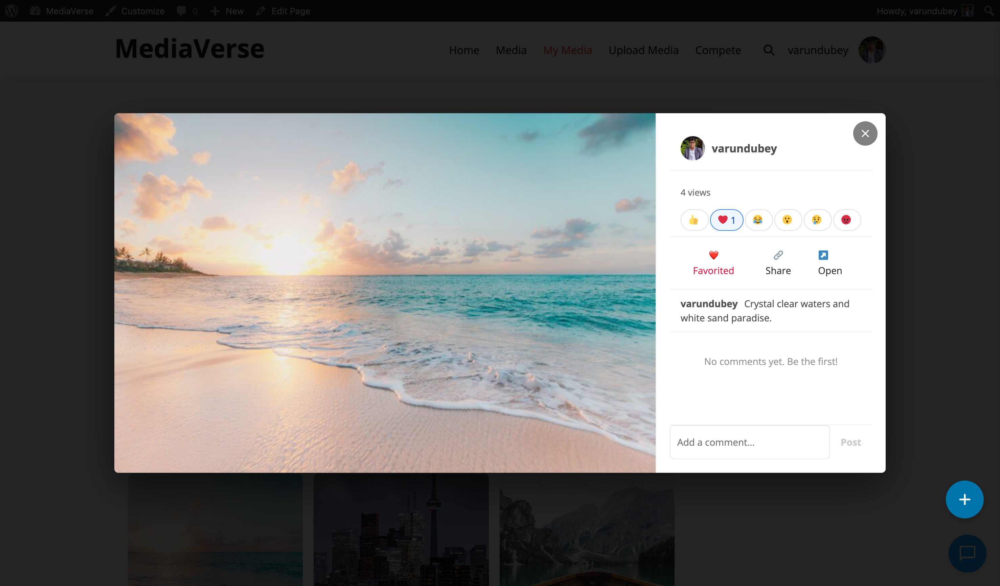
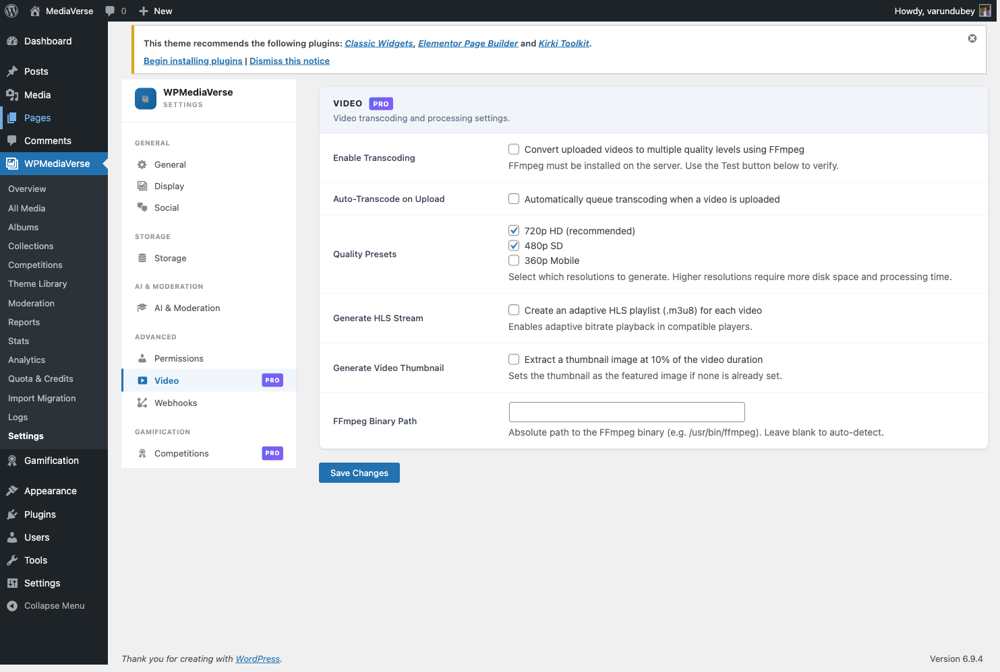

# Video Transcoding

> **Requires WPMediaVerse Pro** - This feature is available exclusively in the Pro version.


Give your community professional-quality video playback with automatic quality selection - viewers on fast connections get 720p, mobile users on slower connections get 360p, automatically.

## What Users See

When a user plays a video, they see a quality selector in the player corner showing available options: **720p**, **480p**, and **360p**. The player automatically selects the best quality for their connection and lets them override it manually. Playback starts faster because the video streams progressively rather than requiring a full download.

While transcoding is in progress after upload, the video plays at its original uploaded resolution. Once transcoding completes (typically within a few minutes), the quality selector appears.



## What Admins Need

- FFmpeg installed on the server and accessible from PHP. Verify this by running `which ffmpeg` via SSH.
- Action Scheduler 3.0+ (bundled with WooCommerce, or install as a standalone plugin from wordpress.org)

Shared hosting plans often do not have FFmpeg. VPS and dedicated servers typically do. Contact your host if you are unsure.

## Enabling Transcoding

1. Confirm FFmpeg is installed on your server: run `which ffmpeg` via SSH and note the path
2. Go to **Media > Settings > Video**
3. Enable **Transcode Uploaded Videos**
4. If your FFmpeg path differs from `/usr/bin/ffmpeg`, update the **FFmpeg Path** field
5. Click **Save Settings**
6. All new video uploads will now be queued for transcoding automatically



## Requirements

- FFmpeg installed on the server and accessible from PHP (verify with `which ffmpeg` via SSH)
- Action Scheduler 3.0+ (bundled with WooCommerce or installable as a standalone plugin)

## Enabling Transcoding

Go to **Media > Settings > Video** and enable **Transcode Uploaded Videos**. The setting is stored in the `mvs_pro_transcode_enabled` option.

| Option | Option Key | Default | Description |
|--------|-----------|---------|-------------|
| Transcode Uploaded Videos | `mvs_pro_transcode_enabled` | `0` | Enable async FFmpeg transcoding on upload |
| FFmpeg Path | `mvs_pro_ffmpeg_path` | `/usr/bin/ffmpeg` | Absolute path to the FFmpeg binary |


## Output Formats

Each uploaded video is transcoded to:

| Resolution | Bitrate | Format |
|-----------|---------|--------|
| 720p | ~2500 kbps | MP4 (H.264 + AAC) |
| 480p | ~1000 kbps | MP4 (H.264 + AAC) |
| 360p | ~500 kbps | MP4 (H.264 + AAC) |

An HLS playlist (`master.m3u8`) is also generated, referencing all three resolutions. The player loads the HLS stream by default and falls back to direct MP4 at the highest available resolution for browsers without HLS support.

## File Storage

Transcoded files are stored at:

```
/wp-content/uploads/mvs-transcodes/{media_id}/
  720p.mp4
  480p.mp4
  360p.mp4
  master.m3u8
  720p/
  480p/
  360p/
```

If cloud storage is configured, the transcoded files are uploaded to the same bucket or storage zone using the same path structure.

## Post Meta

| Meta Key | Values | Description |
|----------|--------|-------------|
| `_mvs_transcode_status` | `pending`, `processing`, `complete`, `failed` | Current transcoding job status |
| `_mvs_transcodes` | serialized array | URLs to each transcoded file and the HLS playlist |

## REST API

**Base URL:** `/wp-json/mvs-pro/v1/`

### GET /media/{id}/transcodes

Get the transcoding status and file URLs for a media item.

**Response:**

```json
{
  "status": "complete",
  "transcodes": {
    "720p": "https://example.com/wp-content/uploads/mvs-transcodes/123/720p.mp4",
    "480p": "https://example.com/wp-content/uploads/mvs-transcodes/123/480p.mp4",
    "360p": "https://example.com/wp-content/uploads/mvs-transcodes/123/360p.mp4",
    "hls": "https://example.com/wp-content/uploads/mvs-transcodes/123/master.m3u8"
  }
}
```

### POST /media/{id}/transcodes

Trigger transcoding manually. Requires ownership or `edit_others_mvs_media`. Use this to re-transcode a file after correcting the FFmpeg path.

**Response:** `202 Accepted` with the current status object.

## Transcoding Queue

Action Scheduler processes the transcoding queue in the background. You can monitor jobs at **Tools > Scheduled Actions** (if WooCommerce is active) or at the Action Scheduler standalone admin page. Filter by the `mvs_pro_transcode` hook to see only transcoding jobs.

## Troubleshooting

If transcoding fails, check:

1. FFmpeg is installed: run `ffmpeg -version` via SSH.
2. The path in **Media > Settings > Video > FFmpeg Path** matches the `which ffmpeg` output.
3. The PHP process has permission to invoke the binary (`disable_functions` in `php.ini` does not block it).
4. The `mvs-transcodes` directory inside `wp-content/uploads` is writable by the web server user.

Failed jobs set `_mvs_transcode_status` to `failed`. Re-trigger via the REST API endpoint above or by editing the media item in WP Admin and clicking **Re-Transcode**.
