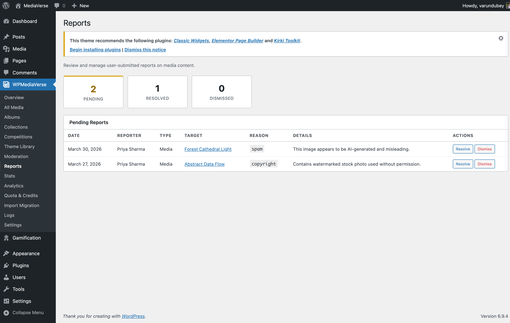
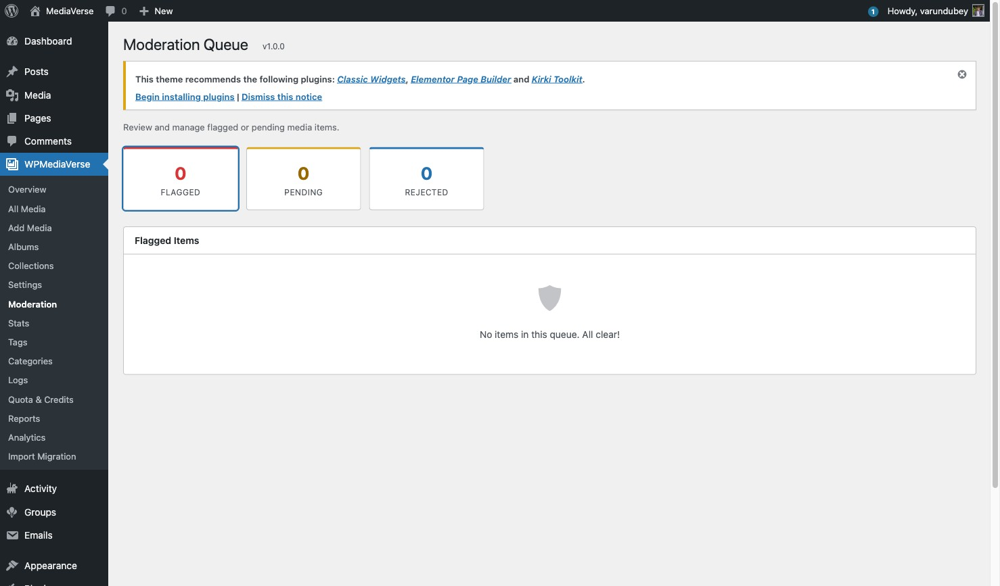
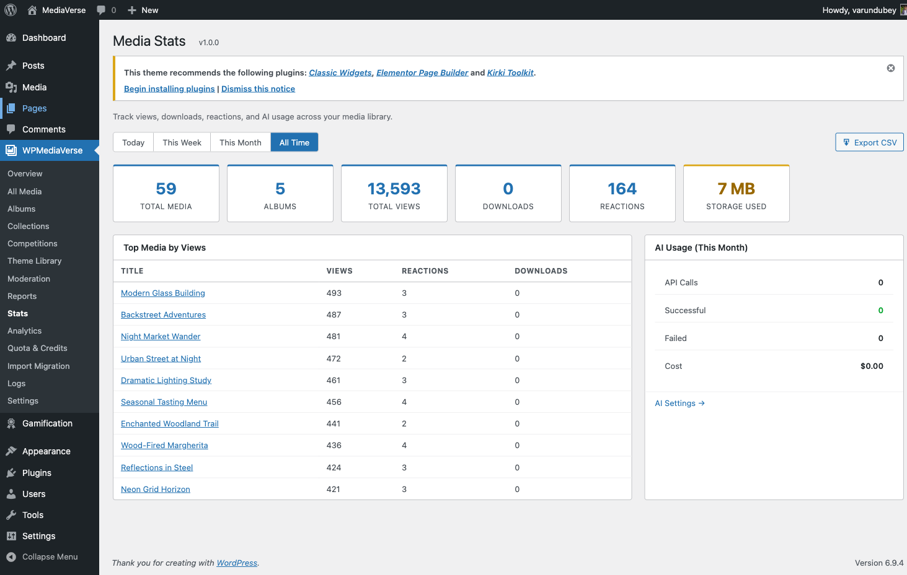

# AI & Moderation Settings

Access these settings at **WPMediaVerse > Settings > AI & Moderation**.



## AI Features Section

AI is **opt-in and off by default**. Nothing calls an AI provider until you (1) supply an API key and (2) turn on at least one of the toggles below. There is no separate "enable AI" master switch because a missing key already disables every AI feature - you stay in full control of what runs and what it costs.

| Option | Default | Description |
|--------|---------|-------------|
| AI Provider | OpenAI (GPT-4 Vision) | The AI service used for image analysis, tagging, and moderation. Free version: OpenAI only. Pro adds **Google Vision**, **AWS Rekognition**, and **Claude (Anthropic)** (selectable from this dropdown). |
| OpenAI API Key | (empty) | Your OpenAI API key. You can also define `MVS_OPENAI_API_KEY` in `wp-config.php` instead. |
| OpenAI Model | GPT-4o Mini | Model used for analysis calls. **GPT-4o Mini** is cheaper; **GPT-4o** provides higher quality results. |
| Auto-Analyze Uploads | Off | Master switch for the two per-feature toggles below. When off, neither descriptions nor tags are generated on upload. |
| Generate Descriptions | On | When Auto-Analyze is on, use AI to generate a description / alt text for each upload. Turn off to skip description calls and only generate tags. |
| Generate Tags | On | When Auto-Analyze is on, use AI to suggest tags for each upload. Turn off to skip tag-suggestion calls. |
| Auto-Apply Tags | Off | When enabled, AI-suggested tags are automatically assigned to the `mvs_tag` taxonomy. Requires **Generate Tags** to be on. |
| Auto-Moderate Uploads | Off | When enabled, each new upload is checked for policy violations. The action taken depends on the **When AI Flags Content** setting below. |
| Monthly AI Budget ($) | $10 | Hard cap on AI spend per calendar month, covering analysis, tagging **and moderation** calls. When the cap is reached, all AI calls stop until the next month. Set to **0** for unlimited spend - recommended only after you configure a billing alert on the provider account itself. |

**Estimated cost per call** is not a settings-page field - it is a developer-only default (`$0.01`) used for budget tracking, overridable via the [`mvs_ai_cost_per_call`](../developer-guide/hooks-filters.md) filter.

### AI Flag Criteria and Custom Flag Terms **(New in 2.0.0)**

| Option | Default | Description |
|--------|---------|-------------|
| AI Flag Criteria | All 6 categories on | Checkbox group controlling which content categories the AI flags: Nudity / sexual content, Violence / gore, Hate / harassment, Self-harm, Drugs, Spam. Unchecking all categories restores every category (the rule can never go blank). |
| Custom Flag Terms | (empty) | Optional comma-separated terms the AI should also flag beyond the built-in categories - e.g. `weapons, gambling, political content, competitor logos`. Narrated to the AI alongside the categories above. |

### Choosing exactly which AI features run

Each toggle is independent so a site owner enables only what they want to pay for:

- **Descriptions only** - Auto-Analyze on, Generate Descriptions on, Generate Tags off.
- **Tags only** - Auto-Analyze on, Generate Descriptions off, Generate Tags on (add Auto-Apply Tags to write them to the taxonomy automatically).
- **Moderation only** - leave Auto-Analyze off and turn on Auto-Moderate; uploads are scanned for policy violations without generating descriptions or tags.

The budget cap applies to all of the above, so moderation calls also stop once the monthly cap is hit.

## Setting the API Key via wp-config.php

```php
// wp-config.php
define( 'MVS_OPENAI_API_KEY', 'sk-your-key-here' );
```

When this constant is defined, the settings page field is disabled and shows a notice.

## Moderation Section

| Option | Default | Description |
|--------|---------|-------------|
| When AI Flags Content | Flag for review | What happens when AI detects a policy violation. Options: **Flag for review** (keeps media visible but adds it to the moderation queue), **Hide** (sets media to private), **Reject** (moves media to draft). |
| Auto-Hide Threshold | 3 | Number of user reports required to automatically hide a media item. The media is set to private and added to the moderation queue. Set to 0 to disable automatic hiding. |

## Moderation Queue

Administrators with the `moderate_mvs_media` capability can review flagged media at **WPMediaVerse > Moderation**.



The queue shows:
- Media flagged by AI
- Media that reached the auto-hide threshold from user reports
- Media manually flagged by moderators

## Log Viewer

The AI & moderation activity log is available at **WPMediaVerse > Logs**. It shows each AI call, the result, estimated cost, and any action taken.



## Budget Alerts

When monthly AI spend reaches 80% of your budget, WPMediaVerse adds an admin notice. When the budget is fully consumed, **all** AI calls - analysis, tagging, and moderation - are suspended and a warning appears on the settings page. Because a fresh install ships with a conservative `$10` default cap, AI never silently runs against an unbounded bill before you have chosen a budget.
