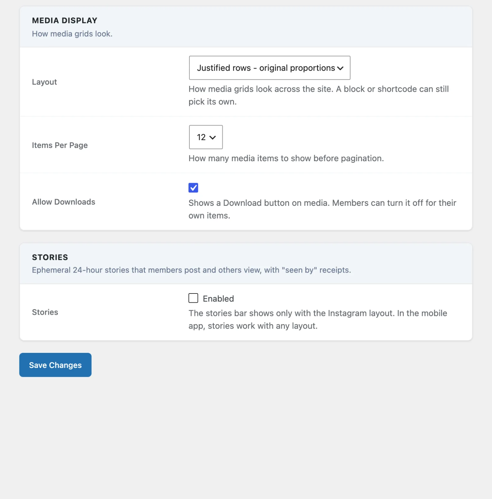

# Display Settings

Access these settings at **MediaVerse > Settings > Display**.



## Media Display Section

| Option | Default | Description |
|--------|---------|-------------|
| Layout | Justified rows - original proportions | How media grids look across the site. A block or shortcode can still pick its own. **Grid - square crops** crops every thumbnail to 1:1. **Justified rows - original proportions** keeps each image's shape and fills each row to the full width (Flickr / Google Photos style). **List - one row per item** puts a small thumbnail beside the title. With MediaVerse Pro the list also offers **Instagram Feed**, **Pinterest Masonry**, **Flickr Justified** and **Dribbble Shots**. |
| Grid Columns | 3 | Columns in the square grid. Shown only when Layout is "Grid - square crops". Options: 2, 3, 4, 5 columns. |
| Items Per Page | 12 | How many media items to show before pagination. Options: 12, 24, 48. |
| Allow Downloads | On | Shows a Download button on media. Members can turn it off for their own items. When off, the button is hidden site-wide and the `/mvs/v1/media/{id}/download` REST endpoint refuses requests. |

**How Layout is saved.** Since 2.6.0 one Layout select replaces the old "Default Layout" and Pro's "Explore and Profile Layout". A Free choice (Grid, Justified rows, List) is saved to `mvs_thumbnail_style` and also puts the Pro feed back on grid. A Pro skin is saved to `mvs_pro_feed_layout`. The stored values are unchanged (`square`, `original`, `list`), as is the `masonry` spelling accepted by block and shortcode attributes. Change the site-wide default with the `mvs_default_thumbnail_style` filter.

**No longer on this screen.** Thumbnail Quality (`mvs_thumbnail_size`, default `large`), Large Image Size (`mvs_large_image_size`, default 1024) and Lightbox Image Size (`mvs_lightbox_image_source`, default `large`) have no screen control since 2.6.0. They are still registered, their defaults did not change, and a stored value keeps working. Set them in code or with WP-CLI. See the [Settings Reference](settings-reference.md#display).

Saving this screen never changes a hidden or removed setting's stored value.

## Stories (Pro)

With MediaVerse Pro, the **Stories** switch is on this tab. The stories bar shows only with the Instagram layout. In the mobile app, stories work with any layout.

## Explore Sort, Type Filter and Loading

The Explore page has a sort control with four choices: Newest, Trending, Oldest and Most viewed. Trending ranks items by recent reactions, comments and views. It is the same ranking as `orderby=trending` in the REST feed.

A **Type** filter (All types, Photos, Videos, Audio) shows on Explore and on the Pro feed layouts. Profiles have the sort but no type filter.

Lists with a **Load More** button (Explore, the front-page feed, profiles and album pages) load the next pages as you scroll for 3 pages, then show the Load More button so the site footer stays reachable. The My Media dashboard keeps its own Load More button.

## Lightbox Toolbar

The full-screen lightbox includes a toolbar with three quick-action buttons.

| Button | Behaviour |
|--------|-----------|
| Download | Streams the original file to the user and increments the `mvs_media_stats.downloads` counter. Hidden when **Allow Downloads** is off (either site-wide or per-media). Rate-limited to 30 requests per minute per user. |
| Fullscreen | Expands the lightbox to fill the viewport using the browser Fullscreen API. Also bound to the `F` keyboard shortcut. |
| Share | Uses `navigator.share` where supported, falls back to copying the URL to the clipboard, falls back to a toast error. No `window.prompt()` fallback. |

All three buttons carry `aria-label` text and `:focus-visible` outlines for keyboard users.

The **Save** button shows "Saved" (filled) while the item is in the member's Favorites. The image's alt text is the AI description when there is one, otherwise the title, the same as on grid cards.

## How Display Settings Interact with Shortcodes

The `[mvs_gallery]` shortcode deliberately uses the backend settings for **Grid Columns** and **Items Per Page** rather than letting shortcode attributes override them. This ensures consistent display across your site.

The `[mvs_album]` shortcode allows you to override the column count directly:

```
[mvs_album id="123" columns="4"]
```

## Thumbnail Generation

MediaVerse generates thumbnails for uploaded images using WordPress's built-in image editor. Thumbnails are stored alongside the original file in the `wpmediaverse/YYYY/MM/` upload directory.

For video files, a poster is taken from the file's embedded cover atom (getID3); a cover-less video falls back to a default poster image. No ffmpeg. As of 1.8.0, every grid, feed, and layout (My Media, Explore, the explore-feed block, and the Pinterest/Flickr/Dribbble/Instagram layouts, including Load More) shows this real video poster instead of a generic video placeholder icon.

## Watermarking: Free vs Pro

Watermark settings are no longer on the Display tab. Since 2.6.0 they live on **MediaVerse > Settings > Storage**, in the **Image Watermarking** section (MediaVerse Pro).

MediaVerse Free ships the watermark **engine**: `WatermarkService` decides whether an upload should be stamped and fires the `mvs_watermark_stamp_file` filter at upload time and at file-replace time (so there is no bypass through the replace endpoint), before any thumbnail or WebP/AVIF copy is made. The option schema (watermark type, text, logo, position, opacity) also ships in Free with safe defaults, all off.

What Free does **not** include is the screen to configure those options, or the code that draws the mark into the image. **MediaVerse Pro** adds both. On the Storage tab, tick **Enable Watermark** and the other rows appear: Apply to (all uploads or selected roles), Watermark uploads from, Watermark Type (Text, Image (logo), or Logo + text), Watermark Text, Watermark Image, Position, Opacity, Text Size and Text Color. Without Pro active, nothing is registered to draw the mark, so uploads are never watermarked.
