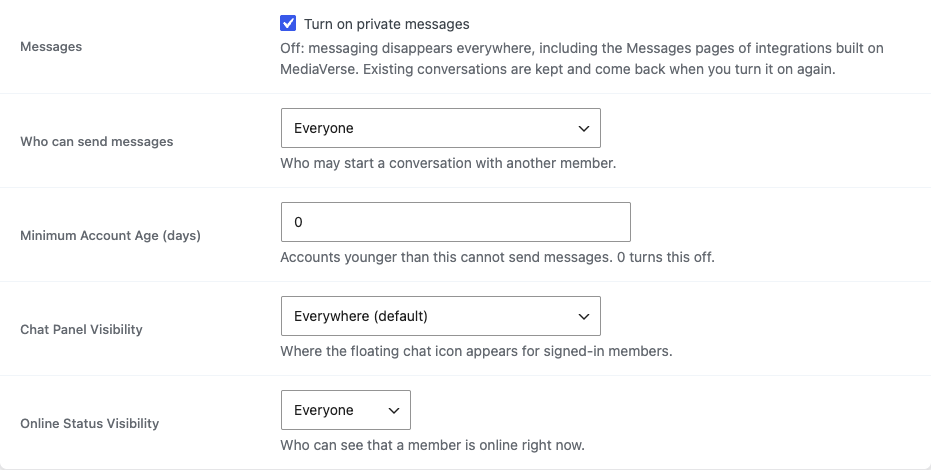

# Social & Messaging Settings

Access these settings at **Media > Settings > Social**.



These settings control who can send direct messages and online presence visibility.

---

## Direct Messages

| Option | Key | Default | Description |
|--------|-----|---------|-------------|
| Who Can Send DMs | `mvs_dm_access` | `everyone` | Controls who is allowed to send direct messages to other users on the site. Options: `everyone`, `followers` (people the recipient follows back), `nobody`. |
| Minimum Account Age (days) | `mvs_dm_min_age` | `0` | Number of days a user account must exist before that user can initiate new conversations. Set to `0` to disable the restriction. |
| Online Status Visibility | `mvs_show_online_status` | `everyone` | Who can see when a user is currently online in the messaging interface. Options: `everyone`, `followers`, `nobody`. |
| Chat Panel Visibility | `mvs_chat_panel_visibility` | `everywhere` | Where the floating chat panel renders. Options: `everywhere`, `mvs_pages` (WPMediaVerse pages only — Explore, Dashboard, Upload, single media), `bp_pages` (BuddyPress pages only), `disabled`. For code-level overrides, hook into the `mvs_should_render_chat_panel` filter — return `false` to suppress the panel on a specific request. |

> Setting **Who Can Send DMs** here applies site-wide. Users cannot override this individually at this time.

---

## Defining Options via wp-config.php

You can lock any Social setting as a constant to prevent admin changes:

```php
// wp-config.php
define( 'MVS_DM_ACCESS', 'followers' );        // Lock DM access to followers only.
define( 'MVS_DM_MIN_AGE', 7 );                 // Require 7-day-old accounts to send DMs.
define( 'MVS_SHOW_ONLINE_STATUS', false );      // Disable online status site-wide.
```

When a constant is detected, the corresponding field on the settings page is shown as read-only.
